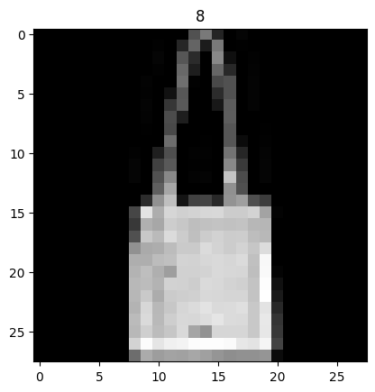

## [Fashion-MNIST](https://pytorch.org/docs/stable/torchvision/datasets.html#fashion-mnist)


```python
import os
import random
import numpy as np
import torch
import torchvision
```


```python
def seed_everything(seed):
    random.seed(seed)
    os.environ['PYTHONHASHSEED'] = str(seed)
    np.random.seed(seed)
    torch.manual_seed(seed)
    torch.cuda.manual_seed(seed)
    torch.backends.cudnn.deterministic = True
    torch.backends.cudnn.benchmark = False

seed_everything(42)
```


```python
dataset = torchvision.datasets.FashionMNIST('../data', download=True)
```

    100.0%
    100.0%
    100.0%
    100.0%


```python
print(type(dataset))

# tuple: (image, target)
```

    <class 'torchvision.datasets.mnist.FashionMNIST'>


```python
print(len(dataset))
```

    60000


```python
n = 200
data, target = dataset[n]
```


```python
print(type(data))
```

    <class 'PIL.Image.Image'>


```python
print(data.mode, data.width, data.height)
```

    L 28 28


```python
print(type(target))
```

    <class 'int'>


```python
import matplotlib.pyplot as plt
%matplotlib inline

plt.title(target)
plt.imshow(data, cmap='gray')
data.show()
```

    /home/ubuntu/.local/lib/python3.10/site-packages/numpy/_core/getlimits.py:551: UserWarning: Signature b'\x00\xd0\xcc\xcc\xcc\xcc\xcc\xcc\xfb\xbf\x00\x00\x00\x00\x00\x00' for <class 'numpy.longdouble'> does not match any known type: falling back to type probe function.
    This warnings indicates broken support for the dtype!
      machar = _get_machar(dtype)


    

    


    

    

