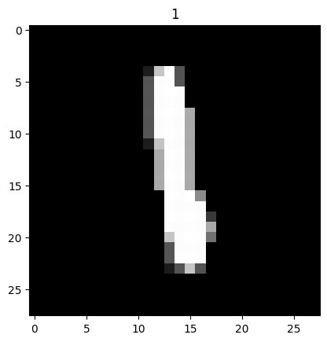
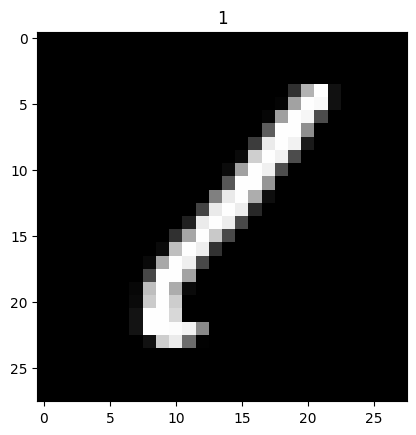
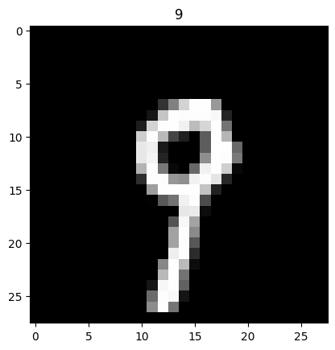

## [QMNIST](https://pytorch.org/docs/stable/torchvision/datasets.html#qmnist)


```python
%pip install torchvision
```

    Defaulting to user installation because normal site-packages is not writeable
    Requirement already satisfied: torchvision in /home/ubuntu/.local/lib/python3.10/site-packages (0.22.1)
    Requirement already satisfied: torch==2.7.1 in /home/ubuntu/.local/lib/python3.10/site-packages (from torchvision) (2.7.1)
    Requirement already satisfied: pillow!=8.3.*,>=5.3.0 in /home/ubuntu/.local/lib/python3.10/site-packages (from torchvision) (11.3.0)
    Requirement already satisfied: numpy in /home/ubuntu/.local/lib/python3.10/site-packages (from torchvision) (2.2.6)
    Requirement already satisfied: nvidia-nvjitlink-cu12==12.6.85 in /home/ubuntu/.local/lib/python3.10/site-packages (from torch==2.7.1->torchvision) (12.6.85)
    Requirement already satisfied: nvidia-cusparselt-cu12==0.6.3 in /home/ubuntu/.local/lib/python3.10/site-packages (from torch==2.7.1->torchvision) (0.6.3)
    Requirement already satisfied: nvidia-cufile-cu12==1.11.1.6 in /home/ubuntu/.local/lib/python3.10/site-packages (from torch==2.7.1->torchvision) (1.11.1.6)
    Requirement already satisfied: nvidia-cusolver-cu12==11.7.1.2 in /home/ubuntu/.local/lib/python3.10/site-packages (from torch==2.7.1->torchvision) (11.7.1.2)
    Requirement already satisfied: typing-extensions>=4.10.0 in /home/ubuntu/.local/lib/python3.10/site-packages (from torch==2.7.1->torchvision) (4.14.1)
    Requirement already satisfied: nvidia-cufft-cu12==11.3.0.4 in /home/ubuntu/.local/lib/python3.10/site-packages (from torch==2.7.1->torchvision) (11.3.0.4)
    Requirement already satisfied: nvidia-cudnn-cu12==9.5.1.17 in /home/ubuntu/.local/lib/python3.10/site-packages (from torch==2.7.1->torchvision) (9.5.1.17)
    Requirement already satisfied: networkx in /home/ubuntu/.local/lib/python3.10/site-packages (from torch==2.7.1->torchvision) (3.4.2)
    Requirement already satisfied: fsspec in /home/ubuntu/.local/lib/python3.10/site-packages (from torch==2.7.1->torchvision) (2025.7.0)
    Requirement already satisfied: jinja2 in /usr/lib/python3/dist-packages (from torch==2.7.1->torchvision) (3.0.3)
    Requirement already satisfied: nvidia-cusparse-cu12==12.5.4.2 in /home/ubuntu/.local/lib/python3.10/site-packages (from torch==2.7.1->torchvision) (12.5.4.2)
    Requirement already satisfied: nvidia-cuda-nvrtc-cu12==12.6.77 in /home/ubuntu/.local/lib/python3.10/site-packages (from torch==2.7.1->torchvision) (12.6.77)
    Requirement already satisfied: nvidia-nccl-cu12==2.26.2 in /home/ubuntu/.local/lib/python3.10/site-packages (from torch==2.7.1->torchvision) (2.26.2)
    Requirement already satisfied: nvidia-cuda-cupti-cu12==12.6.80 in /home/ubuntu/.local/lib/python3.10/site-packages (from torch==2.7.1->torchvision) (12.6.80)
    Requirement already satisfied: sympy>=1.13.3 in /home/ubuntu/.local/lib/python3.10/site-packages (from torch==2.7.1->torchvision) (1.14.0)
    Requirement already satisfied: filelock in /home/ubuntu/.local/lib/python3.10/site-packages (from torch==2.7.1->torchvision) (3.18.0)
    Requirement already satisfied: nvidia-nvtx-cu12==12.6.77 in /home/ubuntu/.local/lib/python3.10/site-packages (from torch==2.7.1->torchvision) (12.6.77)
    Requirement already satisfied: nvidia-cublas-cu12==12.6.4.1 in /home/ubuntu/.local/lib/python3.10/site-packages (from torch==2.7.1->torchvision) (12.6.4.1)
    Requirement already satisfied: triton==3.3.1 in /home/ubuntu/.local/lib/python3.10/site-packages (from torch==2.7.1->torchvision) (3.3.1)
    Requirement already satisfied: nvidia-cuda-runtime-cu12==12.6.77 in /home/ubuntu/.local/lib/python3.10/site-packages (from torch==2.7.1->torchvision) (12.6.77)
    Requirement already satisfied: nvidia-curand-cu12==10.3.7.77 in /home/ubuntu/.local/lib/python3.10/site-packages (from torch==2.7.1->torchvision) (10.3.7.77)
    Requirement already satisfied: setuptools>=40.8.0 in /usr/lib/python3/dist-packages (from triton==3.3.1->torch==2.7.1->torchvision) (59.6.0)
    Requirement already satisfied: mpmath<1.4,>=1.1.0 in /home/ubuntu/.local/lib/python3.10/site-packages (from sympy>=1.13.3->torch==2.7.1->torchvision) (1.3.0)
    Note: you may need to restart the kernel to use updated packages.


```python
import os
import random
import numpy as np
import torch
import torchvision
```


```python
def seed_everything(seed):
    random.seed(seed)
    os.environ['PYTHONHASHSEED'] = str(seed)
    np.random.seed(seed)
    torch.manual_seed(seed)
    torch.cuda.manual_seed(seed)
    torch.backends.cudnn.deterministic = True
    torch.backends.cudnn.benchmark = False

seed_everything(42)
```


```python
dataset = torchvision.datasets.QMNIST('./data', download=True)
```


```python
print(type(dataset))

# tuple: (image, target)
```

    <class 'torchvision.datasets.mnist.QMNIST'>


```python
print(len(dataset))
```

    60000


```python
n = 200
data, target = dataset[n]
```


```python
print(type(data))
```

    <class 'PIL.Image.Image'>


```python
print(data.mode, data.width, data.height)
```

    L 28 28


```python
print(type(target))
```

    <class 'int'>


```python
import matplotlib.pyplot as plt
%matplotlib inline

plt.title(target)
plt.imshow(data, cmap='gray')
data.show()
```

    /home/ubuntu/.local/lib/python3.10/site-packages/numpy/_core/getlimits.py:551: UserWarning: Signature b'\x00\xd0\xcc\xcc\xcc\xcc\xcc\xcc\xfb\xbf\x00\x00\x00\x00\x00\x00' for <class 'numpy.longdouble'> does not match any known type: falling back to type probe function.
    This warnings indicates broken support for the dtype!
      machar = _get_machar(dtype)


    

    


    

    


```python
import torchvision.transforms as transforms
# batch must contain tensors, numpy arrays, numbers, dicts or lists
ToTensor = transforms.Compose([
    transforms.ToTensor()
])
dataset = torchvision.datasets.QMNIST('./data', transform = ToTensor)
```


```python
data_loader = torch.utils.data.DataLoader(dataset,
                                          batch_size=1,
                                          shuffle=True)
```


```python
ToPILImage = transforms.Compose([
    transforms.ToPILImage()
])

for data, target in data_loader:
    print(data.shape)
    data = data.squeeze() # 불필요한 차원 하나를 줄인다(batch_size=1)
    data = data.squeeze() # 불필요한 차원 하나를 줄인다(color)
    print(data.shape)
    pic = ToPILImage(data)
    plt.title(int(target))
    plt.imshow(pic, cmap='gray')
    plt.show()
    break
```

    torch.Size([1, 1, 28, 28])
    torch.Size([28, 28])


    

    


```python
data_loader = torch.utils.data.DataLoader(dataset,
                                          batch_size=10,
                                          shuffle=True)
```


```python
ToPILImage = transforms.Compose([
    transforms.ToPILImage()
])

for data, target in data_loader:
    index = 5
    print(data.shape)
    img = data[index]
    print(img.shape)
    img = img[0] 
    print(img.shape)
    pic = ToPILImage(img)
    plt.title(int(target[index]))
    plt.imshow(img, cmap='gray')
    plt.show()
    break
```

    torch.Size([10, 1, 28, 28])
    torch.Size([1, 28, 28])
    torch.Size([28, 28])


    

    

