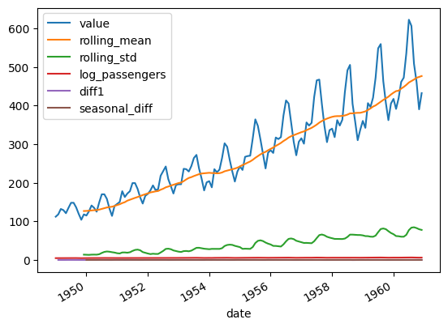

```python
%pip install statsmodels matplotlib pandas
```

    Defaulting to user installation because normal site-packages is not writeable
    Requirement already satisfied: statsmodels in /home/ubuntu/.local/lib/python3.10/site-packages (0.14.5)
    Requirement already satisfied: matplotlib in /home/ubuntu/.local/lib/python3.10/site-packages (3.10.5)
    Requirement already satisfied: pandas in /home/ubuntu/.local/lib/python3.10/site-packages (2.3.1)
    Requirement already satisfied: patsy>=0.5.6 in /home/ubuntu/.local/lib/python3.10/site-packages (from statsmodels) (1.0.1)
    Requirement already satisfied: numpy<3,>=1.22.3 in /home/ubuntu/.local/lib/python3.10/site-packages (from statsmodels) (2.2.6)
    Requirement already satisfied: scipy!=1.9.2,>=1.8 in /home/ubuntu/.local/lib/python3.10/site-packages (from statsmodels) (1.15.3)
    Requirement already satisfied: packaging>=21.3 in /home/ubuntu/.local/lib/python3.10/site-packages (from statsmodels) (25.0)
    Requirement already satisfied: kiwisolver>=1.3.1 in /home/ubuntu/.local/lib/python3.10/site-packages (from matplotlib) (1.4.8)
    Requirement already satisfied: fonttools>=4.22.0 in /home/ubuntu/.local/lib/python3.10/site-packages (from matplotlib) (4.59.0)
    Requirement already satisfied: pillow>=8 in /home/ubuntu/.local/lib/python3.10/site-packages (from matplotlib) (11.3.0)
    Requirement already satisfied: cycler>=0.10 in /home/ubuntu/.local/lib/python3.10/site-packages (from matplotlib) (0.12.1)
    Requirement already satisfied: contourpy>=1.0.1 in /home/ubuntu/.local/lib/python3.10/site-packages (from matplotlib) (1.3.2)
    Requirement already satisfied: python-dateutil>=2.7 in /home/ubuntu/.local/lib/python3.10/site-packages (from matplotlib) (2.9.0.post0)
    Requirement already satisfied: pyparsing>=2.3.1 in /usr/lib/python3/dist-packages (from matplotlib) (2.4.7)
    Requirement already satisfied: tzdata>=2022.7 in /home/ubuntu/.local/lib/python3.10/site-packages (from pandas) (2025.2)
    Requirement already satisfied: pytz>=2020.1 in /usr/lib/python3/dist-packages (from pandas) (2022.1)
    Requirement already satisfied: six>=1.5 in /usr/lib/python3/dist-packages (from python-dateutil>=2.7->matplotlib) (1.16.0)
    Note: you may need to restart the kernel to use updated packages.


```python
import seaborn as sns
import pandas as pd
import numpy as np
import matplotlib.pyplot as plt
import statsmodels.api as sm
```

    /home/ubuntu/.local/lib/python3.10/site-packages/numpy/_core/getlimits.py:551: UserWarning: Signature b'\x00\xd0\xcc\xcc\xcc\xcc\xcc\xcc\xfb\xbf\x00\x00\x00\x00\x00\x00' for <class 'numpy.longdouble'> does not match any known type: falling back to type probe function.
    This warnings indicates broken support for the dtype!
      machar = _get_machar(dtype)


```python
# https://www.statsmodels.org/stable/datasets/index.html#available-datasets
```


```python
df = sm.datasets.get_rdataset("AirPassengers").data
```


```python
print(type(df))
```

    <class 'pandas.core.frame.DataFrame'>


```python
df.head()
```


<div>
<style scoped>
    .dataframe tbody tr th:only-of-type {
        vertical-align: middle;
    }

    .dataframe tbody tr th {
        vertical-align: top;
    }

    .dataframe thead th {
        text-align: right;
    }
</style>
<table border="1" class="dataframe">
  <thead>
    <tr style="text-align: right;">
      <th></th>
      <th>time</th>
      <th>value</th>
    </tr>
  </thead>
  <tbody>
    <tr>
      <th>0</th>
      <td>1949.000000</td>
      <td>112</td>
    </tr>
    <tr>
      <th>1</th>
      <td>1949.083333</td>
      <td>118</td>
    </tr>
    <tr>
      <th>2</th>
      <td>1949.166667</td>
      <td>132</td>
    </tr>
    <tr>
      <th>3</th>
      <td>1949.250000</td>
      <td>129</td>
    </tr>
    <tr>
      <th>4</th>
      <td>1949.333333</td>
      <td>121</td>
    </tr>
  </tbody>
</table>
</div>


```python
df.tail()
```


<div>
<style scoped>
    .dataframe tbody tr th:only-of-type {
        vertical-align: middle;
    }

    .dataframe tbody tr th {
        vertical-align: top;
    }

    .dataframe thead th {
        text-align: right;
    }
</style>
<table border="1" class="dataframe">
  <thead>
    <tr style="text-align: right;">
      <th></th>
      <th>time</th>
      <th>value</th>
    </tr>
  </thead>
  <tbody>
    <tr>
      <th>139</th>
      <td>1960.583333</td>
      <td>606</td>
    </tr>
    <tr>
      <th>140</th>
      <td>1960.666667</td>
      <td>508</td>
    </tr>
    <tr>
      <th>141</th>
      <td>1960.750000</td>
      <td>461</td>
    </tr>
    <tr>
      <th>142</th>
      <td>1960.833333</td>
      <td>390</td>
    </tr>
    <tr>
      <th>143</th>
      <td>1960.916667</td>
      <td>432</td>
    </tr>
  </tbody>
</table>
</div>


```python
print(df.shape)
```

    (144, 2)


```python
df['date'] = pd.to_datetime('1949-01-01') + pd.to_timedelta((df['time'] - 1949) * 365.25, unit='D')
df.set_index('date', inplace=True)
df.drop(columns='time', inplace=True)
```


```python
df.head()
```


<div>
<style scoped>
    .dataframe tbody tr th:only-of-type {
        vertical-align: middle;
    }

    .dataframe tbody tr th {
        vertical-align: top;
    }

    .dataframe thead th {
        text-align: right;
    }
</style>
<table border="1" class="dataframe">
  <thead>
    <tr style="text-align: right;">
      <th></th>
      <th>value</th>
    </tr>
    <tr>
      <th>date</th>
      <th></th>
    </tr>
  </thead>
  <tbody>
    <tr>
      <th>1949-01-01 00:00:00.000000000</th>
      <td>112</td>
    </tr>
    <tr>
      <th>1949-01-31 10:29:59.999897149</th>
      <td>118</td>
    </tr>
    <tr>
      <th>1949-03-02 21:00:00.000102850</th>
      <td>132</td>
    </tr>
    <tr>
      <th>1949-04-02 07:30:00.000000000</th>
      <td>129</td>
    </tr>
    <tr>
      <th>1949-05-02 17:59:59.999897149</th>
      <td>121</td>
    </tr>
  </tbody>
</table>
</div>


```python
df.describe()
```


<div>
<style scoped>
    .dataframe tbody tr th:only-of-type {
        vertical-align: middle;
    }

    .dataframe tbody tr th {
        vertical-align: top;
    }

    .dataframe thead th {
        text-align: right;
    }
</style>
<table border="1" class="dataframe">
  <thead>
    <tr style="text-align: right;">
      <th></th>
      <th>value</th>
    </tr>
  </thead>
  <tbody>
    <tr>
      <th>count</th>
      <td>144.000000</td>
    </tr>
    <tr>
      <th>mean</th>
      <td>280.298611</td>
    </tr>
    <tr>
      <th>std</th>
      <td>119.966317</td>
    </tr>
    <tr>
      <th>min</th>
      <td>104.000000</td>
    </tr>
    <tr>
      <th>25%</th>
      <td>180.000000</td>
    </tr>
    <tr>
      <th>50%</th>
      <td>265.500000</td>
    </tr>
    <tr>
      <th>75%</th>
      <td>360.500000</td>
    </tr>
    <tr>
      <th>max</th>
      <td>622.000000</td>
    </tr>
  </tbody>
</table>
</div>


```python
df.info()
```

    <class 'pandas.core.frame.DataFrame'>
    DatetimeIndex: 144 entries, 1949-01-01 00:00:00 to 1960-12-01 13:30:00.000102859
    Data columns (total 1 columns):
     #   Column  Non-Null Count  Dtype
    ---  ------  --------------  -----
     0   value   144 non-null    int64
    dtypes: int64(1)
    memory usage: 2.2 KB


```python
df.isnull().sum()
```


    value    0
    dtype: int64


```python
df.dropna(inplace=True)
```


```python
df.plot()
```


    <Axes: xlabel='date'>


    

    


```python
# AR(AutoRegressive): 과거의 실제 관측값들로 현재를 예측
# MA(Moving Average): 과거의 예측 오차들로 현재를 예측
# ARMA = AR + MA
# 통계적 모델은 '데이터의 계절성과 추세가 뚜렷하다'라는 전제하에 사용되는 경량 모델
```


```python
df['rolling_mean'] = df['value'].rolling(window=12).mean() # 이동 평균: 추세 식별, 노이즈 제거, 계절성 분석을 위해 사용
df['rolling_std'] = df['value'].rolling(window=12).std() # 이동 표준편차: 시간에 따른 변동성의 변화를 추적. 증가하면 평균 주위 데이터의 변동성이 커진다는 의미

plt.figure(figsize=(10, 4))
plt.plot(df['value'], label='Original')
plt.plot(df['rolling_mean'], label='Rolling Mean')
plt.plot(df['rolling_std'], label='Rolling Std')
plt.legend()
plt.title('Rolling Mean & Std Dev')
plt.show()
```


    

    


```python
df['log_passengers'] = np.log(df['value'])
```


```python
df['diff1'] = df['log_passengers'].diff().dropna()
df['seasonal_diff'] = df['log_passengers'].diff(12).dropna()
```


```python
from statsmodels.graphics.tsaplots import plot_acf, plot_pacf
plot_acf(df['log_passengers'].diff().dropna(), lags=40) # k=40
plt.title('ACF - First Difference') # Autocorrelation Function. 시점 t의 값이 시점 t-k값과 얼마나 선형적으로 관계되어 있는가? 0~1
                                    # ACF가 급격히 감소하는 지점이 MA 차수
plt.show()
```


    

    


```python
from statsmodels.tsa.stattools import acf
acf_values = acf(df['log_passengers'].diff().dropna(), nlags=40)

acf_df = pd.DataFrame({
    'lag': range(len(acf_values)),
    'acf': acf_values
})
```


```python
acf_df.head(30)
```


<div>
<style scoped>
    .dataframe tbody tr th:only-of-type {
        vertical-align: middle;
    }

    .dataframe tbody tr th {
        vertical-align: top;
    }

    .dataframe thead th {
        text-align: right;
    }
</style>
<table border="1" class="dataframe">
  <thead>
    <tr style="text-align: right;">
      <th></th>
      <th>lag</th>
      <th>acf</th>
    </tr>
  </thead>
  <tbody>
    <tr>
      <th>0</th>
      <td>0</td>
      <td>1.000000</td>
    </tr>
    <tr>
      <th>1</th>
      <td>1</td>
      <td>0.199751</td>
    </tr>
    <tr>
      <th>2</th>
      <td>2</td>
      <td>-0.120104</td>
    </tr>
    <tr>
      <th>3</th>
      <td>3</td>
      <td>-0.150772</td>
    </tr>
    <tr>
      <th>4</th>
      <td>4</td>
      <td>-0.322074</td>
    </tr>
    <tr>
      <th>5</th>
      <td>5</td>
      <td>-0.083975</td>
    </tr>
    <tr>
      <th>6</th>
      <td>6</td>
      <td>0.025778</td>
    </tr>
    <tr>
      <th>7</th>
      <td>7</td>
      <td>-0.110961</td>
    </tr>
    <tr>
      <th>8</th>
      <td>8</td>
      <td>-0.336721</td>
    </tr>
    <tr>
      <th>9</th>
      <td>9</td>
      <td>-0.115586</td>
    </tr>
    <tr>
      <th>10</th>
      <td>10</td>
      <td>-0.109267</td>
    </tr>
    <tr>
      <th>11</th>
      <td>11</td>
      <td>0.205852</td>
    </tr>
    <tr>
      <th>12</th>
      <td>12</td>
      <td>0.841430</td>
    </tr>
    <tr>
      <th>13</th>
      <td>13</td>
      <td>0.215087</td>
    </tr>
    <tr>
      <th>14</th>
      <td>14</td>
      <td>-0.139554</td>
    </tr>
    <tr>
      <th>15</th>
      <td>15</td>
      <td>-0.115996</td>
    </tr>
    <tr>
      <th>16</th>
      <td>16</td>
      <td>-0.278943</td>
    </tr>
    <tr>
      <th>17</th>
      <td>17</td>
      <td>-0.051706</td>
    </tr>
    <tr>
      <th>18</th>
      <td>18</td>
      <td>0.012458</td>
    </tr>
    <tr>
      <th>19</th>
      <td>19</td>
      <td>-0.114358</td>
    </tr>
    <tr>
      <th>20</th>
      <td>20</td>
      <td>-0.337174</td>
    </tr>
    <tr>
      <th>21</th>
      <td>21</td>
      <td>-0.107385</td>
    </tr>
    <tr>
      <th>22</th>
      <td>22</td>
      <td>-0.075211</td>
    </tr>
    <tr>
      <th>23</th>
      <td>23</td>
      <td>0.199475</td>
    </tr>
    <tr>
      <th>24</th>
      <td>24</td>
      <td>0.736921</td>
    </tr>
    <tr>
      <th>25</th>
      <td>25</td>
      <td>0.197262</td>
    </tr>
    <tr>
      <th>26</th>
      <td>26</td>
      <td>-0.123884</td>
    </tr>
    <tr>
      <th>27</th>
      <td>27</td>
      <td>-0.102699</td>
    </tr>
    <tr>
      <th>28</th>
      <td>28</td>
      <td>-0.210992</td>
    </tr>
    <tr>
      <th>29</th>
      <td>29</td>
      <td>-0.065357</td>
    </tr>
  </tbody>
</table>
</div>


```python
plot_pacf(df['log_passengers'].diff().dropna(), lags=40) # 중간 지연들(t-1, t-2, ..., t-k+1)의 영향을 통제한 후의 순수한 상관관계
                                                        #  PCAF가 급격히 감소하는 지점이 AR 차수
plt.title('PACF - First Difference') 
plt.show()
```


    

    


```python
from statsmodels.tsa.stattools import pacf
pacf_values = pacf(df['log_passengers'].diff().dropna(), nlags=40)

pacf_df = pd.DataFrame({
    'lag': range(len(acf_values)),
    'pacf': pacf_values
})
```


```python
pacf_df.head(30)
```


<div>
<style scoped>
    .dataframe tbody tr th:only-of-type {
        vertical-align: middle;
    }

    .dataframe tbody tr th {
        vertical-align: top;
    }

    .dataframe thead th {
        text-align: right;
    }
</style>
<table border="1" class="dataframe">
  <thead>
    <tr style="text-align: right;">
      <th></th>
      <th>lag</th>
      <th>pacf</th>
    </tr>
  </thead>
  <tbody>
    <tr>
      <th>0</th>
      <td>0</td>
      <td>1.000000</td>
    </tr>
    <tr>
      <th>1</th>
      <td>1</td>
      <td>0.201158</td>
    </tr>
    <tr>
      <th>2</th>
      <td>2</td>
      <td>-0.169116</td>
    </tr>
    <tr>
      <th>3</th>
      <td>3</td>
      <td>-0.097992</td>
    </tr>
    <tr>
      <th>4</th>
      <td>4</td>
      <td>-0.320381</td>
    </tr>
    <tr>
      <th>5</th>
      <td>5</td>
      <td>0.007670</td>
    </tr>
    <tr>
      <th>6</th>
      <td>6</td>
      <td>-0.078763</td>
    </tr>
    <tr>
      <th>7</th>
      <td>7</td>
      <td>-0.222941</td>
    </tr>
    <tr>
      <th>8</th>
      <td>8</td>
      <td>-0.533272</td>
    </tr>
    <tr>
      <th>9</th>
      <td>9</td>
      <td>-0.236851</td>
    </tr>
    <tr>
      <th>10</th>
      <td>10</td>
      <td>-0.652377</td>
    </tr>
    <tr>
      <th>11</th>
      <td>11</td>
      <td>-0.642547</td>
    </tr>
    <tr>
      <th>12</th>
      <td>12</td>
      <td>0.558940</td>
    </tr>
    <tr>
      <th>13</th>
      <td>13</td>
      <td>0.272979</td>
    </tr>
    <tr>
      <th>14</th>
      <td>14</td>
      <td>-0.221404</td>
    </tr>
    <tr>
      <th>15</th>
      <td>15</td>
      <td>0.204449</td>
    </tr>
    <tr>
      <th>16</th>
      <td>16</td>
      <td>0.079876</td>
    </tr>
    <tr>
      <th>17</th>
      <td>17</td>
      <td>0.024656</td>
    </tr>
    <tr>
      <th>18</th>
      <td>18</td>
      <td>-0.133072</td>
    </tr>
    <tr>
      <th>19</th>
      <td>19</td>
      <td>0.140568</td>
    </tr>
    <tr>
      <th>20</th>
      <td>20</td>
      <td>-0.168438</td>
    </tr>
    <tr>
      <th>21</th>
      <td>21</td>
      <td>-0.357001</td>
    </tr>
    <tr>
      <th>22</th>
      <td>22</td>
      <td>-0.166085</td>
    </tr>
    <tr>
      <th>23</th>
      <td>23</td>
      <td>0.009090</td>
    </tr>
    <tr>
      <th>24</th>
      <td>24</td>
      <td>-0.051520</td>
    </tr>
    <tr>
      <th>25</th>
      <td>25</td>
      <td>-0.122320</td>
    </tr>
    <tr>
      <th>26</th>
      <td>26</td>
      <td>0.136368</td>
    </tr>
    <tr>
      <th>27</th>
      <td>27</td>
      <td>0.234654</td>
    </tr>
    <tr>
      <th>28</th>
      <td>28</td>
      <td>0.162930</td>
    </tr>
    <tr>
      <th>29</th>
      <td>29</td>
      <td>-0.116849</td>
    </tr>
  </tbody>
</table>
</div>


```python
df.plot()
```


    <Axes: xlabel='date'>


    

    


```python
from statsmodels.tsa.arima.model import ARIMA

model_arima = ARIMA(df['log_passengers'], order=(2, 1, 2))
result_arima = model_arima.fit()
```

    /home/ubuntu/.local/lib/python3.10/site-packages/statsmodels/tsa/base/tsa_model.py:473: ValueWarning: A date index has been provided, but it has no associated frequency information and so will be ignored when e.g. forecasting.
      self._init_dates(dates, freq)
    /home/ubuntu/.local/lib/python3.10/site-packages/statsmodels/tsa/base/tsa_model.py:473: ValueWarning: A date index has been provided, but it has no associated frequency information and so will be ignored when e.g. forecasting.
      self._init_dates(dates, freq)
    /home/ubuntu/.local/lib/python3.10/site-packages/statsmodels/tsa/base/tsa_model.py:473: ValueWarning: A date index has been provided, but it has no associated frequency information and so will be ignored when e.g. forecasting.
      self._init_dates(dates, freq)


```python
n_periods = 24
forecast_arima_log = result_arima.get_forecast(steps=n_periods)
forecast_index = pd.date_range(df.index[-1] + pd.DateOffset(months=1), periods=n_periods, freq='MS')
forecast_arima = np.exp(forecast_arima_log.predicted_mean)
forecast_arima.index = forecast_index
```

    /home/ubuntu/.local/lib/python3.10/site-packages/statsmodels/tsa/base/tsa_model.py:837: ValueWarning: No supported index is available. Prediction results will be given with an integer index beginning at `start`.
      return get_prediction_index(
    /home/ubuntu/.local/lib/python3.10/site-packages/statsmodels/tsa/base/tsa_model.py:837: FutureWarning: No supported index is available. In the next version, calling this method in a model without a supported index will result in an exception.
      return get_prediction_index(


```python
plt.figure(figsize=(10, 4))
plt.plot(df['value'], label='Observed')
plt.plot(forecast_arima, label='ARIMA Forecast')
plt.fill_between(forecast_index,
                 np.exp(forecast_arima_log.conf_int().iloc[:, 0]),
                 np.exp(forecast_arima_log.conf_int().iloc[:, 1]),
                 color='pink', alpha=0.3)
plt.legend()
plt.title('ARIMA Forecast')
plt.show()
```


    

    


```python
from statsmodels.tsa.statespace.sarimax import SARIMAX

model_sarima = SARIMAX(df['log_passengers'], order=(1, 1, 1), seasonal_order=(1, 1, 1, 12))
result_sarima = model_sarima.fit()
```

    /home/ubuntu/.local/lib/python3.10/site-packages/statsmodels/tsa/base/tsa_model.py:473: ValueWarning: A date index has been provided, but it has no associated frequency information and so will be ignored when e.g. forecasting.
      self._init_dates(dates, freq)
    /home/ubuntu/.local/lib/python3.10/site-packages/statsmodels/tsa/base/tsa_model.py:473: ValueWarning: A date index has been provided, but it has no associated frequency information and so will be ignored when e.g. forecasting.
      self._init_dates(dates, freq)


```python
forecast_sarima_log = result_sarima.get_forecast(steps=n_periods)
forecast_sarima = np.exp(forecast_sarima_log.predicted_mean)
forecast_sarima.index = forecast_index
```

    /home/ubuntu/.local/lib/python3.10/site-packages/statsmodels/tsa/base/tsa_model.py:837: ValueWarning: No supported index is available. Prediction results will be given with an integer index beginning at `start`.
      return get_prediction_index(
    /home/ubuntu/.local/lib/python3.10/site-packages/statsmodels/tsa/base/tsa_model.py:837: FutureWarning: No supported index is available. In the next version, calling this method in a model without a supported index will result in an exception.
      return get_prediction_index(


```python
plt.figure(figsize=(10, 4))
plt.plot(df['value'], label='Observed')
plt.plot(forecast_sarima, label='SARIMA Forecast')
plt.fill_between(forecast_index,
                 np.exp(forecast_sarima_log.conf_int().iloc[:, 0]),
                 np.exp(forecast_sarima_log.conf_int().iloc[:, 1]),
                 color='lightblue', alpha=0.3)
plt.legend()
plt.title('SARIMA Forecast')
plt.show()
```


    

    

