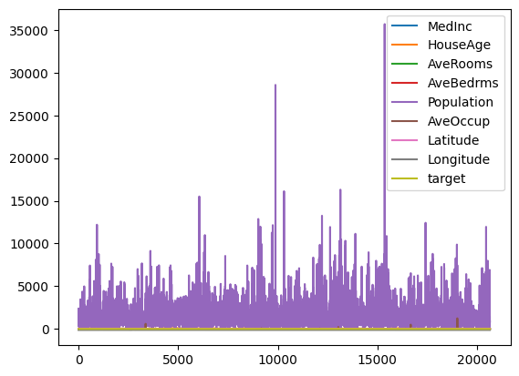

# fetch california housing


```python
from sklearn.datasets import fetch_california_housing
import pandas as pd
import seaborn as sns
%matplotlib inline
```

    /home/ubuntu/.local/lib/python3.10/site-packages/numpy/_core/getlimits.py:551: UserWarning: Signature b'\x00\xd0\xcc\xcc\xcc\xcc\xcc\xcc\xfb\xbf\x00\x00\x00\x00\x00\x00' for <class 'numpy.longdouble'> does not match any known type: falling back to type probe function.
    This warnings indicates broken support for the dtype!
      machar = _get_machar(dtype)


```python
data = fetch_california_housing()
```


```python
print(type(data))
```

    <class 'sklearn.utils._bunch.Bunch'>


```python
print(data.keys())
```

    dict_keys(['data', 'target', 'frame', 'target_names', 'feature_names', 'DESCR'])


```python
print(type(data))
```

    <class 'sklearn.utils._bunch.Bunch'>


```python
print(data.DESCR)
```

    .. _california_housing_dataset:
    
    California Housing dataset
    --------------------------
    
    **Data Set Characteristics:**
    
    :Number of Instances: 20640
    
    :Number of Attributes: 8 numeric, predictive attributes and the target
    
    :Attribute Information:
        - MedInc        median income in block group
        - HouseAge      median house age in block group
        - AveRooms      average number of rooms per household
        - AveBedrms     average number of bedrooms per household
        - Population    block group population
        - AveOccup      average number of household members
        - Latitude      block group latitude
        - Longitude     block group longitude
    
    :Missing Attribute Values: None
    
    This dataset was obtained from the StatLib repository.
    https://www.dcc.fc.up.pt/~ltorgo/Regression/cal_housing.html
    
    The target variable is the median house value for California districts,
    expressed in hundreds of thousands of dollars ($100,000).
    
    This dataset was derived from the 1990 U.S. census, using one row per census
    block group. A block group is the smallest geographical unit for which the U.S.
    Census Bureau publishes sample data (a block group typically has a population
    of 600 to 3,000 people).
    
    A household is a group of people residing within a home. Since the average
    number of rooms and bedrooms in this dataset are provided per household, these
    columns may take surprisingly large values for block groups with few households
    and many empty houses, such as vacation resorts.
    
    It can be downloaded/loaded using the
    :func:`sklearn.datasets.fetch_california_housing` function.
    
    .. rubric:: References
    
    - Pace, R. Kelley and Ronald Barry, Sparse Spatial Autoregressions,
      Statistics and Probability Letters, 33:291-297, 1997.
    


```python
print(data.target_names)
```

    ['MedHouseVal']


```python
print(data.feature_names)
```

    ['MedInc', 'HouseAge', 'AveRooms', 'AveBedrms', 'Population', 'AveOccup', 'Latitude', 'Longitude']


```python
df = pd.DataFrame(data=data.data, columns=data.feature_names)
df['target'] = data.target
```


```python
df.head()
```


<div>
<style scoped>
    .dataframe tbody tr th:only-of-type {
        vertical-align: middle;
    }

    .dataframe tbody tr th {
        vertical-align: top;
    }

    .dataframe thead th {
        text-align: right;
    }
</style>
<table border="1" class="dataframe">
  <thead>
    <tr style="text-align: right;">
      <th></th>
      <th>MedInc</th>
      <th>HouseAge</th>
      <th>AveRooms</th>
      <th>AveBedrms</th>
      <th>Population</th>
      <th>AveOccup</th>
      <th>Latitude</th>
      <th>Longitude</th>
      <th>target</th>
    </tr>
  </thead>
  <tbody>
    <tr>
      <th>0</th>
      <td>8.3252</td>
      <td>41.0</td>
      <td>6.984127</td>
      <td>1.023810</td>
      <td>322.0</td>
      <td>2.555556</td>
      <td>37.88</td>
      <td>-122.23</td>
      <td>4.526</td>
    </tr>
    <tr>
      <th>1</th>
      <td>8.3014</td>
      <td>21.0</td>
      <td>6.238137</td>
      <td>0.971880</td>
      <td>2401.0</td>
      <td>2.109842</td>
      <td>37.86</td>
      <td>-122.22</td>
      <td>3.585</td>
    </tr>
    <tr>
      <th>2</th>
      <td>7.2574</td>
      <td>52.0</td>
      <td>8.288136</td>
      <td>1.073446</td>
      <td>496.0</td>
      <td>2.802260</td>
      <td>37.85</td>
      <td>-122.24</td>
      <td>3.521</td>
    </tr>
    <tr>
      <th>3</th>
      <td>5.6431</td>
      <td>52.0</td>
      <td>5.817352</td>
      <td>1.073059</td>
      <td>558.0</td>
      <td>2.547945</td>
      <td>37.85</td>
      <td>-122.25</td>
      <td>3.413</td>
    </tr>
    <tr>
      <th>4</th>
      <td>3.8462</td>
      <td>52.0</td>
      <td>6.281853</td>
      <td>1.081081</td>
      <td>565.0</td>
      <td>2.181467</td>
      <td>37.85</td>
      <td>-122.25</td>
      <td>3.422</td>
    </tr>
  </tbody>
</table>
</div>


```python
df.tail()
```


<div>
<style scoped>
    .dataframe tbody tr th:only-of-type {
        vertical-align: middle;
    }

    .dataframe tbody tr th {
        vertical-align: top;
    }

    .dataframe thead th {
        text-align: right;
    }
</style>
<table border="1" class="dataframe">
  <thead>
    <tr style="text-align: right;">
      <th></th>
      <th>MedInc</th>
      <th>HouseAge</th>
      <th>AveRooms</th>
      <th>AveBedrms</th>
      <th>Population</th>
      <th>AveOccup</th>
      <th>Latitude</th>
      <th>Longitude</th>
      <th>target</th>
    </tr>
  </thead>
  <tbody>
    <tr>
      <th>20635</th>
      <td>1.5603</td>
      <td>25.0</td>
      <td>5.045455</td>
      <td>1.133333</td>
      <td>845.0</td>
      <td>2.560606</td>
      <td>39.48</td>
      <td>-121.09</td>
      <td>0.781</td>
    </tr>
    <tr>
      <th>20636</th>
      <td>2.5568</td>
      <td>18.0</td>
      <td>6.114035</td>
      <td>1.315789</td>
      <td>356.0</td>
      <td>3.122807</td>
      <td>39.49</td>
      <td>-121.21</td>
      <td>0.771</td>
    </tr>
    <tr>
      <th>20637</th>
      <td>1.7000</td>
      <td>17.0</td>
      <td>5.205543</td>
      <td>1.120092</td>
      <td>1007.0</td>
      <td>2.325635</td>
      <td>39.43</td>
      <td>-121.22</td>
      <td>0.923</td>
    </tr>
    <tr>
      <th>20638</th>
      <td>1.8672</td>
      <td>18.0</td>
      <td>5.329513</td>
      <td>1.171920</td>
      <td>741.0</td>
      <td>2.123209</td>
      <td>39.43</td>
      <td>-121.32</td>
      <td>0.847</td>
    </tr>
    <tr>
      <th>20639</th>
      <td>2.3886</td>
      <td>16.0</td>
      <td>5.254717</td>
      <td>1.162264</td>
      <td>1387.0</td>
      <td>2.616981</td>
      <td>39.37</td>
      <td>-121.24</td>
      <td>0.894</td>
    </tr>
  </tbody>
</table>
</div>


```python
df.describe()
```


<div>
<style scoped>
    .dataframe tbody tr th:only-of-type {
        vertical-align: middle;
    }

    .dataframe tbody tr th {
        vertical-align: top;
    }

    .dataframe thead th {
        text-align: right;
    }
</style>
<table border="1" class="dataframe">
  <thead>
    <tr style="text-align: right;">
      <th></th>
      <th>MedInc</th>
      <th>HouseAge</th>
      <th>AveRooms</th>
      <th>AveBedrms</th>
      <th>Population</th>
      <th>AveOccup</th>
      <th>Latitude</th>
      <th>Longitude</th>
      <th>target</th>
    </tr>
  </thead>
  <tbody>
    <tr>
      <th>count</th>
      <td>20640.000000</td>
      <td>20640.000000</td>
      <td>20640.000000</td>
      <td>20640.000000</td>
      <td>20640.000000</td>
      <td>20640.000000</td>
      <td>20640.000000</td>
      <td>20640.000000</td>
      <td>20640.000000</td>
    </tr>
    <tr>
      <th>mean</th>
      <td>3.870671</td>
      <td>28.639486</td>
      <td>5.429000</td>
      <td>1.096675</td>
      <td>1425.476744</td>
      <td>3.070655</td>
      <td>35.631861</td>
      <td>-119.569704</td>
      <td>2.068558</td>
    </tr>
    <tr>
      <th>std</th>
      <td>1.899822</td>
      <td>12.585558</td>
      <td>2.474173</td>
      <td>0.473911</td>
      <td>1132.462122</td>
      <td>10.386050</td>
      <td>2.135952</td>
      <td>2.003532</td>
      <td>1.153956</td>
    </tr>
    <tr>
      <th>min</th>
      <td>0.499900</td>
      <td>1.000000</td>
      <td>0.846154</td>
      <td>0.333333</td>
      <td>3.000000</td>
      <td>0.692308</td>
      <td>32.540000</td>
      <td>-124.350000</td>
      <td>0.149990</td>
    </tr>
    <tr>
      <th>25%</th>
      <td>2.563400</td>
      <td>18.000000</td>
      <td>4.440716</td>
      <td>1.006079</td>
      <td>787.000000</td>
      <td>2.429741</td>
      <td>33.930000</td>
      <td>-121.800000</td>
      <td>1.196000</td>
    </tr>
    <tr>
      <th>50%</th>
      <td>3.534800</td>
      <td>29.000000</td>
      <td>5.229129</td>
      <td>1.048780</td>
      <td>1166.000000</td>
      <td>2.818116</td>
      <td>34.260000</td>
      <td>-118.490000</td>
      <td>1.797000</td>
    </tr>
    <tr>
      <th>75%</th>
      <td>4.743250</td>
      <td>37.000000</td>
      <td>6.052381</td>
      <td>1.099526</td>
      <td>1725.000000</td>
      <td>3.282261</td>
      <td>37.710000</td>
      <td>-118.010000</td>
      <td>2.647250</td>
    </tr>
    <tr>
      <th>max</th>
      <td>15.000100</td>
      <td>52.000000</td>
      <td>141.909091</td>
      <td>34.066667</td>
      <td>35682.000000</td>
      <td>1243.333333</td>
      <td>41.950000</td>
      <td>-114.310000</td>
      <td>5.000010</td>
    </tr>
  </tbody>
</table>
</div>


```python
df.info()
```

    <class 'pandas.core.frame.DataFrame'>
    RangeIndex: 20640 entries, 0 to 20639
    Data columns (total 9 columns):
     #   Column      Non-Null Count  Dtype  
    ---  ------      --------------  -----  
     0   MedInc      20640 non-null  float64
     1   HouseAge    20640 non-null  float64
     2   AveRooms    20640 non-null  float64
     3   AveBedrms   20640 non-null  float64
     4   Population  20640 non-null  float64
     5   AveOccup    20640 non-null  float64
     6   Latitude    20640 non-null  float64
     7   Longitude   20640 non-null  float64
     8   target      20640 non-null  float64
    dtypes: float64(9)
    memory usage: 1.4 MB


```python
print(df.isnull().sum())
```

    MedInc        0
    HouseAge      0
    AveRooms      0
    AveBedrms     0
    Population    0
    AveOccup      0
    Latitude      0
    Longitude     0
    target        0
    dtype: int64


```python
df.plot()
```


    <Axes: >


    

    


```python
import torch
import torch.nn as nn
import torch.nn.functional as F
import torch.optim as optim
import torch.utils.data as data_utils
```


```python
class CaliforniaHousingModel(nn.Module):
    def __init__(self, input_size, output_size):
        super(CaliforniaHousingModel, self).__init__()
        self.model = nn.Sequential(
            nn.Linear(input_size, 16),
            nn.ReLU(),
            nn.Linear(16, output_size)
        )
        
    def forward(self, x):
        output = self.model(x)
        return output
```


```python
X = torch.Tensor(data.data)
y = torch.Tensor(data.target)
```


```python
import numpy as np
from sklearn.model_selection import train_test_split

X_train, X_test, y_train, y_test = train_test_split(X, y, test_size=0.2) # train과 test를 8:2로 분할
```


```python
model = CaliforniaHousingModel(8, 1)
```


```python
n = 0
y = model(X_train[n]).detach() # 더 이상 연산을 추적하지 않는다
print(y, y_train[n])
```


```python
optimizer = torch.optim.Adam(model.parameters(), lr=0.001)
```


```python
print(model)
```


```python
model = CaliforniaHousingModel(8, 1)
optimizer = torch.optim.Adam(model.parameters(), lr=0.001)
criterion = nn.MSELoss()

n_epochs = 10000 # 10000회 학습

avg_loss = 0 
for epoch in range(n_epochs):
    y = model(X_train)
    target = torch.unsqueeze(y_train, dim=1)
    loss = criterion(y, target).sum()
    optimizer.zero_grad()
    loss.backward()
    optimizer.step()
    if epoch % 1000 == 0:
        print('epoch {}th loss: {}'.format(epoch, loss.data))
```


```python
n = 99
y = model(X_train[n]).detach() # 더 이상 연산을 추적하지 않는다
print(y, y_train[n])
```
