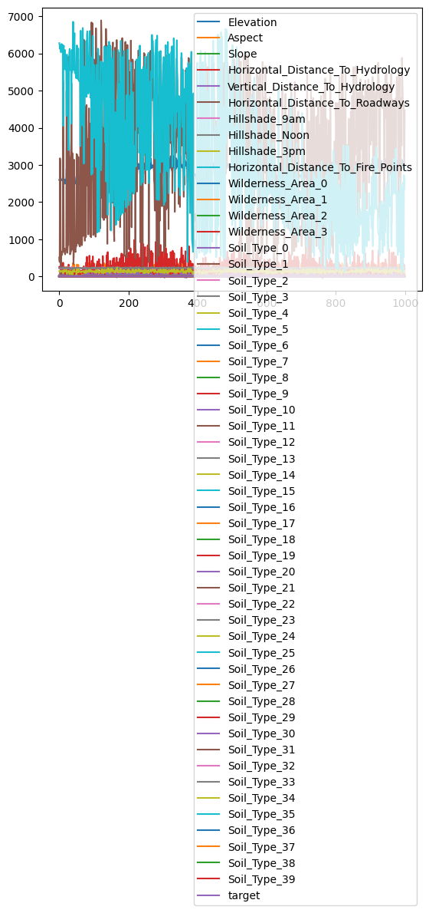

## fetch_convtype


```python
from sklearn.datasets import fetch_covtype
import pandas as pd
import seaborn as sns
%matplotlib inline
```

    /home/ubuntu/.local/lib/python3.10/site-packages/numpy/_core/getlimits.py:551: UserWarning: Signature b'\x00\xd0\xcc\xcc\xcc\xcc\xcc\xcc\xfb\xbf\x00\x00\x00\x00\x00\x00' for <class 'numpy.longdouble'> does not match any known type: falling back to type probe function.
    This warnings indicates broken support for the dtype!
      machar = _get_machar(dtype)


```python
data = fetch_covtype()
```


```python
print(type(data))
```

    <class 'sklearn.utils._bunch.Bunch'>


```python
print(data.DESCR)
```

    .. _covtype_dataset:
    
    Forest covertypes
    -----------------
    
    The samples in this dataset correspond to 30×30m patches of forest in the US,
    collected for the task of predicting each patch's cover type,
    i.e. the dominant species of tree.
    There are seven covertypes, making this a multiclass classification problem.
    Each sample has 54 features, described on the
    `dataset's homepage <https://archive.ics.uci.edu/ml/datasets/Covertype>`__.
    Some of the features are boolean indicators,
    while others are discrete or continuous measurements.
    
    **Data Set Characteristics:**
    
    =================   ============
    Classes                        7
    Samples total             581012
    Dimensionality                54
    Features                     int
    =================   ============
    
    :func:`sklearn.datasets.fetch_covtype` will load the covertype dataset;
    it returns a dictionary-like 'Bunch' object
    with the feature matrix in the ``data`` member
    and the target values in ``target``. If optional argument 'as_frame' is
    set to 'True', it will return ``data`` and ``target`` as pandas
    data frame, and there will be an additional member ``frame`` as well.
    The dataset will be downloaded from the web if necessary.
    


```python
print(data.keys())
```

    dict_keys(['data', 'target', 'frame', 'target_names', 'feature_names', 'DESCR'])


```python
df = pd.DataFrame(data=data.data, columns=data.feature_names)
df['target'] = data.target
```


```python
df.head()
```


<div>
<style scoped>
    .dataframe tbody tr th:only-of-type {
        vertical-align: middle;
    }

    .dataframe tbody tr th {
        vertical-align: top;
    }

    .dataframe thead th {
        text-align: right;
    }
</style>
<table border="1" class="dataframe">
  <thead>
    <tr style="text-align: right;">
      <th></th>
      <th>Elevation</th>
      <th>Aspect</th>
      <th>Slope</th>
      <th>Horizontal_Distance_To_Hydrology</th>
      <th>Vertical_Distance_To_Hydrology</th>
      <th>Horizontal_Distance_To_Roadways</th>
      <th>Hillshade_9am</th>
      <th>Hillshade_Noon</th>
      <th>Hillshade_3pm</th>
      <th>Horizontal_Distance_To_Fire_Points</th>
      <th>...</th>
      <th>Soil_Type_31</th>
      <th>Soil_Type_32</th>
      <th>Soil_Type_33</th>
      <th>Soil_Type_34</th>
      <th>Soil_Type_35</th>
      <th>Soil_Type_36</th>
      <th>Soil_Type_37</th>
      <th>Soil_Type_38</th>
      <th>Soil_Type_39</th>
      <th>target</th>
    </tr>
  </thead>
  <tbody>
    <tr>
      <th>0</th>
      <td>2596.0</td>
      <td>51.0</td>
      <td>3.0</td>
      <td>258.0</td>
      <td>0.0</td>
      <td>510.0</td>
      <td>221.0</td>
      <td>232.0</td>
      <td>148.0</td>
      <td>6279.0</td>
      <td>...</td>
      <td>0.0</td>
      <td>0.0</td>
      <td>0.0</td>
      <td>0.0</td>
      <td>0.0</td>
      <td>0.0</td>
      <td>0.0</td>
      <td>0.0</td>
      <td>0.0</td>
      <td>5</td>
    </tr>
    <tr>
      <th>1</th>
      <td>2590.0</td>
      <td>56.0</td>
      <td>2.0</td>
      <td>212.0</td>
      <td>-6.0</td>
      <td>390.0</td>
      <td>220.0</td>
      <td>235.0</td>
      <td>151.0</td>
      <td>6225.0</td>
      <td>...</td>
      <td>0.0</td>
      <td>0.0</td>
      <td>0.0</td>
      <td>0.0</td>
      <td>0.0</td>
      <td>0.0</td>
      <td>0.0</td>
      <td>0.0</td>
      <td>0.0</td>
      <td>5</td>
    </tr>
    <tr>
      <th>2</th>
      <td>2804.0</td>
      <td>139.0</td>
      <td>9.0</td>
      <td>268.0</td>
      <td>65.0</td>
      <td>3180.0</td>
      <td>234.0</td>
      <td>238.0</td>
      <td>135.0</td>
      <td>6121.0</td>
      <td>...</td>
      <td>0.0</td>
      <td>0.0</td>
      <td>0.0</td>
      <td>0.0</td>
      <td>0.0</td>
      <td>0.0</td>
      <td>0.0</td>
      <td>0.0</td>
      <td>0.0</td>
      <td>2</td>
    </tr>
    <tr>
      <th>3</th>
      <td>2785.0</td>
      <td>155.0</td>
      <td>18.0</td>
      <td>242.0</td>
      <td>118.0</td>
      <td>3090.0</td>
      <td>238.0</td>
      <td>238.0</td>
      <td>122.0</td>
      <td>6211.0</td>
      <td>...</td>
      <td>0.0</td>
      <td>0.0</td>
      <td>0.0</td>
      <td>0.0</td>
      <td>0.0</td>
      <td>0.0</td>
      <td>0.0</td>
      <td>0.0</td>
      <td>0.0</td>
      <td>2</td>
    </tr>
    <tr>
      <th>4</th>
      <td>2595.0</td>
      <td>45.0</td>
      <td>2.0</td>
      <td>153.0</td>
      <td>-1.0</td>
      <td>391.0</td>
      <td>220.0</td>
      <td>234.0</td>
      <td>150.0</td>
      <td>6172.0</td>
      <td>...</td>
      <td>0.0</td>
      <td>0.0</td>
      <td>0.0</td>
      <td>0.0</td>
      <td>0.0</td>
      <td>0.0</td>
      <td>0.0</td>
      <td>0.0</td>
      <td>0.0</td>
      <td>5</td>
    </tr>
  </tbody>
</table>
<p>5 rows × 55 columns</p>
</div>


```python
df.tail()
```


<div>
<style scoped>
    .dataframe tbody tr th:only-of-type {
        vertical-align: middle;
    }

    .dataframe tbody tr th {
        vertical-align: top;
    }

    .dataframe thead th {
        text-align: right;
    }
</style>
<table border="1" class="dataframe">
  <thead>
    <tr style="text-align: right;">
      <th></th>
      <th>Elevation</th>
      <th>Aspect</th>
      <th>Slope</th>
      <th>Horizontal_Distance_To_Hydrology</th>
      <th>Vertical_Distance_To_Hydrology</th>
      <th>Horizontal_Distance_To_Roadways</th>
      <th>Hillshade_9am</th>
      <th>Hillshade_Noon</th>
      <th>Hillshade_3pm</th>
      <th>Horizontal_Distance_To_Fire_Points</th>
      <th>...</th>
      <th>Soil_Type_31</th>
      <th>Soil_Type_32</th>
      <th>Soil_Type_33</th>
      <th>Soil_Type_34</th>
      <th>Soil_Type_35</th>
      <th>Soil_Type_36</th>
      <th>Soil_Type_37</th>
      <th>Soil_Type_38</th>
      <th>Soil_Type_39</th>
      <th>target</th>
    </tr>
  </thead>
  <tbody>
    <tr>
      <th>581007</th>
      <td>2396.0</td>
      <td>153.0</td>
      <td>20.0</td>
      <td>85.0</td>
      <td>17.0</td>
      <td>108.0</td>
      <td>240.0</td>
      <td>237.0</td>
      <td>118.0</td>
      <td>837.0</td>
      <td>...</td>
      <td>0.0</td>
      <td>0.0</td>
      <td>0.0</td>
      <td>0.0</td>
      <td>0.0</td>
      <td>0.0</td>
      <td>0.0</td>
      <td>0.0</td>
      <td>0.0</td>
      <td>3</td>
    </tr>
    <tr>
      <th>581008</th>
      <td>2391.0</td>
      <td>152.0</td>
      <td>19.0</td>
      <td>67.0</td>
      <td>12.0</td>
      <td>95.0</td>
      <td>240.0</td>
      <td>237.0</td>
      <td>119.0</td>
      <td>845.0</td>
      <td>...</td>
      <td>0.0</td>
      <td>0.0</td>
      <td>0.0</td>
      <td>0.0</td>
      <td>0.0</td>
      <td>0.0</td>
      <td>0.0</td>
      <td>0.0</td>
      <td>0.0</td>
      <td>3</td>
    </tr>
    <tr>
      <th>581009</th>
      <td>2386.0</td>
      <td>159.0</td>
      <td>17.0</td>
      <td>60.0</td>
      <td>7.0</td>
      <td>90.0</td>
      <td>236.0</td>
      <td>241.0</td>
      <td>130.0</td>
      <td>854.0</td>
      <td>...</td>
      <td>0.0</td>
      <td>0.0</td>
      <td>0.0</td>
      <td>0.0</td>
      <td>0.0</td>
      <td>0.0</td>
      <td>0.0</td>
      <td>0.0</td>
      <td>0.0</td>
      <td>3</td>
    </tr>
    <tr>
      <th>581010</th>
      <td>2384.0</td>
      <td>170.0</td>
      <td>15.0</td>
      <td>60.0</td>
      <td>5.0</td>
      <td>90.0</td>
      <td>230.0</td>
      <td>245.0</td>
      <td>143.0</td>
      <td>864.0</td>
      <td>...</td>
      <td>0.0</td>
      <td>0.0</td>
      <td>0.0</td>
      <td>0.0</td>
      <td>0.0</td>
      <td>0.0</td>
      <td>0.0</td>
      <td>0.0</td>
      <td>0.0</td>
      <td>3</td>
    </tr>
    <tr>
      <th>581011</th>
      <td>2383.0</td>
      <td>165.0</td>
      <td>13.0</td>
      <td>60.0</td>
      <td>4.0</td>
      <td>67.0</td>
      <td>231.0</td>
      <td>244.0</td>
      <td>141.0</td>
      <td>875.0</td>
      <td>...</td>
      <td>0.0</td>
      <td>0.0</td>
      <td>0.0</td>
      <td>0.0</td>
      <td>0.0</td>
      <td>0.0</td>
      <td>0.0</td>
      <td>0.0</td>
      <td>0.0</td>
      <td>3</td>
    </tr>
  </tbody>
</table>
<p>5 rows × 55 columns</p>
</div>


```python
df.describe()
```


<div>
<style scoped>
    .dataframe tbody tr th:only-of-type {
        vertical-align: middle;
    }

    .dataframe tbody tr th {
        vertical-align: top;
    }

    .dataframe thead th {
        text-align: right;
    }
</style>
<table border="1" class="dataframe">
  <thead>
    <tr style="text-align: right;">
      <th></th>
      <th>Elevation</th>
      <th>Aspect</th>
      <th>Slope</th>
      <th>Horizontal_Distance_To_Hydrology</th>
      <th>Vertical_Distance_To_Hydrology</th>
      <th>Horizontal_Distance_To_Roadways</th>
      <th>Hillshade_9am</th>
      <th>Hillshade_Noon</th>
      <th>Hillshade_3pm</th>
      <th>Horizontal_Distance_To_Fire_Points</th>
      <th>...</th>
      <th>Soil_Type_31</th>
      <th>Soil_Type_32</th>
      <th>Soil_Type_33</th>
      <th>Soil_Type_34</th>
      <th>Soil_Type_35</th>
      <th>Soil_Type_36</th>
      <th>Soil_Type_37</th>
      <th>Soil_Type_38</th>
      <th>Soil_Type_39</th>
      <th>target</th>
    </tr>
  </thead>
  <tbody>
    <tr>
      <th>count</th>
      <td>581012.000000</td>
      <td>581012.000000</td>
      <td>581012.000000</td>
      <td>581012.000000</td>
      <td>581012.000000</td>
      <td>581012.000000</td>
      <td>581012.000000</td>
      <td>581012.000000</td>
      <td>581012.000000</td>
      <td>581012.000000</td>
      <td>...</td>
      <td>581012.000000</td>
      <td>581012.000000</td>
      <td>581012.000000</td>
      <td>581012.000000</td>
      <td>581012.000000</td>
      <td>581012.000000</td>
      <td>581012.000000</td>
      <td>581012.000000</td>
      <td>581012.000000</td>
      <td>581012.000000</td>
    </tr>
    <tr>
      <th>mean</th>
      <td>2959.365301</td>
      <td>155.656807</td>
      <td>14.103704</td>
      <td>269.428217</td>
      <td>46.418855</td>
      <td>2350.146611</td>
      <td>212.146049</td>
      <td>223.318716</td>
      <td>142.528263</td>
      <td>1980.291226</td>
      <td>...</td>
      <td>0.090392</td>
      <td>0.077716</td>
      <td>0.002773</td>
      <td>0.003255</td>
      <td>0.000205</td>
      <td>0.000513</td>
      <td>0.026803</td>
      <td>0.023762</td>
      <td>0.015060</td>
      <td>2.051471</td>
    </tr>
    <tr>
      <th>std</th>
      <td>279.984734</td>
      <td>111.913721</td>
      <td>7.488242</td>
      <td>212.549356</td>
      <td>58.295232</td>
      <td>1559.254870</td>
      <td>26.769889</td>
      <td>19.768697</td>
      <td>38.274529</td>
      <td>1324.195210</td>
      <td>...</td>
      <td>0.286743</td>
      <td>0.267725</td>
      <td>0.052584</td>
      <td>0.056957</td>
      <td>0.014310</td>
      <td>0.022641</td>
      <td>0.161508</td>
      <td>0.152307</td>
      <td>0.121791</td>
      <td>1.396504</td>
    </tr>
    <tr>
      <th>min</th>
      <td>1859.000000</td>
      <td>0.000000</td>
      <td>0.000000</td>
      <td>0.000000</td>
      <td>-173.000000</td>
      <td>0.000000</td>
      <td>0.000000</td>
      <td>0.000000</td>
      <td>0.000000</td>
      <td>0.000000</td>
      <td>...</td>
      <td>0.000000</td>
      <td>0.000000</td>
      <td>0.000000</td>
      <td>0.000000</td>
      <td>0.000000</td>
      <td>0.000000</td>
      <td>0.000000</td>
      <td>0.000000</td>
      <td>0.000000</td>
      <td>1.000000</td>
    </tr>
    <tr>
      <th>25%</th>
      <td>2809.000000</td>
      <td>58.000000</td>
      <td>9.000000</td>
      <td>108.000000</td>
      <td>7.000000</td>
      <td>1106.000000</td>
      <td>198.000000</td>
      <td>213.000000</td>
      <td>119.000000</td>
      <td>1024.000000</td>
      <td>...</td>
      <td>0.000000</td>
      <td>0.000000</td>
      <td>0.000000</td>
      <td>0.000000</td>
      <td>0.000000</td>
      <td>0.000000</td>
      <td>0.000000</td>
      <td>0.000000</td>
      <td>0.000000</td>
      <td>1.000000</td>
    </tr>
    <tr>
      <th>50%</th>
      <td>2996.000000</td>
      <td>127.000000</td>
      <td>13.000000</td>
      <td>218.000000</td>
      <td>30.000000</td>
      <td>1997.000000</td>
      <td>218.000000</td>
      <td>226.000000</td>
      <td>143.000000</td>
      <td>1710.000000</td>
      <td>...</td>
      <td>0.000000</td>
      <td>0.000000</td>
      <td>0.000000</td>
      <td>0.000000</td>
      <td>0.000000</td>
      <td>0.000000</td>
      <td>0.000000</td>
      <td>0.000000</td>
      <td>0.000000</td>
      <td>2.000000</td>
    </tr>
    <tr>
      <th>75%</th>
      <td>3163.000000</td>
      <td>260.000000</td>
      <td>18.000000</td>
      <td>384.000000</td>
      <td>69.000000</td>
      <td>3328.000000</td>
      <td>231.000000</td>
      <td>237.000000</td>
      <td>168.000000</td>
      <td>2550.000000</td>
      <td>...</td>
      <td>0.000000</td>
      <td>0.000000</td>
      <td>0.000000</td>
      <td>0.000000</td>
      <td>0.000000</td>
      <td>0.000000</td>
      <td>0.000000</td>
      <td>0.000000</td>
      <td>0.000000</td>
      <td>2.000000</td>
    </tr>
    <tr>
      <th>max</th>
      <td>3858.000000</td>
      <td>360.000000</td>
      <td>66.000000</td>
      <td>1397.000000</td>
      <td>601.000000</td>
      <td>7117.000000</td>
      <td>254.000000</td>
      <td>254.000000</td>
      <td>254.000000</td>
      <td>7173.000000</td>
      <td>...</td>
      <td>1.000000</td>
      <td>1.000000</td>
      <td>1.000000</td>
      <td>1.000000</td>
      <td>1.000000</td>
      <td>1.000000</td>
      <td>1.000000</td>
      <td>1.000000</td>
      <td>1.000000</td>
      <td>7.000000</td>
    </tr>
  </tbody>
</table>
<p>8 rows × 55 columns</p>
</div>


```python
df.info()
```

    <class 'pandas.core.frame.DataFrame'>
    RangeIndex: 581012 entries, 0 to 581011
    Data columns (total 55 columns):
     #   Column                              Non-Null Count   Dtype  
    ---  ------                              --------------   -----  
     0   Elevation                           581012 non-null  float64
     1   Aspect                              581012 non-null  float64
     2   Slope                               581012 non-null  float64
     3   Horizontal_Distance_To_Hydrology    581012 non-null  float64
     4   Vertical_Distance_To_Hydrology      581012 non-null  float64
     5   Horizontal_Distance_To_Roadways     581012 non-null  float64
     6   Hillshade_9am                       581012 non-null  float64
     7   Hillshade_Noon                      581012 non-null  float64
     8   Hillshade_3pm                       581012 non-null  float64
     9   Horizontal_Distance_To_Fire_Points  581012 non-null  float64
     10  Wilderness_Area_0                   581012 non-null  float64
     11  Wilderness_Area_1                   581012 non-null  float64
     12  Wilderness_Area_2                   581012 non-null  float64
     13  Wilderness_Area_3                   581012 non-null  float64
     14  Soil_Type_0                         581012 non-null  float64
     15  Soil_Type_1                         581012 non-null  float64
     16  Soil_Type_2                         581012 non-null  float64
     17  Soil_Type_3                         581012 non-null  float64
     18  Soil_Type_4                         581012 non-null  float64
     19  Soil_Type_5                         581012 non-null  float64
     20  Soil_Type_6                         581012 non-null  float64
     21  Soil_Type_7                         581012 non-null  float64
     22  Soil_Type_8                         581012 non-null  float64
     23  Soil_Type_9                         581012 non-null  float64
     24  Soil_Type_10                        581012 non-null  float64
     25  Soil_Type_11                        581012 non-null  float64
     26  Soil_Type_12                        581012 non-null  float64
     27  Soil_Type_13                        581012 non-null  float64
     28  Soil_Type_14                        581012 non-null  float64
     29  Soil_Type_15                        581012 non-null  float64
     30  Soil_Type_16                        581012 non-null  float64
     31  Soil_Type_17                        581012 non-null  float64
     32  Soil_Type_18                        581012 non-null  float64
     33  Soil_Type_19                        581012 non-null  float64
     34  Soil_Type_20                        581012 non-null  float64
     35  Soil_Type_21                        581012 non-null  float64
     36  Soil_Type_22                        581012 non-null  float64
     37  Soil_Type_23                        581012 non-null  float64
     38  Soil_Type_24                        581012 non-null  float64
     39  Soil_Type_25                        581012 non-null  float64
     40  Soil_Type_26                        581012 non-null  float64
     41  Soil_Type_27                        581012 non-null  float64
     42  Soil_Type_28                        581012 non-null  float64
     43  Soil_Type_29                        581012 non-null  float64
     44  Soil_Type_30                        581012 non-null  float64
     45  Soil_Type_31                        581012 non-null  float64
     46  Soil_Type_32                        581012 non-null  float64
     47  Soil_Type_33                        581012 non-null  float64
     48  Soil_Type_34                        581012 non-null  float64
     49  Soil_Type_35                        581012 non-null  float64
     50  Soil_Type_36                        581012 non-null  float64
     51  Soil_Type_37                        581012 non-null  float64
     52  Soil_Type_38                        581012 non-null  float64
     53  Soil_Type_39                        581012 non-null  float64
     54  target                              581012 non-null  int32  
    dtypes: float64(54), int32(1)
    memory usage: 241.6 MB


```python
print(df.isnull().sum())
```

    Elevation                             0
    Aspect                                0
    Slope                                 0
    Horizontal_Distance_To_Hydrology      0
    Vertical_Distance_To_Hydrology        0
    Horizontal_Distance_To_Roadways       0
    Hillshade_9am                         0
    Hillshade_Noon                        0
    Hillshade_3pm                         0
    Horizontal_Distance_To_Fire_Points    0
    Wilderness_Area_0                     0
    Wilderness_Area_1                     0
    Wilderness_Area_2                     0
    Wilderness_Area_3                     0
    Soil_Type_0                           0
    Soil_Type_1                           0
    Soil_Type_2                           0
    Soil_Type_3                           0
    Soil_Type_4                           0
    Soil_Type_5                           0
    Soil_Type_6                           0
    Soil_Type_7                           0
    Soil_Type_8                           0
    Soil_Type_9                           0
    Soil_Type_10                          0
    Soil_Type_11                          0
    Soil_Type_12                          0
    Soil_Type_13                          0
    Soil_Type_14                          0
    Soil_Type_15                          0
    Soil_Type_16                          0
    Soil_Type_17                          0
    Soil_Type_18                          0
    Soil_Type_19                          0
    Soil_Type_20                          0
    Soil_Type_21                          0
    Soil_Type_22                          0
    Soil_Type_23                          0
    Soil_Type_24                          0
    Soil_Type_25                          0
    Soil_Type_26                          0
    Soil_Type_27                          0
    Soil_Type_28                          0
    Soil_Type_29                          0
    Soil_Type_30                          0
    Soil_Type_31                          0
    Soil_Type_32                          0
    Soil_Type_33                          0
    Soil_Type_34                          0
    Soil_Type_35                          0
    Soil_Type_36                          0
    Soil_Type_37                          0
    Soil_Type_38                          0
    Soil_Type_39                          0
    target                                0
    dtype: int64


```python
df[:1000].plot()
```


    <Axes: >


    

    


```python
import torch
import torch.nn as nn
import torch.nn.functional as F
import torch.optim as optim
import torch.utils.data as data_utils
```


```python
class CovTypeModel(nn.Module):
    def __init__(self, input_size, output_size):
        super(CovTypeModel, self).__init__()
        self.model = nn.Sequential(
            nn.Linear(input_size, 128),
            nn.ReLU(),
            nn.Linear(128, output_size)
        )
        
    def forward(self, x):
        output = self.model(x)
        with torch.no_grad():
            value = torch.argmax(output, dim=1)
        return output, value        
```


```python
X = torch.Tensor(data.data)
y = torch.LongTensor(data.target)
```


```python
import numpy as np
from sklearn.model_selection import train_test_split

X_train, X_test, y_train, y_test = train_test_split(X, y, test_size=0.2) # train과 test를 8:2로 분할
```


```python
model = CovTypeModel(54, 7)
```


```python
with torch.no_grad():
    y, _ = model(torch.unsqueeze(X_train[0], dim=0))
    print(y)
    print(y.sum())
    print(np.argmax(y), y_train[0]-1)
```

    tensor([[ -0.9897, 113.4391,  82.0996,  64.2678, 307.4230,  51.4260,  80.9597]])
    tensor(698.6254)
    tensor(4) tensor(1)


```python
optimizer = torch.optim.Adam(model.parameters(), lr=0.001)
```


```python
print(model)
```

    CovTypeModel(
      (model): Sequential(
        (0): Linear(in_features=54, out_features=128, bias=True)
        (1): ReLU()
        (2): Linear(in_features=128, out_features=7, bias=True)
      )
    )

