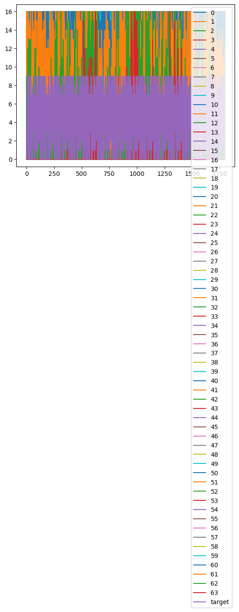
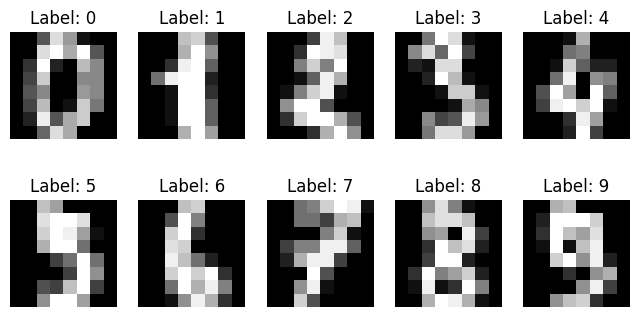
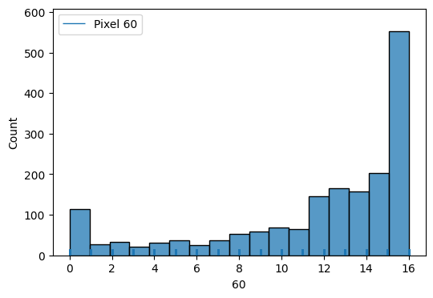
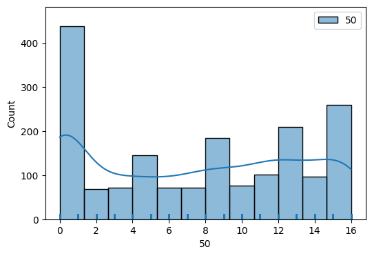
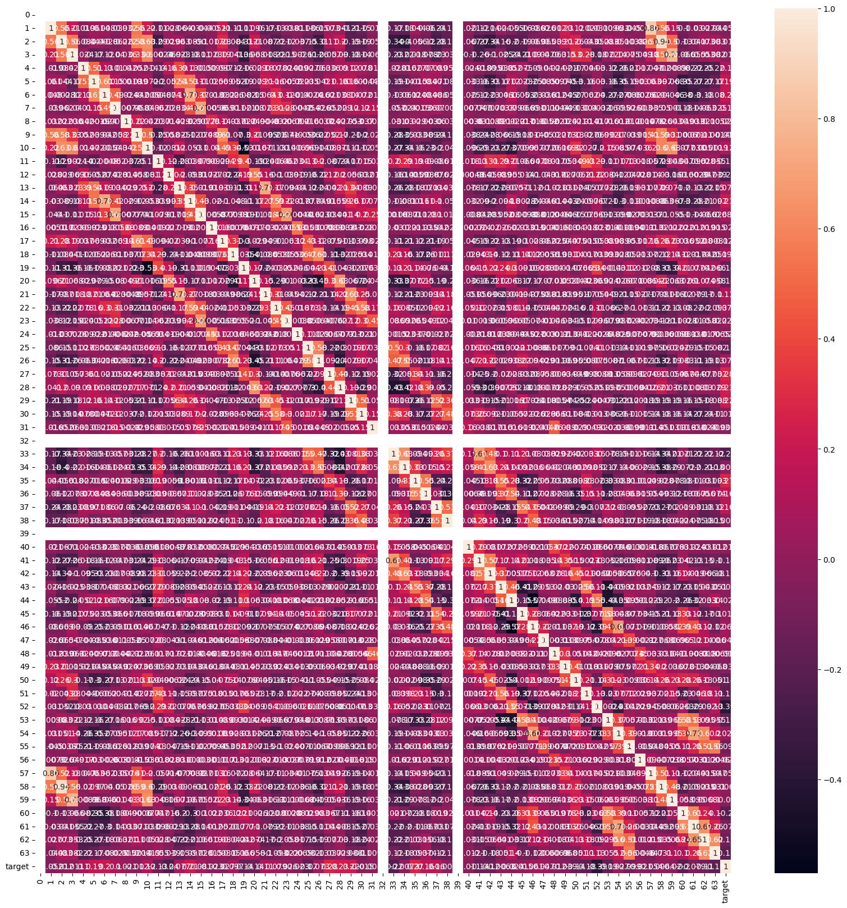
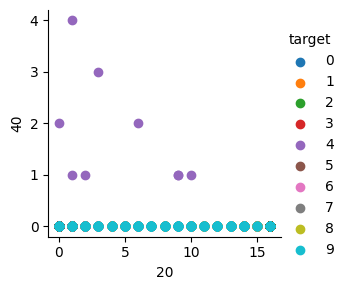
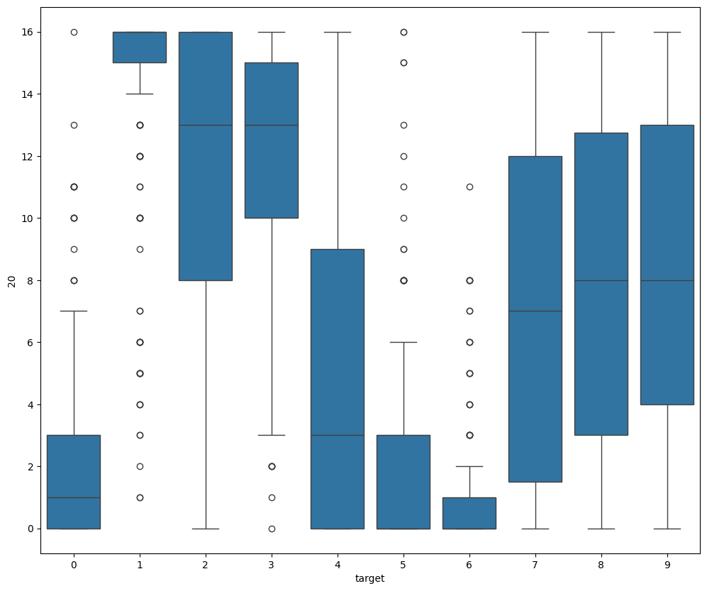
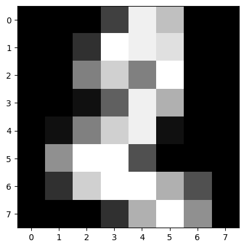

```python
import sklearn.datasets
import numpy as np
import pandas as pd
import seaborn as sns
from matplotlib import pyplot as plt
%matplotlib inline
```

    /home/ubuntu/.local/lib/python3.10/site-packages/numpy/_core/getlimits.py:551: UserWarning: Signature b'\x00\xd0\xcc\xcc\xcc\xcc\xcc\xcc\xfb\xbf\x00\x00\x00\x00\x00\x00' for <class 'numpy.longdouble'> does not match any known type: falling back to type probe function.
    This warnings indicates broken support for the dtype!
      machar = _get_machar(dtype)


```python
data = sklearn.datasets.load_digits()
```


```python
print(data.keys())
for f in data.keys():
    t = type(data[f])
    print('key: {}, type: {}'.format(f, t))
    if isinstance(data[f], np.ndarray):
        print('shape: {}'.format(data[f].shape))
```

    dict_keys(['data', 'target', 'frame', 'feature_names', 'target_names', 'images', 'DESCR'])
    key: data, type: <class 'numpy.ndarray'>
    shape: (1797, 64)
    key: target, type: <class 'numpy.ndarray'>
    shape: (1797,)
    key: frame, type: <class 'NoneType'>
    key: feature_names, type: <class 'list'>
    key: target_names, type: <class 'numpy.ndarray'>
    shape: (10,)
    key: images, type: <class 'numpy.ndarray'>
    shape: (1797, 8, 8)
    key: DESCR, type: <class 'str'>


```python
df = pd.DataFrame(data=data.data)
df['target'] = data.target
```


```python
df.head()
```


<div>
<style scoped>
    .dataframe tbody tr th:only-of-type {
        vertical-align: middle;
    }

    .dataframe tbody tr th {
        vertical-align: top;
    }

    .dataframe thead th {
        text-align: right;
    }
</style>
<table border="1" class="dataframe">
  <thead>
    <tr style="text-align: right;">
      <th></th>
      <th>0</th>
      <th>1</th>
      <th>2</th>
      <th>3</th>
      <th>4</th>
      <th>5</th>
      <th>6</th>
      <th>7</th>
      <th>8</th>
      <th>9</th>
      <th>...</th>
      <th>55</th>
      <th>56</th>
      <th>57</th>
      <th>58</th>
      <th>59</th>
      <th>60</th>
      <th>61</th>
      <th>62</th>
      <th>63</th>
      <th>target</th>
    </tr>
  </thead>
  <tbody>
    <tr>
      <th>0</th>
      <td>0.0</td>
      <td>0.0</td>
      <td>5.0</td>
      <td>13.0</td>
      <td>9.0</td>
      <td>1.0</td>
      <td>0.0</td>
      <td>0.0</td>
      <td>0.0</td>
      <td>0.0</td>
      <td>...</td>
      <td>0.0</td>
      <td>0.0</td>
      <td>0.0</td>
      <td>6.0</td>
      <td>13.0</td>
      <td>10.0</td>
      <td>0.0</td>
      <td>0.0</td>
      <td>0.0</td>
      <td>0</td>
    </tr>
    <tr>
      <th>1</th>
      <td>0.0</td>
      <td>0.0</td>
      <td>0.0</td>
      <td>12.0</td>
      <td>13.0</td>
      <td>5.0</td>
      <td>0.0</td>
      <td>0.0</td>
      <td>0.0</td>
      <td>0.0</td>
      <td>...</td>
      <td>0.0</td>
      <td>0.0</td>
      <td>0.0</td>
      <td>0.0</td>
      <td>11.0</td>
      <td>16.0</td>
      <td>10.0</td>
      <td>0.0</td>
      <td>0.0</td>
      <td>1</td>
    </tr>
    <tr>
      <th>2</th>
      <td>0.0</td>
      <td>0.0</td>
      <td>0.0</td>
      <td>4.0</td>
      <td>15.0</td>
      <td>12.0</td>
      <td>0.0</td>
      <td>0.0</td>
      <td>0.0</td>
      <td>0.0</td>
      <td>...</td>
      <td>0.0</td>
      <td>0.0</td>
      <td>0.0</td>
      <td>0.0</td>
      <td>3.0</td>
      <td>11.0</td>
      <td>16.0</td>
      <td>9.0</td>
      <td>0.0</td>
      <td>2</td>
    </tr>
    <tr>
      <th>3</th>
      <td>0.0</td>
      <td>0.0</td>
      <td>7.0</td>
      <td>15.0</td>
      <td>13.0</td>
      <td>1.0</td>
      <td>0.0</td>
      <td>0.0</td>
      <td>0.0</td>
      <td>8.0</td>
      <td>...</td>
      <td>0.0</td>
      <td>0.0</td>
      <td>0.0</td>
      <td>7.0</td>
      <td>13.0</td>
      <td>13.0</td>
      <td>9.0</td>
      <td>0.0</td>
      <td>0.0</td>
      <td>3</td>
    </tr>
    <tr>
      <th>4</th>
      <td>0.0</td>
      <td>0.0</td>
      <td>0.0</td>
      <td>1.0</td>
      <td>11.0</td>
      <td>0.0</td>
      <td>0.0</td>
      <td>0.0</td>
      <td>0.0</td>
      <td>0.0</td>
      <td>...</td>
      <td>0.0</td>
      <td>0.0</td>
      <td>0.0</td>
      <td>0.0</td>
      <td>2.0</td>
      <td>16.0</td>
      <td>4.0</td>
      <td>0.0</td>
      <td>0.0</td>
      <td>4</td>
    </tr>
  </tbody>
</table>
<p>5 rows × 65 columns</p>
</div>


```python
df.tail()
```


<div>
<style scoped>
    .dataframe tbody tr th:only-of-type {
        vertical-align: middle;
    }

    .dataframe tbody tr th {
        vertical-align: top;
    }

    .dataframe thead th {
        text-align: right;
    }
</style>
<table border="1" class="dataframe">
  <thead>
    <tr style="text-align: right;">
      <th></th>
      <th>0</th>
      <th>1</th>
      <th>2</th>
      <th>3</th>
      <th>4</th>
      <th>5</th>
      <th>6</th>
      <th>7</th>
      <th>8</th>
      <th>9</th>
      <th>...</th>
      <th>55</th>
      <th>56</th>
      <th>57</th>
      <th>58</th>
      <th>59</th>
      <th>60</th>
      <th>61</th>
      <th>62</th>
      <th>63</th>
      <th>target</th>
    </tr>
  </thead>
  <tbody>
    <tr>
      <th>1792</th>
      <td>0.0</td>
      <td>0.0</td>
      <td>4.0</td>
      <td>10.0</td>
      <td>13.0</td>
      <td>6.0</td>
      <td>0.0</td>
      <td>0.0</td>
      <td>0.0</td>
      <td>1.0</td>
      <td>...</td>
      <td>0.0</td>
      <td>0.0</td>
      <td>0.0</td>
      <td>2.0</td>
      <td>14.0</td>
      <td>15.0</td>
      <td>9.0</td>
      <td>0.0</td>
      <td>0.0</td>
      <td>9</td>
    </tr>
    <tr>
      <th>1793</th>
      <td>0.0</td>
      <td>0.0</td>
      <td>6.0</td>
      <td>16.0</td>
      <td>13.0</td>
      <td>11.0</td>
      <td>1.0</td>
      <td>0.0</td>
      <td>0.0</td>
      <td>0.0</td>
      <td>...</td>
      <td>0.0</td>
      <td>0.0</td>
      <td>0.0</td>
      <td>6.0</td>
      <td>16.0</td>
      <td>14.0</td>
      <td>6.0</td>
      <td>0.0</td>
      <td>0.0</td>
      <td>0</td>
    </tr>
    <tr>
      <th>1794</th>
      <td>0.0</td>
      <td>0.0</td>
      <td>1.0</td>
      <td>11.0</td>
      <td>15.0</td>
      <td>1.0</td>
      <td>0.0</td>
      <td>0.0</td>
      <td>0.0</td>
      <td>0.0</td>
      <td>...</td>
      <td>0.0</td>
      <td>0.0</td>
      <td>0.0</td>
      <td>2.0</td>
      <td>9.0</td>
      <td>13.0</td>
      <td>6.0</td>
      <td>0.0</td>
      <td>0.0</td>
      <td>8</td>
    </tr>
    <tr>
      <th>1795</th>
      <td>0.0</td>
      <td>0.0</td>
      <td>2.0</td>
      <td>10.0</td>
      <td>7.0</td>
      <td>0.0</td>
      <td>0.0</td>
      <td>0.0</td>
      <td>0.0</td>
      <td>0.0</td>
      <td>...</td>
      <td>0.0</td>
      <td>0.0</td>
      <td>0.0</td>
      <td>5.0</td>
      <td>12.0</td>
      <td>16.0</td>
      <td>12.0</td>
      <td>0.0</td>
      <td>0.0</td>
      <td>9</td>
    </tr>
    <tr>
      <th>1796</th>
      <td>0.0</td>
      <td>0.0</td>
      <td>10.0</td>
      <td>14.0</td>
      <td>8.0</td>
      <td>1.0</td>
      <td>0.0</td>
      <td>0.0</td>
      <td>0.0</td>
      <td>2.0</td>
      <td>...</td>
      <td>0.0</td>
      <td>0.0</td>
      <td>1.0</td>
      <td>8.0</td>
      <td>12.0</td>
      <td>14.0</td>
      <td>12.0</td>
      <td>1.0</td>
      <td>0.0</td>
      <td>8</td>
    </tr>
  </tbody>
</table>
<p>5 rows × 65 columns</p>
</div>


```python
df.describe()
```


<div>
<style scoped>
    .dataframe tbody tr th:only-of-type {
        vertical-align: middle;
    }

    .dataframe tbody tr th {
        vertical-align: top;
    }

    .dataframe thead th {
        text-align: right;
    }
</style>
<table border="1" class="dataframe">
  <thead>
    <tr style="text-align: right;">
      <th></th>
      <th>0</th>
      <th>1</th>
      <th>2</th>
      <th>3</th>
      <th>4</th>
      <th>5</th>
      <th>6</th>
      <th>7</th>
      <th>8</th>
      <th>9</th>
      <th>...</th>
      <th>55</th>
      <th>56</th>
      <th>57</th>
      <th>58</th>
      <th>59</th>
      <th>60</th>
      <th>61</th>
      <th>62</th>
      <th>63</th>
      <th>target</th>
    </tr>
  </thead>
  <tbody>
    <tr>
      <th>count</th>
      <td>1797.0</td>
      <td>1797.000000</td>
      <td>1797.000000</td>
      <td>1797.000000</td>
      <td>1797.000000</td>
      <td>1797.000000</td>
      <td>1797.000000</td>
      <td>1797.000000</td>
      <td>1797.000000</td>
      <td>1797.000000</td>
      <td>...</td>
      <td>1797.000000</td>
      <td>1797.000000</td>
      <td>1797.000000</td>
      <td>1797.000000</td>
      <td>1797.000000</td>
      <td>1797.000000</td>
      <td>1797.000000</td>
      <td>1797.000000</td>
      <td>1797.000000</td>
      <td>1797.000000</td>
    </tr>
    <tr>
      <th>mean</th>
      <td>0.0</td>
      <td>0.303840</td>
      <td>5.204786</td>
      <td>11.835838</td>
      <td>11.848080</td>
      <td>5.781859</td>
      <td>1.362270</td>
      <td>0.129661</td>
      <td>0.005565</td>
      <td>1.993879</td>
      <td>...</td>
      <td>0.206455</td>
      <td>0.000556</td>
      <td>0.279354</td>
      <td>5.557596</td>
      <td>12.089037</td>
      <td>11.809126</td>
      <td>6.764051</td>
      <td>2.067891</td>
      <td>0.364496</td>
      <td>4.490818</td>
    </tr>
    <tr>
      <th>std</th>
      <td>0.0</td>
      <td>0.907192</td>
      <td>4.754826</td>
      <td>4.248842</td>
      <td>4.287388</td>
      <td>5.666418</td>
      <td>3.325775</td>
      <td>1.037383</td>
      <td>0.094222</td>
      <td>3.196160</td>
      <td>...</td>
      <td>0.984401</td>
      <td>0.023590</td>
      <td>0.934302</td>
      <td>5.103019</td>
      <td>4.374694</td>
      <td>4.933947</td>
      <td>5.900623</td>
      <td>4.090548</td>
      <td>1.860122</td>
      <td>2.865304</td>
    </tr>
    <tr>
      <th>min</th>
      <td>0.0</td>
      <td>0.000000</td>
      <td>0.000000</td>
      <td>0.000000</td>
      <td>0.000000</td>
      <td>0.000000</td>
      <td>0.000000</td>
      <td>0.000000</td>
      <td>0.000000</td>
      <td>0.000000</td>
      <td>...</td>
      <td>0.000000</td>
      <td>0.000000</td>
      <td>0.000000</td>
      <td>0.000000</td>
      <td>0.000000</td>
      <td>0.000000</td>
      <td>0.000000</td>
      <td>0.000000</td>
      <td>0.000000</td>
      <td>0.000000</td>
    </tr>
    <tr>
      <th>25%</th>
      <td>0.0</td>
      <td>0.000000</td>
      <td>1.000000</td>
      <td>10.000000</td>
      <td>10.000000</td>
      <td>0.000000</td>
      <td>0.000000</td>
      <td>0.000000</td>
      <td>0.000000</td>
      <td>0.000000</td>
      <td>...</td>
      <td>0.000000</td>
      <td>0.000000</td>
      <td>0.000000</td>
      <td>1.000000</td>
      <td>11.000000</td>
      <td>10.000000</td>
      <td>0.000000</td>
      <td>0.000000</td>
      <td>0.000000</td>
      <td>2.000000</td>
    </tr>
    <tr>
      <th>50%</th>
      <td>0.0</td>
      <td>0.000000</td>
      <td>4.000000</td>
      <td>13.000000</td>
      <td>13.000000</td>
      <td>4.000000</td>
      <td>0.000000</td>
      <td>0.000000</td>
      <td>0.000000</td>
      <td>0.000000</td>
      <td>...</td>
      <td>0.000000</td>
      <td>0.000000</td>
      <td>0.000000</td>
      <td>4.000000</td>
      <td>13.000000</td>
      <td>14.000000</td>
      <td>6.000000</td>
      <td>0.000000</td>
      <td>0.000000</td>
      <td>4.000000</td>
    </tr>
    <tr>
      <th>75%</th>
      <td>0.0</td>
      <td>0.000000</td>
      <td>9.000000</td>
      <td>15.000000</td>
      <td>15.000000</td>
      <td>11.000000</td>
      <td>0.000000</td>
      <td>0.000000</td>
      <td>0.000000</td>
      <td>3.000000</td>
      <td>...</td>
      <td>0.000000</td>
      <td>0.000000</td>
      <td>0.000000</td>
      <td>10.000000</td>
      <td>16.000000</td>
      <td>16.000000</td>
      <td>12.000000</td>
      <td>2.000000</td>
      <td>0.000000</td>
      <td>7.000000</td>
    </tr>
    <tr>
      <th>max</th>
      <td>0.0</td>
      <td>8.000000</td>
      <td>16.000000</td>
      <td>16.000000</td>
      <td>16.000000</td>
      <td>16.000000</td>
      <td>16.000000</td>
      <td>15.000000</td>
      <td>2.000000</td>
      <td>16.000000</td>
      <td>...</td>
      <td>13.000000</td>
      <td>1.000000</td>
      <td>9.000000</td>
      <td>16.000000</td>
      <td>16.000000</td>
      <td>16.000000</td>
      <td>16.000000</td>
      <td>16.000000</td>
      <td>16.000000</td>
      <td>9.000000</td>
    </tr>
  </tbody>
</table>
<p>8 rows × 65 columns</p>
</div>


```python
df.info()
```

    <class 'pandas.core.frame.DataFrame'>
    RangeIndex: 1797 entries, 0 to 1796
    Data columns (total 65 columns):
     #   Column  Non-Null Count  Dtype  
    ---  ------  --------------  -----  
     0   0       1797 non-null   float64
     1   1       1797 non-null   float64
     2   2       1797 non-null   float64
     3   3       1797 non-null   float64
     4   4       1797 non-null   float64
     5   5       1797 non-null   float64
     6   6       1797 non-null   float64
     7   7       1797 non-null   float64
     8   8       1797 non-null   float64
     9   9       1797 non-null   float64
     10  10      1797 non-null   float64
     11  11      1797 non-null   float64
     12  12      1797 non-null   float64
     13  13      1797 non-null   float64
     14  14      1797 non-null   float64
     15  15      1797 non-null   float64
     16  16      1797 non-null   float64
     17  17      1797 non-null   float64
     18  18      1797 non-null   float64
     19  19      1797 non-null   float64
     20  20      1797 non-null   float64
     21  21      1797 non-null   float64
     22  22      1797 non-null   float64
     23  23      1797 non-null   float64
     24  24      1797 non-null   float64
     25  25      1797 non-null   float64
     26  26      1797 non-null   float64
     27  27      1797 non-null   float64
     28  28      1797 non-null   float64
     29  29      1797 non-null   float64
     30  30      1797 non-null   float64
     31  31      1797 non-null   float64
     32  32      1797 non-null   float64
     33  33      1797 non-null   float64
     34  34      1797 non-null   float64
     35  35      1797 non-null   float64
     36  36      1797 non-null   float64
     37  37      1797 non-null   float64
     38  38      1797 non-null   float64
     39  39      1797 non-null   float64
     40  40      1797 non-null   float64
     41  41      1797 non-null   float64
     42  42      1797 non-null   float64
     43  43      1797 non-null   float64
     44  44      1797 non-null   float64
     45  45      1797 non-null   float64
     46  46      1797 non-null   float64
     47  47      1797 non-null   float64
     48  48      1797 non-null   float64
     49  49      1797 non-null   float64
     50  50      1797 non-null   float64
     51  51      1797 non-null   float64
     52  52      1797 non-null   float64
     53  53      1797 non-null   float64
     54  54      1797 non-null   float64
     55  55      1797 non-null   float64
     56  56      1797 non-null   float64
     57  57      1797 non-null   float64
     58  58      1797 non-null   float64
     59  59      1797 non-null   float64
     60  60      1797 non-null   float64
     61  61      1797 non-null   float64
     62  62      1797 non-null   float64
     63  63      1797 non-null   float64
     64  target  1797 non-null   int64  
    dtypes: float64(64), int64(1)
    memory usage: 912.7 KB


```python
df.isnull().sum()
```


    0         0
    1         0
    2         0
    3         0
    4         0
             ..
    60        0
    61        0
    62        0
    63        0
    target    0
    Length: 65, dtype: int64


```python
df.plot()
```


    <Axes: >


    

    


```python
fig, axes = plt.subplots(2, 5, figsize=(8, 4))
for i, ax in enumerate(axes.flat):
    ax.imshow(data.images[i], cmap='gray', interpolation='nearest')
    ax.set_title(f"Label: {data.target[i]}")
    ax.axis('off')
plt.show()
```


    

    


```python
plt.figure(figsize=(6,4))
sns.histplot(df[60], kde=True)
sns.rugplot(df[60])
plt.legend(['Pixel 60'])
plt.show()
```


    

    


```python
plt.figure(figsize=(6, 4))
sns.histplot(df[50], kde=True, label="50")  # hist=True 기본
sns.rugplot(df[50])  # rug=True 대체
plt.legend()
plt.show()
```


    

    


```python
plt.figure(figsize=(20,20))
sns.heatmap(df.corr(),annot=True)
plt.show()
```


    

    


```python
sns.FacetGrid(df, hue='target') \
.map(plt.scatter, 20, 40) \
.add_legend()
plt.show()
```


    

    


```python
plt.figure(figsize=(12,10))
sns.boxplot(x='target', y=20,data=df)
```


    <Axes: xlabel='target', ylabel='20'>


    

    


```python
plt.imshow(data.data[2].reshape(8, 8), cmap='gray')
plt.show()
```


    

    


```python

```
