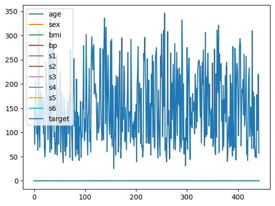
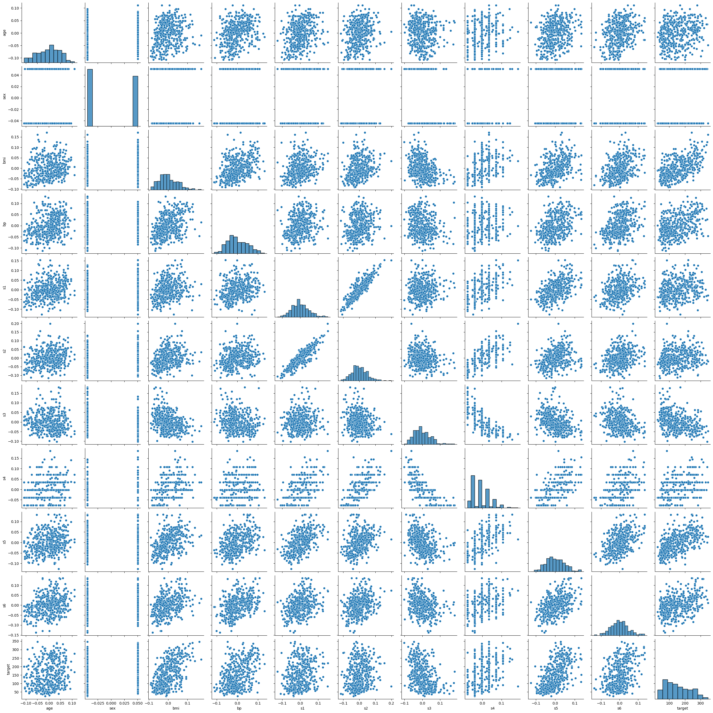
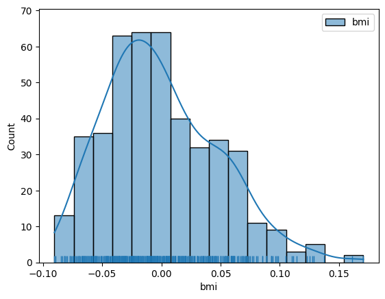
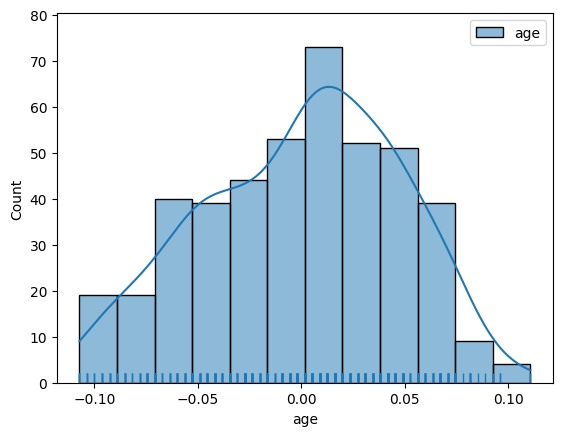
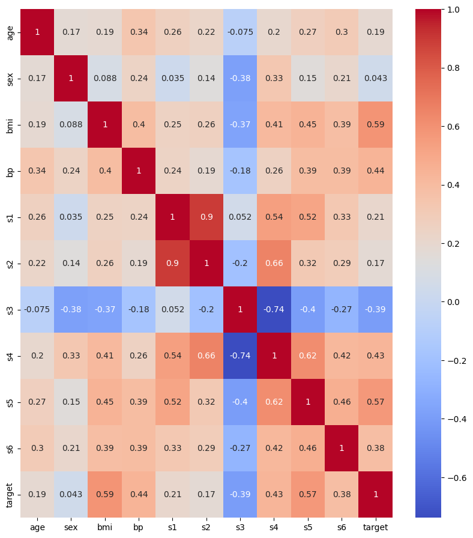
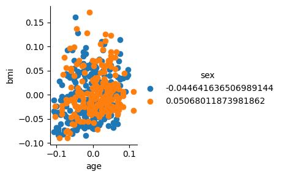
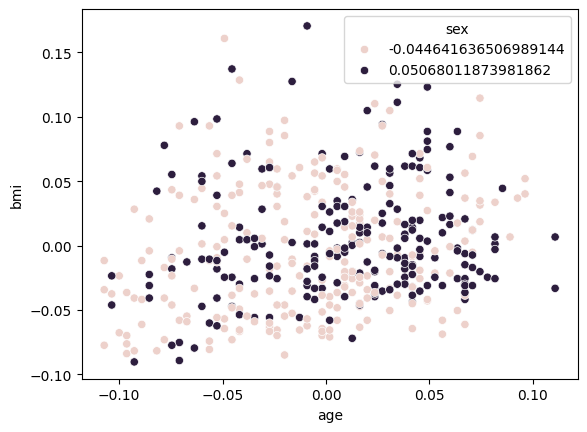
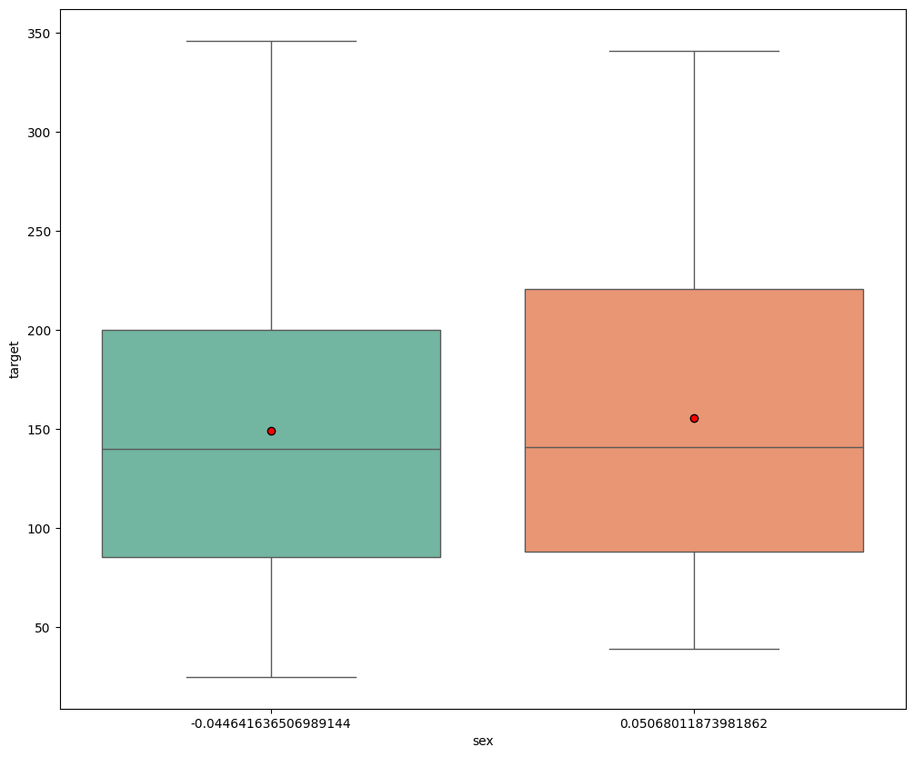

## load_diabetes

#### sklearn datasets를 모두 DataFrame으로 바꾸고 matplotlib과 seaborn을 이용하여 분석, 데이터를 탐색해보고 그래프를 그린다(load_diabetes)


```python
import sklearn.datasets
import numpy as np
import pandas as pd
import seaborn as sns
from matplotlib import pyplot as plt
%matplotlib inline
```

    /home/ubuntu/.local/lib/python3.10/site-packages/numpy/_core/getlimits.py:551: UserWarning: Signature b'\x00\xd0\xcc\xcc\xcc\xcc\xcc\xcc\xfb\xbf\x00\x00\x00\x00\x00\x00' for <class 'numpy.longdouble'> does not match any known type: falling back to type probe function.
    This warnings indicates broken support for the dtype!
      machar = _get_machar(dtype)


```python
data = sklearn.datasets.load_diabetes()
print(data.keys())
for f in data.keys():
    t = type(data[f])
    print('key: {}, type: {}'.format(f, t))
    if t == np.ndarray:
        print('shape: {}'.format(data[f].shape))
```

    dict_keys(['data', 'target', 'frame', 'DESCR', 'feature_names', 'data_filename', 'target_filename', 'data_module'])
    key: data, type: <class 'numpy.ndarray'>
    shape: (442, 10)
    key: target, type: <class 'numpy.ndarray'>
    shape: (442,)
    key: frame, type: <class 'NoneType'>
    key: DESCR, type: <class 'str'>
    key: feature_names, type: <class 'list'>
    key: data_filename, type: <class 'str'>
    key: target_filename, type: <class 'str'>
    key: data_module, type: <class 'str'>


```python
df = pd.DataFrame(data=data.data, columns=data.feature_names)
df['target'] = data.target
```


```python
df.head()
```


<div>
<style scoped>
    .dataframe tbody tr th:only-of-type {
        vertical-align: middle;
    }

    .dataframe tbody tr th {
        vertical-align: top;
    }

    .dataframe thead th {
        text-align: right;
    }
</style>
<table border="1" class="dataframe">
  <thead>
    <tr style="text-align: right;">
      <th></th>
      <th>age</th>
      <th>sex</th>
      <th>bmi</th>
      <th>bp</th>
      <th>s1</th>
      <th>s2</th>
      <th>s3</th>
      <th>s4</th>
      <th>s5</th>
      <th>s6</th>
      <th>target</th>
    </tr>
  </thead>
  <tbody>
    <tr>
      <th>0</th>
      <td>0.038076</td>
      <td>0.050680</td>
      <td>0.061696</td>
      <td>0.021872</td>
      <td>-0.044223</td>
      <td>-0.034821</td>
      <td>-0.043401</td>
      <td>-0.002592</td>
      <td>0.019907</td>
      <td>-0.017646</td>
      <td>151.0</td>
    </tr>
    <tr>
      <th>1</th>
      <td>-0.001882</td>
      <td>-0.044642</td>
      <td>-0.051474</td>
      <td>-0.026328</td>
      <td>-0.008449</td>
      <td>-0.019163</td>
      <td>0.074412</td>
      <td>-0.039493</td>
      <td>-0.068332</td>
      <td>-0.092204</td>
      <td>75.0</td>
    </tr>
    <tr>
      <th>2</th>
      <td>0.085299</td>
      <td>0.050680</td>
      <td>0.044451</td>
      <td>-0.005670</td>
      <td>-0.045599</td>
      <td>-0.034194</td>
      <td>-0.032356</td>
      <td>-0.002592</td>
      <td>0.002861</td>
      <td>-0.025930</td>
      <td>141.0</td>
    </tr>
    <tr>
      <th>3</th>
      <td>-0.089063</td>
      <td>-0.044642</td>
      <td>-0.011595</td>
      <td>-0.036656</td>
      <td>0.012191</td>
      <td>0.024991</td>
      <td>-0.036038</td>
      <td>0.034309</td>
      <td>0.022688</td>
      <td>-0.009362</td>
      <td>206.0</td>
    </tr>
    <tr>
      <th>4</th>
      <td>0.005383</td>
      <td>-0.044642</td>
      <td>-0.036385</td>
      <td>0.021872</td>
      <td>0.003935</td>
      <td>0.015596</td>
      <td>0.008142</td>
      <td>-0.002592</td>
      <td>-0.031988</td>
      <td>-0.046641</td>
      <td>135.0</td>
    </tr>
  </tbody>
</table>
</div>


```python
df.tail()
```


<div>
<style scoped>
    .dataframe tbody tr th:only-of-type {
        vertical-align: middle;
    }

    .dataframe tbody tr th {
        vertical-align: top;
    }

    .dataframe thead th {
        text-align: right;
    }
</style>
<table border="1" class="dataframe">
  <thead>
    <tr style="text-align: right;">
      <th></th>
      <th>age</th>
      <th>sex</th>
      <th>bmi</th>
      <th>bp</th>
      <th>s1</th>
      <th>s2</th>
      <th>s3</th>
      <th>s4</th>
      <th>s5</th>
      <th>s6</th>
      <th>target</th>
    </tr>
  </thead>
  <tbody>
    <tr>
      <th>437</th>
      <td>0.041708</td>
      <td>0.050680</td>
      <td>0.019662</td>
      <td>0.059744</td>
      <td>-0.005697</td>
      <td>-0.002566</td>
      <td>-0.028674</td>
      <td>-0.002592</td>
      <td>0.031193</td>
      <td>0.007207</td>
      <td>178.0</td>
    </tr>
    <tr>
      <th>438</th>
      <td>-0.005515</td>
      <td>0.050680</td>
      <td>-0.015906</td>
      <td>-0.067642</td>
      <td>0.049341</td>
      <td>0.079165</td>
      <td>-0.028674</td>
      <td>0.034309</td>
      <td>-0.018114</td>
      <td>0.044485</td>
      <td>104.0</td>
    </tr>
    <tr>
      <th>439</th>
      <td>0.041708</td>
      <td>0.050680</td>
      <td>-0.015906</td>
      <td>0.017293</td>
      <td>-0.037344</td>
      <td>-0.013840</td>
      <td>-0.024993</td>
      <td>-0.011080</td>
      <td>-0.046883</td>
      <td>0.015491</td>
      <td>132.0</td>
    </tr>
    <tr>
      <th>440</th>
      <td>-0.045472</td>
      <td>-0.044642</td>
      <td>0.039062</td>
      <td>0.001215</td>
      <td>0.016318</td>
      <td>0.015283</td>
      <td>-0.028674</td>
      <td>0.026560</td>
      <td>0.044529</td>
      <td>-0.025930</td>
      <td>220.0</td>
    </tr>
    <tr>
      <th>441</th>
      <td>-0.045472</td>
      <td>-0.044642</td>
      <td>-0.073030</td>
      <td>-0.081413</td>
      <td>0.083740</td>
      <td>0.027809</td>
      <td>0.173816</td>
      <td>-0.039493</td>
      <td>-0.004222</td>
      <td>0.003064</td>
      <td>57.0</td>
    </tr>
  </tbody>
</table>
</div>


```python
df.describe()
```


<div>
<style scoped>
    .dataframe tbody tr th:only-of-type {
        vertical-align: middle;
    }

    .dataframe tbody tr th {
        vertical-align: top;
    }

    .dataframe thead th {
        text-align: right;
    }
</style>
<table border="1" class="dataframe">
  <thead>
    <tr style="text-align: right;">
      <th></th>
      <th>age</th>
      <th>sex</th>
      <th>bmi</th>
      <th>bp</th>
      <th>s1</th>
      <th>s2</th>
      <th>s3</th>
      <th>s4</th>
      <th>s5</th>
      <th>s6</th>
      <th>target</th>
    </tr>
  </thead>
  <tbody>
    <tr>
      <th>count</th>
      <td>4.420000e+02</td>
      <td>4.420000e+02</td>
      <td>4.420000e+02</td>
      <td>4.420000e+02</td>
      <td>4.420000e+02</td>
      <td>4.420000e+02</td>
      <td>4.420000e+02</td>
      <td>4.420000e+02</td>
      <td>4.420000e+02</td>
      <td>4.420000e+02</td>
      <td>442.000000</td>
    </tr>
    <tr>
      <th>mean</th>
      <td>-2.511817e-19</td>
      <td>1.230790e-17</td>
      <td>-2.245564e-16</td>
      <td>-4.797570e-17</td>
      <td>-1.381499e-17</td>
      <td>3.918434e-17</td>
      <td>-5.777179e-18</td>
      <td>-9.042540e-18</td>
      <td>9.293722e-17</td>
      <td>1.130318e-17</td>
      <td>152.133484</td>
    </tr>
    <tr>
      <th>std</th>
      <td>4.761905e-02</td>
      <td>4.761905e-02</td>
      <td>4.761905e-02</td>
      <td>4.761905e-02</td>
      <td>4.761905e-02</td>
      <td>4.761905e-02</td>
      <td>4.761905e-02</td>
      <td>4.761905e-02</td>
      <td>4.761905e-02</td>
      <td>4.761905e-02</td>
      <td>77.093005</td>
    </tr>
    <tr>
      <th>min</th>
      <td>-1.072256e-01</td>
      <td>-4.464164e-02</td>
      <td>-9.027530e-02</td>
      <td>-1.123988e-01</td>
      <td>-1.267807e-01</td>
      <td>-1.156131e-01</td>
      <td>-1.023071e-01</td>
      <td>-7.639450e-02</td>
      <td>-1.260971e-01</td>
      <td>-1.377672e-01</td>
      <td>25.000000</td>
    </tr>
    <tr>
      <th>25%</th>
      <td>-3.729927e-02</td>
      <td>-4.464164e-02</td>
      <td>-3.422907e-02</td>
      <td>-3.665608e-02</td>
      <td>-3.424784e-02</td>
      <td>-3.035840e-02</td>
      <td>-3.511716e-02</td>
      <td>-3.949338e-02</td>
      <td>-3.324559e-02</td>
      <td>-3.317903e-02</td>
      <td>87.000000</td>
    </tr>
    <tr>
      <th>50%</th>
      <td>5.383060e-03</td>
      <td>-4.464164e-02</td>
      <td>-7.283766e-03</td>
      <td>-5.670422e-03</td>
      <td>-4.320866e-03</td>
      <td>-3.819065e-03</td>
      <td>-6.584468e-03</td>
      <td>-2.592262e-03</td>
      <td>-1.947171e-03</td>
      <td>-1.077698e-03</td>
      <td>140.500000</td>
    </tr>
    <tr>
      <th>75%</th>
      <td>3.807591e-02</td>
      <td>5.068012e-02</td>
      <td>3.124802e-02</td>
      <td>3.564379e-02</td>
      <td>2.835801e-02</td>
      <td>2.984439e-02</td>
      <td>2.931150e-02</td>
      <td>3.430886e-02</td>
      <td>3.243232e-02</td>
      <td>2.791705e-02</td>
      <td>211.500000</td>
    </tr>
    <tr>
      <th>max</th>
      <td>1.107267e-01</td>
      <td>5.068012e-02</td>
      <td>1.705552e-01</td>
      <td>1.320436e-01</td>
      <td>1.539137e-01</td>
      <td>1.987880e-01</td>
      <td>1.811791e-01</td>
      <td>1.852344e-01</td>
      <td>1.335973e-01</td>
      <td>1.356118e-01</td>
      <td>346.000000</td>
    </tr>
  </tbody>
</table>
</div>


```python
df.info()
```

    <class 'pandas.core.frame.DataFrame'>
    RangeIndex: 442 entries, 0 to 441
    Data columns (total 11 columns):
     #   Column  Non-Null Count  Dtype  
    ---  ------  --------------  -----  
     0   age     442 non-null    float64
     1   sex     442 non-null    float64
     2   bmi     442 non-null    float64
     3   bp      442 non-null    float64
     4   s1      442 non-null    float64
     5   s2      442 non-null    float64
     6   s3      442 non-null    float64
     7   s4      442 non-null    float64
     8   s5      442 non-null    float64
     9   s6      442 non-null    float64
     10  target  442 non-null    float64
    dtypes: float64(11)
    memory usage: 38.1 KB


```python
df.isnull().sum()
```


    age       0
    sex       0
    bmi       0
    bp        0
    s1        0
    s2        0
    s3        0
    s4        0
    s5        0
    s6        0
    target    0
    dtype: int64


```python
df.plot()
```


    <Axes: >


    

    


```python
sns.pairplot(df)
```


    <seaborn.axisgrid.PairGrid at 0x7fc800f6eb30>


    

    


```python
sns.histplot(df["bmi"], kde=True, label="bmi")
sns.rugplot(df["bmi"])
plt.legend()
plt.show()
```


    

    


```python
sns.histplot(df["age"], kde=True, label="age")
sns.rugplot(df["age"])
plt.legend()
plt.show()
```


    

    


```python
plt.figure(figsize=(10,11))
sns.heatmap(df.corr(),annot=True)
plt.plot()
```


    

    


```python
plt.figure(figsize=(10, 11))
sns.heatmap(df.corr(), annot=True, cmap='coolwarm')
plt.show()
```


    

    


```python
sns.FacetGrid(df, hue='sex') \
.map(plt.scatter,'age','bmi') \
.add_legend()
plt.show()
```


    

    


```python
sns.scatterplot(data=df, x='age', y='bmi', hue='sex')
plt.show()
```


    

    


```python
plt.figure(figsize=(12,10))
sns.boxplot(x='sex', y='target', data=df, palette='Set2', showmeans=True,
            meanprops={"marker":"o", "markerfacecolor":"red", "markeredgecolor":"black"})
plt.show()
```

    /tmp/ipykernel_500/75457911.py:2: FutureWarning: 
    
    Passing `palette` without assigning `hue` is deprecated and will be removed in v0.14.0. Assign the `x` variable to `hue` and set `legend=False` for the same effect.
    
      sns.boxplot(x='sex', y='target', data=df, palette='Set2', showmeans=True,


    

    

