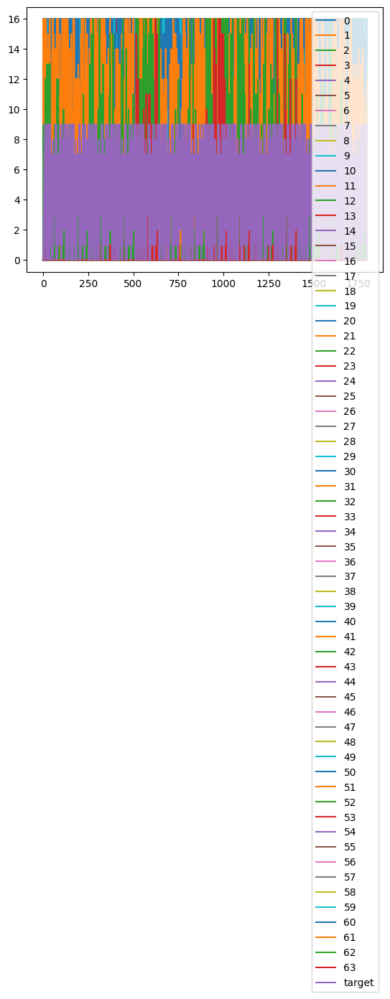

## load_digits

### #1. sklearn의 load_breast_cancer, load_digits, load_wine을 pytorch로 classification하고 score를 측정한다.


```python
from sklearn.datasets import load_digits
import pandas as pd
import seaborn as sns
%matplotlib inline
```

    /home/ubuntu/.local/lib/python3.10/site-packages/numpy/_core/getlimits.py:551: UserWarning: Signature b'\x00\xd0\xcc\xcc\xcc\xcc\xcc\xcc\xfb\xbf\x00\x00\x00\x00\x00\x00' for <class 'numpy.longdouble'> does not match any known type: falling back to type probe function.
    This warnings indicates broken support for the dtype!
      machar = _get_machar(dtype)


```python
data = load_digits()
```


```python
print(type(data))
```

    <class 'sklearn.utils._bunch.Bunch'>


```python
print(data.DESCR)
```

    .. _digits_dataset:
    
    Optical recognition of handwritten digits dataset
    --------------------------------------------------
    
    **Data Set Characteristics:**
    
    :Number of Instances: 1797
    :Number of Attributes: 64
    :Attribute Information: 8x8 image of integer pixels in the range 0..16.
    :Missing Attribute Values: None
    :Creator: E. Alpaydin (alpaydin '@' boun.edu.tr)
    :Date: July; 1998
    
    This is a copy of the test set of the UCI ML hand-written digits datasets
    https://archive.ics.uci.edu/ml/datasets/Optical+Recognition+of+Handwritten+Digits
    
    The data set contains images of hand-written digits: 10 classes where
    each class refers to a digit.
    
    Preprocessing programs made available by NIST were used to extract
    normalized bitmaps of handwritten digits from a preprinted form. From a
    total of 43 people, 30 contributed to the training set and different 13
    to the test set. 32x32 bitmaps are divided into nonoverlapping blocks of
    4x4 and the number of on pixels are counted in each block. This generates
    an input matrix of 8x8 where each element is an integer in the range
    0..16. This reduces dimensionality and gives invariance to small
    distortions.
    
    For info on NIST preprocessing routines, see M. D. Garris, J. L. Blue, G.
    T. Candela, D. L. Dimmick, J. Geist, P. J. Grother, S. A. Janet, and C.
    L. Wilson, NIST Form-Based Handprint Recognition System, NISTIR 5469,
    1994.
    
    .. dropdown:: References
    
      - C. Kaynak (1995) Methods of Combining Multiple Classifiers and Their
        Applications to Handwritten Digit Recognition, MSc Thesis, Institute of
        Graduate Studies in Science and Engineering, Bogazici University.
      - E. Alpaydin, C. Kaynak (1998) Cascading Classifiers, Kybernetika.
      - Ken Tang and Ponnuthurai N. Suganthan and Xi Yao and A. Kai Qin.
        Linear dimensionalityreduction using relevance weighted LDA. School of
        Electrical and Electronic Engineering Nanyang Technological University.
        2005.
      - Claudio Gentile. A New Approximate Maximal Margin Classification
        Algorithm. NIPS. 2000.
    


```python
print(data.keys())
```

    dict_keys(['data', 'target', 'frame', 'feature_names', 'target_names', 'images', 'DESCR'])


```python
df = pd.DataFrame(data=data.data)
df['target'] = data.target
```


```python
df.head()
```


<div>
<style scoped>
    .dataframe tbody tr th:only-of-type {
        vertical-align: middle;
    }

    .dataframe tbody tr th {
        vertical-align: top;
    }

    .dataframe thead th {
        text-align: right;
    }
</style>
<table border="1" class="dataframe">
  <thead>
    <tr style="text-align: right;">
      <th></th>
      <th>0</th>
      <th>1</th>
      <th>2</th>
      <th>3</th>
      <th>4</th>
      <th>5</th>
      <th>6</th>
      <th>7</th>
      <th>8</th>
      <th>9</th>
      <th>...</th>
      <th>55</th>
      <th>56</th>
      <th>57</th>
      <th>58</th>
      <th>59</th>
      <th>60</th>
      <th>61</th>
      <th>62</th>
      <th>63</th>
      <th>target</th>
    </tr>
  </thead>
  <tbody>
    <tr>
      <th>0</th>
      <td>0.0</td>
      <td>0.0</td>
      <td>5.0</td>
      <td>13.0</td>
      <td>9.0</td>
      <td>1.0</td>
      <td>0.0</td>
      <td>0.0</td>
      <td>0.0</td>
      <td>0.0</td>
      <td>...</td>
      <td>0.0</td>
      <td>0.0</td>
      <td>0.0</td>
      <td>6.0</td>
      <td>13.0</td>
      <td>10.0</td>
      <td>0.0</td>
      <td>0.0</td>
      <td>0.0</td>
      <td>0</td>
    </tr>
    <tr>
      <th>1</th>
      <td>0.0</td>
      <td>0.0</td>
      <td>0.0</td>
      <td>12.0</td>
      <td>13.0</td>
      <td>5.0</td>
      <td>0.0</td>
      <td>0.0</td>
      <td>0.0</td>
      <td>0.0</td>
      <td>...</td>
      <td>0.0</td>
      <td>0.0</td>
      <td>0.0</td>
      <td>0.0</td>
      <td>11.0</td>
      <td>16.0</td>
      <td>10.0</td>
      <td>0.0</td>
      <td>0.0</td>
      <td>1</td>
    </tr>
    <tr>
      <th>2</th>
      <td>0.0</td>
      <td>0.0</td>
      <td>0.0</td>
      <td>4.0</td>
      <td>15.0</td>
      <td>12.0</td>
      <td>0.0</td>
      <td>0.0</td>
      <td>0.0</td>
      <td>0.0</td>
      <td>...</td>
      <td>0.0</td>
      <td>0.0</td>
      <td>0.0</td>
      <td>0.0</td>
      <td>3.0</td>
      <td>11.0</td>
      <td>16.0</td>
      <td>9.0</td>
      <td>0.0</td>
      <td>2</td>
    </tr>
    <tr>
      <th>3</th>
      <td>0.0</td>
      <td>0.0</td>
      <td>7.0</td>
      <td>15.0</td>
      <td>13.0</td>
      <td>1.0</td>
      <td>0.0</td>
      <td>0.0</td>
      <td>0.0</td>
      <td>8.0</td>
      <td>...</td>
      <td>0.0</td>
      <td>0.0</td>
      <td>0.0</td>
      <td>7.0</td>
      <td>13.0</td>
      <td>13.0</td>
      <td>9.0</td>
      <td>0.0</td>
      <td>0.0</td>
      <td>3</td>
    </tr>
    <tr>
      <th>4</th>
      <td>0.0</td>
      <td>0.0</td>
      <td>0.0</td>
      <td>1.0</td>
      <td>11.0</td>
      <td>0.0</td>
      <td>0.0</td>
      <td>0.0</td>
      <td>0.0</td>
      <td>0.0</td>
      <td>...</td>
      <td>0.0</td>
      <td>0.0</td>
      <td>0.0</td>
      <td>0.0</td>
      <td>2.0</td>
      <td>16.0</td>
      <td>4.0</td>
      <td>0.0</td>
      <td>0.0</td>
      <td>4</td>
    </tr>
  </tbody>
</table>
<p>5 rows × 65 columns</p>
</div>


```python
df.tail()
```


<div>
<style scoped>
    .dataframe tbody tr th:only-of-type {
        vertical-align: middle;
    }

    .dataframe tbody tr th {
        vertical-align: top;
    }

    .dataframe thead th {
        text-align: right;
    }
</style>
<table border="1" class="dataframe">
  <thead>
    <tr style="text-align: right;">
      <th></th>
      <th>0</th>
      <th>1</th>
      <th>2</th>
      <th>3</th>
      <th>4</th>
      <th>5</th>
      <th>6</th>
      <th>7</th>
      <th>8</th>
      <th>9</th>
      <th>...</th>
      <th>55</th>
      <th>56</th>
      <th>57</th>
      <th>58</th>
      <th>59</th>
      <th>60</th>
      <th>61</th>
      <th>62</th>
      <th>63</th>
      <th>target</th>
    </tr>
  </thead>
  <tbody>
    <tr>
      <th>1792</th>
      <td>0.0</td>
      <td>0.0</td>
      <td>4.0</td>
      <td>10.0</td>
      <td>13.0</td>
      <td>6.0</td>
      <td>0.0</td>
      <td>0.0</td>
      <td>0.0</td>
      <td>1.0</td>
      <td>...</td>
      <td>0.0</td>
      <td>0.0</td>
      <td>0.0</td>
      <td>2.0</td>
      <td>14.0</td>
      <td>15.0</td>
      <td>9.0</td>
      <td>0.0</td>
      <td>0.0</td>
      <td>9</td>
    </tr>
    <tr>
      <th>1793</th>
      <td>0.0</td>
      <td>0.0</td>
      <td>6.0</td>
      <td>16.0</td>
      <td>13.0</td>
      <td>11.0</td>
      <td>1.0</td>
      <td>0.0</td>
      <td>0.0</td>
      <td>0.0</td>
      <td>...</td>
      <td>0.0</td>
      <td>0.0</td>
      <td>0.0</td>
      <td>6.0</td>
      <td>16.0</td>
      <td>14.0</td>
      <td>6.0</td>
      <td>0.0</td>
      <td>0.0</td>
      <td>0</td>
    </tr>
    <tr>
      <th>1794</th>
      <td>0.0</td>
      <td>0.0</td>
      <td>1.0</td>
      <td>11.0</td>
      <td>15.0</td>
      <td>1.0</td>
      <td>0.0</td>
      <td>0.0</td>
      <td>0.0</td>
      <td>0.0</td>
      <td>...</td>
      <td>0.0</td>
      <td>0.0</td>
      <td>0.0</td>
      <td>2.0</td>
      <td>9.0</td>
      <td>13.0</td>
      <td>6.0</td>
      <td>0.0</td>
      <td>0.0</td>
      <td>8</td>
    </tr>
    <tr>
      <th>1795</th>
      <td>0.0</td>
      <td>0.0</td>
      <td>2.0</td>
      <td>10.0</td>
      <td>7.0</td>
      <td>0.0</td>
      <td>0.0</td>
      <td>0.0</td>
      <td>0.0</td>
      <td>0.0</td>
      <td>...</td>
      <td>0.0</td>
      <td>0.0</td>
      <td>0.0</td>
      <td>5.0</td>
      <td>12.0</td>
      <td>16.0</td>
      <td>12.0</td>
      <td>0.0</td>
      <td>0.0</td>
      <td>9</td>
    </tr>
    <tr>
      <th>1796</th>
      <td>0.0</td>
      <td>0.0</td>
      <td>10.0</td>
      <td>14.0</td>
      <td>8.0</td>
      <td>1.0</td>
      <td>0.0</td>
      <td>0.0</td>
      <td>0.0</td>
      <td>2.0</td>
      <td>...</td>
      <td>0.0</td>
      <td>0.0</td>
      <td>1.0</td>
      <td>8.0</td>
      <td>12.0</td>
      <td>14.0</td>
      <td>12.0</td>
      <td>1.0</td>
      <td>0.0</td>
      <td>8</td>
    </tr>
  </tbody>
</table>
<p>5 rows × 65 columns</p>
</div>


```python
df.describe()
```


<div>
<style scoped>
    .dataframe tbody tr th:only-of-type {
        vertical-align: middle;
    }

    .dataframe tbody tr th {
        vertical-align: top;
    }

    .dataframe thead th {
        text-align: right;
    }
</style>
<table border="1" class="dataframe">
  <thead>
    <tr style="text-align: right;">
      <th></th>
      <th>0</th>
      <th>1</th>
      <th>2</th>
      <th>3</th>
      <th>4</th>
      <th>5</th>
      <th>6</th>
      <th>7</th>
      <th>8</th>
      <th>9</th>
      <th>...</th>
      <th>55</th>
      <th>56</th>
      <th>57</th>
      <th>58</th>
      <th>59</th>
      <th>60</th>
      <th>61</th>
      <th>62</th>
      <th>63</th>
      <th>target</th>
    </tr>
  </thead>
  <tbody>
    <tr>
      <th>count</th>
      <td>1797.0</td>
      <td>1797.000000</td>
      <td>1797.000000</td>
      <td>1797.000000</td>
      <td>1797.000000</td>
      <td>1797.000000</td>
      <td>1797.000000</td>
      <td>1797.000000</td>
      <td>1797.000000</td>
      <td>1797.000000</td>
      <td>...</td>
      <td>1797.000000</td>
      <td>1797.000000</td>
      <td>1797.000000</td>
      <td>1797.000000</td>
      <td>1797.000000</td>
      <td>1797.000000</td>
      <td>1797.000000</td>
      <td>1797.000000</td>
      <td>1797.000000</td>
      <td>1797.000000</td>
    </tr>
    <tr>
      <th>mean</th>
      <td>0.0</td>
      <td>0.303840</td>
      <td>5.204786</td>
      <td>11.835838</td>
      <td>11.848080</td>
      <td>5.781859</td>
      <td>1.362270</td>
      <td>0.129661</td>
      <td>0.005565</td>
      <td>1.993879</td>
      <td>...</td>
      <td>0.206455</td>
      <td>0.000556</td>
      <td>0.279354</td>
      <td>5.557596</td>
      <td>12.089037</td>
      <td>11.809126</td>
      <td>6.764051</td>
      <td>2.067891</td>
      <td>0.364496</td>
      <td>4.490818</td>
    </tr>
    <tr>
      <th>std</th>
      <td>0.0</td>
      <td>0.907192</td>
      <td>4.754826</td>
      <td>4.248842</td>
      <td>4.287388</td>
      <td>5.666418</td>
      <td>3.325775</td>
      <td>1.037383</td>
      <td>0.094222</td>
      <td>3.196160</td>
      <td>...</td>
      <td>0.984401</td>
      <td>0.023590</td>
      <td>0.934302</td>
      <td>5.103019</td>
      <td>4.374694</td>
      <td>4.933947</td>
      <td>5.900623</td>
      <td>4.090548</td>
      <td>1.860122</td>
      <td>2.865304</td>
    </tr>
    <tr>
      <th>min</th>
      <td>0.0</td>
      <td>0.000000</td>
      <td>0.000000</td>
      <td>0.000000</td>
      <td>0.000000</td>
      <td>0.000000</td>
      <td>0.000000</td>
      <td>0.000000</td>
      <td>0.000000</td>
      <td>0.000000</td>
      <td>...</td>
      <td>0.000000</td>
      <td>0.000000</td>
      <td>0.000000</td>
      <td>0.000000</td>
      <td>0.000000</td>
      <td>0.000000</td>
      <td>0.000000</td>
      <td>0.000000</td>
      <td>0.000000</td>
      <td>0.000000</td>
    </tr>
    <tr>
      <th>25%</th>
      <td>0.0</td>
      <td>0.000000</td>
      <td>1.000000</td>
      <td>10.000000</td>
      <td>10.000000</td>
      <td>0.000000</td>
      <td>0.000000</td>
      <td>0.000000</td>
      <td>0.000000</td>
      <td>0.000000</td>
      <td>...</td>
      <td>0.000000</td>
      <td>0.000000</td>
      <td>0.000000</td>
      <td>1.000000</td>
      <td>11.000000</td>
      <td>10.000000</td>
      <td>0.000000</td>
      <td>0.000000</td>
      <td>0.000000</td>
      <td>2.000000</td>
    </tr>
    <tr>
      <th>50%</th>
      <td>0.0</td>
      <td>0.000000</td>
      <td>4.000000</td>
      <td>13.000000</td>
      <td>13.000000</td>
      <td>4.000000</td>
      <td>0.000000</td>
      <td>0.000000</td>
      <td>0.000000</td>
      <td>0.000000</td>
      <td>...</td>
      <td>0.000000</td>
      <td>0.000000</td>
      <td>0.000000</td>
      <td>4.000000</td>
      <td>13.000000</td>
      <td>14.000000</td>
      <td>6.000000</td>
      <td>0.000000</td>
      <td>0.000000</td>
      <td>4.000000</td>
    </tr>
    <tr>
      <th>75%</th>
      <td>0.0</td>
      <td>0.000000</td>
      <td>9.000000</td>
      <td>15.000000</td>
      <td>15.000000</td>
      <td>11.000000</td>
      <td>0.000000</td>
      <td>0.000000</td>
      <td>0.000000</td>
      <td>3.000000</td>
      <td>...</td>
      <td>0.000000</td>
      <td>0.000000</td>
      <td>0.000000</td>
      <td>10.000000</td>
      <td>16.000000</td>
      <td>16.000000</td>
      <td>12.000000</td>
      <td>2.000000</td>
      <td>0.000000</td>
      <td>7.000000</td>
    </tr>
    <tr>
      <th>max</th>
      <td>0.0</td>
      <td>8.000000</td>
      <td>16.000000</td>
      <td>16.000000</td>
      <td>16.000000</td>
      <td>16.000000</td>
      <td>16.000000</td>
      <td>15.000000</td>
      <td>2.000000</td>
      <td>16.000000</td>
      <td>...</td>
      <td>13.000000</td>
      <td>1.000000</td>
      <td>9.000000</td>
      <td>16.000000</td>
      <td>16.000000</td>
      <td>16.000000</td>
      <td>16.000000</td>
      <td>16.000000</td>
      <td>16.000000</td>
      <td>9.000000</td>
    </tr>
  </tbody>
</table>
<p>8 rows × 65 columns</p>
</div>


```python
df.info()
```

    <class 'pandas.core.frame.DataFrame'>
    RangeIndex: 1797 entries, 0 to 1796
    Data columns (total 65 columns):
     #   Column  Non-Null Count  Dtype  
    ---  ------  --------------  -----  
     0   0       1797 non-null   float64
     1   1       1797 non-null   float64
     2   2       1797 non-null   float64
     3   3       1797 non-null   float64
     4   4       1797 non-null   float64
     5   5       1797 non-null   float64
     6   6       1797 non-null   float64
     7   7       1797 non-null   float64
     8   8       1797 non-null   float64
     9   9       1797 non-null   float64
     10  10      1797 non-null   float64
     11  11      1797 non-null   float64
     12  12      1797 non-null   float64
     13  13      1797 non-null   float64
     14  14      1797 non-null   float64
     15  15      1797 non-null   float64
     16  16      1797 non-null   float64
     17  17      1797 non-null   float64
     18  18      1797 non-null   float64
     19  19      1797 non-null   float64
     20  20      1797 non-null   float64
     21  21      1797 non-null   float64
     22  22      1797 non-null   float64
     23  23      1797 non-null   float64
     24  24      1797 non-null   float64
     25  25      1797 non-null   float64
     26  26      1797 non-null   float64
     27  27      1797 non-null   float64
     28  28      1797 non-null   float64
     29  29      1797 non-null   float64
     30  30      1797 non-null   float64
     31  31      1797 non-null   float64
     32  32      1797 non-null   float64
     33  33      1797 non-null   float64
     34  34      1797 non-null   float64
     35  35      1797 non-null   float64
     36  36      1797 non-null   float64
     37  37      1797 non-null   float64
     38  38      1797 non-null   float64
     39  39      1797 non-null   float64
     40  40      1797 non-null   float64
     41  41      1797 non-null   float64
     42  42      1797 non-null   float64
     43  43      1797 non-null   float64
     44  44      1797 non-null   float64
     45  45      1797 non-null   float64
     46  46      1797 non-null   float64
     47  47      1797 non-null   float64
     48  48      1797 non-null   float64
     49  49      1797 non-null   float64
     50  50      1797 non-null   float64
     51  51      1797 non-null   float64
     52  52      1797 non-null   float64
     53  53      1797 non-null   float64
     54  54      1797 non-null   float64
     55  55      1797 non-null   float64
     56  56      1797 non-null   float64
     57  57      1797 non-null   float64
     58  58      1797 non-null   float64
     59  59      1797 non-null   float64
     60  60      1797 non-null   float64
     61  61      1797 non-null   float64
     62  62      1797 non-null   float64
     63  63      1797 non-null   float64
     64  target  1797 non-null   int64  
    dtypes: float64(64), int64(1)
    memory usage: 912.7 KB


```python
print(df.isnull().sum())
```

    0         0
    1         0
    2         0
    3         0
    4         0
             ..
    60        0
    61        0
    62        0
    63        0
    target    0
    Length: 65, dtype: int64


```python
df.plot()
```


    <Axes: >


    

    


```python

```
