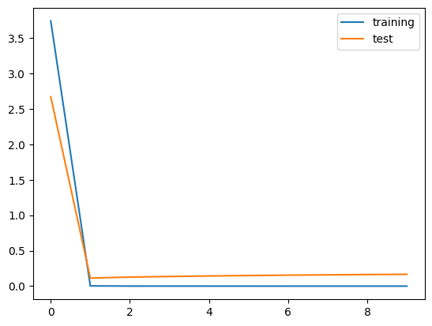
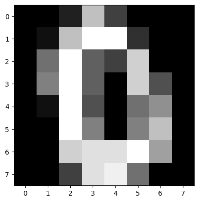

## load_digits

### #1. sklearn의 load_breast_cancer, load_digits, load_wine을 pytorch로 classification하고 score를 측정한다.


```python
from sklearn.datasets import load_digits
import pandas as pd
import seaborn as sns
%matplotlib inline
```

    /home/ubuntu/.local/lib/python3.10/site-packages/numpy/_core/getlimits.py:551: UserWarning: Signature b'\x00\xd0\xcc\xcc\xcc\xcc\xcc\xcc\xfb\xbf\x00\x00\x00\x00\x00\x00' for <class 'numpy.longdouble'> does not match any known type: falling back to type probe function.
    This warnings indicates broken support for the dtype!
      machar = _get_machar(dtype)


```python
data = load_digits()
```


```python
import torch
import torch.nn as nn
import torch.nn.functional as F
import torch.optim as optim
import torch.utils.data as data_utils
```


```python
class DigitsModel(nn.Module):
    def __init__(self, input_size, output_size):
        super(DigitsModel, self).__init__()
        self.model = nn.Sequential(
            nn.Linear(input_size, 128),
            nn.ReLU(),
            nn.Linear(128, output_size)
        )
        
    def forward(self, x):
        output = self.model(x)
        with torch.no_grad():
            value = torch.argmax(output, dim=1)
        return output, value        
```


```python
X = torch.Tensor(data.data)
y = torch.LongTensor(data.target)
```


```python
import numpy as np
from sklearn.model_selection import train_test_split

X_train, X_test, y_train, y_test = train_test_split(X, y, test_size=0.2) # train과 test를 8:2로 분할
```


```python
model = DigitsModel(64, 10)
```


```python
with torch.no_grad():
    y, _ = model(torch.unsqueeze(X_train[0], dim=0))
    print(y)
    print(y.sum())
    print(np.argmax(y), y_train[0])
```

    tensor([[ 5.1580,  0.5059, -0.2071,  1.9209, -1.7117, -0.3965, -0.0748,  7.5202,
              0.4607, -0.1673]])
    tensor(13.0082)
    tensor(7) tensor(9)


```python
optimizer = torch.optim.Adam(model.parameters(), lr=0.001)
```


```python
print(model)
```

    DigitsModel(
      (model): Sequential(
        (0): Linear(in_features=64, out_features=128, bias=True)
        (1): ReLU()
        (2): Linear(in_features=128, out_features=10, bias=True)
      )
    )


```python
model = DigitsModel(64, 10)
optimizer = torch.optim.Adam(model.parameters(), lr=0.001)
criterion = nn.CrossEntropyLoss()

n_epochs = 10000 # 10000회 학습

avg_loss = 0 
for epoch in range(n_epochs):
    y, _ = model(X_train)
    target = y_train
    loss = criterion(y, target).sum()
    optimizer.zero_grad()
    loss.backward()
    optimizer.step()
    if epoch % 1000 == 0:
        print('epoch {}th loss: {}'.format(epoch, loss.data))
```

    epoch 0th loss: 3.8211045265197754
    epoch 1000th loss: 0.0006522461771965027
    epoch 2000th loss: 0.00014525200822390616
    epoch 3000th loss: 5.522094579646364e-05
    epoch 4000th loss: 2.5427234504604712e-05
    epoch 5000th loss: 1.277777937502833e-05
    epoch 6000th loss: 6.765951638953993e-06
    epoch 7000th loss: 3.707541736730491e-06
    epoch 8000th loss: 2.0712539026135346e-06
    epoch 9000th loss: 1.171099029306788e-06


```python
n = 99
with torch.no_grad():
    y, _ = model(torch.unsqueeze(X_train[n], dim=0))
    print(y)
    print(y.sum())
    print(np.argmax(y), y_train[n])
```

    tensor([[-13.4827, -17.4990,  -8.9820,  -4.0122, -20.7610, -19.0979,  -8.3825,
              -9.6686,  14.7547,  -9.1175]])
    tensor(-96.2487)
    tensor(8) tensor(8)


```python
model = DigitsModel(64, 10)
optimizer = torch.optim.Adam(model.parameters(), lr=0.004)
criterion = nn.CrossEntropyLoss()

n_epochs = 2000 # 2000회 학습

list_training_loss = []
list_test_loss = []

for epoch in range(n_epochs):
    model.train()
    y, _ = model(X_train)
    target = y_train
    loss = criterion(y, target).sum()
    optimizer.zero_grad()
    loss.backward()
    optimizer.step()
    if epoch % 200 == 0:
        model.eval()
        y_pred, _ = model(X_test)
        test_loss = criterion(y_pred, y_test).sum()
        print('epoch {}th training loss: {} test loss: {}'.format(epoch, loss.data, test_loss.data))
        list_training_loss.append(loss.data)
        list_test_loss.append(test_loss.data)
```

    epoch 0th training loss: 3.7407474517822266 test loss: 2.67022442817688
    epoch 200th training loss: 0.003028647741302848 test loss: 0.11454083025455475
    epoch 400th training loss: 0.0008412495953962207 test loss: 0.12716442346572876
    epoch 600th training loss: 0.00039483894943259656 test loss: 0.13619427382946014
    epoch 800th training loss: 0.00022878465824760497 test loss: 0.14333194494247437
    epoch 1000th training loss: 0.00014880431990604848 test loss: 0.1492484211921692
    epoch 1200th training loss: 0.00010371558892074972 test loss: 0.15463699400424957
    epoch 1400th training loss: 7.595807255711406e-05 test loss: 0.15911045670509338
    epoch 1600th training loss: 5.7716908486327156e-05 test loss: 0.16310785710811615
    epoch 1800th training loss: 4.503630771068856e-05 test loss: 0.1669355034828186


```python
import matplotlib.pyplot as plt

plt.plot(list_training_loss, label='training')
plt.plot(list_test_loss, label='test')
plt.legend()
plt.show()
```


    

    


```python
from sklearn.metrics import accuracy_score

with torch.no_grad():
    _ , y_pred = model(X_test)
    score = accuracy_score(y_test, y_pred)
    print(score)
```

    0.9777777777777777


```python
plt.imshow(X_test[2].view(8, 8), cmap='gray')
plt.show()
```


    

    


```python
print(y_pred[2], y_test[2])
```

    tensor(0) tensor(0)

