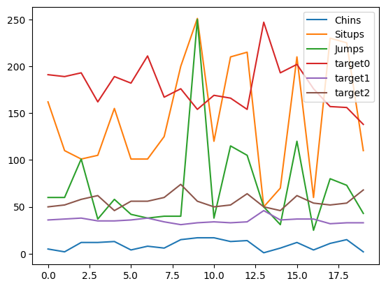

## load_linnerud


```python
from sklearn.datasets import load_linnerud
import pandas as pd
import seaborn as sns
%matplotlib inline
```

    /home/ubuntu/.local/lib/python3.10/site-packages/numpy/_core/getlimits.py:551: UserWarning: Signature b'\x00\xd0\xcc\xcc\xcc\xcc\xcc\xcc\xfb\xbf\x00\x00\x00\x00\x00\x00' for <class 'numpy.longdouble'> does not match any known type: falling back to type probe function.
    This warnings indicates broken support for the dtype!
      machar = _get_machar(dtype)


```python
data = load_linnerud()
```


```python
print(type(data))
```

    <class 'sklearn.utils._bunch.Bunch'>


```python
print(data.keys())

```

    dict_keys(['data', 'feature_names', 'target', 'target_names', 'frame', 'DESCR', 'data_filename', 'target_filename', 'data_module'])


```python
print(type(data.data))
```

    <class 'numpy.ndarray'>


```python
print(data.feature_names)
```

    ['Chins', 'Situps', 'Jumps']


```python
print(data.data)
```

    [[  5. 162.  60.]
     [  2. 110.  60.]
     [ 12. 101. 101.]
     [ 12. 105.  37.]
     [ 13. 155.  58.]
     [  4. 101.  42.]
     [  8. 101.  38.]
     [  6. 125.  40.]
     [ 15. 200.  40.]
     [ 17. 251. 250.]
     [ 17. 120.  38.]
     [ 13. 210. 115.]
     [ 14. 215. 105.]
     [  1.  50.  50.]
     [  6.  70.  31.]
     [ 12. 210. 120.]
     [  4.  60.  25.]
     [ 11. 230.  80.]
     [ 15. 225.  73.]
     [  2. 110.  43.]]


```python
print(data.DESCR)
```

    .. _linnerrud_dataset:
    
    Linnerrud dataset
    -----------------
    
    **Data Set Characteristics:**
    
    :Number of Instances: 20
    :Number of Attributes: 3
    :Missing Attribute Values: None
    
    The Linnerud dataset is a multi-output regression dataset. It consists of three
    exercise (data) and three physiological (target) variables collected from
    twenty middle-aged men in a fitness club:
    
    - *physiological* - CSV containing 20 observations on 3 physiological variables:
       Weight, Waist and Pulse.
    - *exercise* - CSV containing 20 observations on 3 exercise variables:
       Chins, Situps and Jumps.
    
    .. dropdown:: References
    
       * Tenenhaus, M. (1998). La regression PLS: theorie et pratique. Paris:
         Editions Technic.
    


```python
print(data.target)
```

    [[191.  36.  50.]
     [189.  37.  52.]
     [193.  38.  58.]
     [162.  35.  62.]
     [189.  35.  46.]
     [182.  36.  56.]
     [211.  38.  56.]
     [167.  34.  60.]
     [176.  31.  74.]
     [154.  33.  56.]
     [169.  34.  50.]
     [166.  33.  52.]
     [154.  34.  64.]
     [247.  46.  50.]
     [193.  36.  46.]
     [202.  37.  62.]
     [176.  37.  54.]
     [157.  32.  52.]
     [156.  33.  54.]
     [138.  33.  68.]]


```python
print(data.target_names)
```

    ['Weight', 'Waist', 'Pulse']


```python
df = pd.DataFrame(data=data.data, columns=data.feature_names)
df['target0'] = data.target[:, 0]
df['target1'] = data.target[:, 1]
df['target2'] = data.target[:, 2]
```


```python
df.head()

```


<div>
<style scoped>
    .dataframe tbody tr th:only-of-type {
        vertical-align: middle;
    }

    .dataframe tbody tr th {
        vertical-align: top;
    }

    .dataframe thead th {
        text-align: right;
    }
</style>
<table border="1" class="dataframe">
  <thead>
    <tr style="text-align: right;">
      <th></th>
      <th>Chins</th>
      <th>Situps</th>
      <th>Jumps</th>
      <th>target0</th>
      <th>target1</th>
      <th>target2</th>
    </tr>
  </thead>
  <tbody>
    <tr>
      <th>0</th>
      <td>5.0</td>
      <td>162.0</td>
      <td>60.0</td>
      <td>191.0</td>
      <td>36.0</td>
      <td>50.0</td>
    </tr>
    <tr>
      <th>1</th>
      <td>2.0</td>
      <td>110.0</td>
      <td>60.0</td>
      <td>189.0</td>
      <td>37.0</td>
      <td>52.0</td>
    </tr>
    <tr>
      <th>2</th>
      <td>12.0</td>
      <td>101.0</td>
      <td>101.0</td>
      <td>193.0</td>
      <td>38.0</td>
      <td>58.0</td>
    </tr>
    <tr>
      <th>3</th>
      <td>12.0</td>
      <td>105.0</td>
      <td>37.0</td>
      <td>162.0</td>
      <td>35.0</td>
      <td>62.0</td>
    </tr>
    <tr>
      <th>4</th>
      <td>13.0</td>
      <td>155.0</td>
      <td>58.0</td>
      <td>189.0</td>
      <td>35.0</td>
      <td>46.0</td>
    </tr>
  </tbody>
</table>
</div>


```python
df.tail()
```


<div>
<style scoped>
    .dataframe tbody tr th:only-of-type {
        vertical-align: middle;
    }

    .dataframe tbody tr th {
        vertical-align: top;
    }

    .dataframe thead th {
        text-align: right;
    }
</style>
<table border="1" class="dataframe">
  <thead>
    <tr style="text-align: right;">
      <th></th>
      <th>Chins</th>
      <th>Situps</th>
      <th>Jumps</th>
      <th>target0</th>
      <th>target1</th>
      <th>target2</th>
    </tr>
  </thead>
  <tbody>
    <tr>
      <th>15</th>
      <td>12.0</td>
      <td>210.0</td>
      <td>120.0</td>
      <td>202.0</td>
      <td>37.0</td>
      <td>62.0</td>
    </tr>
    <tr>
      <th>16</th>
      <td>4.0</td>
      <td>60.0</td>
      <td>25.0</td>
      <td>176.0</td>
      <td>37.0</td>
      <td>54.0</td>
    </tr>
    <tr>
      <th>17</th>
      <td>11.0</td>
      <td>230.0</td>
      <td>80.0</td>
      <td>157.0</td>
      <td>32.0</td>
      <td>52.0</td>
    </tr>
    <tr>
      <th>18</th>
      <td>15.0</td>
      <td>225.0</td>
      <td>73.0</td>
      <td>156.0</td>
      <td>33.0</td>
      <td>54.0</td>
    </tr>
    <tr>
      <th>19</th>
      <td>2.0</td>
      <td>110.0</td>
      <td>43.0</td>
      <td>138.0</td>
      <td>33.0</td>
      <td>68.0</td>
    </tr>
  </tbody>
</table>
</div>


```python
df.describe()
```


<div>
<style scoped>
    .dataframe tbody tr th:only-of-type {
        vertical-align: middle;
    }

    .dataframe tbody tr th {
        vertical-align: top;
    }

    .dataframe thead th {
        text-align: right;
    }
</style>
<table border="1" class="dataframe">
  <thead>
    <tr style="text-align: right;">
      <th></th>
      <th>Chins</th>
      <th>Situps</th>
      <th>Jumps</th>
      <th>target0</th>
      <th>target1</th>
      <th>target2</th>
    </tr>
  </thead>
  <tbody>
    <tr>
      <th>count</th>
      <td>20.000000</td>
      <td>20.000000</td>
      <td>20.00000</td>
      <td>20.000000</td>
      <td>20.000000</td>
      <td>20.000000</td>
    </tr>
    <tr>
      <th>mean</th>
      <td>9.450000</td>
      <td>145.550000</td>
      <td>70.30000</td>
      <td>178.600000</td>
      <td>35.400000</td>
      <td>56.100000</td>
    </tr>
    <tr>
      <th>std</th>
      <td>5.286278</td>
      <td>62.566575</td>
      <td>51.27747</td>
      <td>24.690505</td>
      <td>3.201973</td>
      <td>7.210373</td>
    </tr>
    <tr>
      <th>min</th>
      <td>1.000000</td>
      <td>50.000000</td>
      <td>25.00000</td>
      <td>138.000000</td>
      <td>31.000000</td>
      <td>46.000000</td>
    </tr>
    <tr>
      <th>25%</th>
      <td>4.750000</td>
      <td>101.000000</td>
      <td>39.50000</td>
      <td>160.750000</td>
      <td>33.000000</td>
      <td>51.500000</td>
    </tr>
    <tr>
      <th>50%</th>
      <td>11.500000</td>
      <td>122.500000</td>
      <td>54.00000</td>
      <td>176.000000</td>
      <td>35.000000</td>
      <td>55.000000</td>
    </tr>
    <tr>
      <th>75%</th>
      <td>13.250000</td>
      <td>210.000000</td>
      <td>85.25000</td>
      <td>191.500000</td>
      <td>37.000000</td>
      <td>60.500000</td>
    </tr>
    <tr>
      <th>max</th>
      <td>17.000000</td>
      <td>251.000000</td>
      <td>250.00000</td>
      <td>247.000000</td>
      <td>46.000000</td>
      <td>74.000000</td>
    </tr>
  </tbody>
</table>
</div>


```python
df.info()
```

    <class 'pandas.core.frame.DataFrame'>
    RangeIndex: 20 entries, 0 to 19
    Data columns (total 6 columns):
     #   Column   Non-Null Count  Dtype  
    ---  ------   --------------  -----  
     0   Chins    20 non-null     float64
     1   Situps   20 non-null     float64
     2   Jumps    20 non-null     float64
     3   target0  20 non-null     float64
     4   target1  20 non-null     float64
     5   target2  20 non-null     float64
    dtypes: float64(6)
    memory usage: 1.1 KB


```python
print(df.isnull().sum())
```

    Chins      0
    Situps     0
    Jumps      0
    target0    0
    target1    0
    target2    0
    dtype: int64


```python
df.plot()
```


    <Axes: >


    

    

