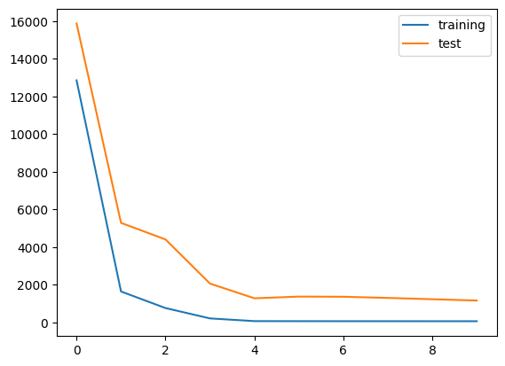

## load_linnerud


```python
from sklearn.datasets import load_linnerud
import pandas as pd
import seaborn as sns
%matplotlib inline
```

    /home/ubuntu/.local/lib/python3.10/site-packages/numpy/_core/getlimits.py:551: UserWarning: Signature b'\x00\xd0\xcc\xcc\xcc\xcc\xcc\xcc\xfb\xbf\x00\x00\x00\x00\x00\x00' for <class 'numpy.longdouble'> does not match any known type: falling back to type probe function.
    This warnings indicates broken support for the dtype!
      machar = _get_machar(dtype)


```python
data = load_linnerud()
```


```python
import torch
import torch.nn as nn
import torch.nn.functional as F
import torch.optim as optim
import torch.utils.data as data_utils
```


```python
class LinnerudModel(nn.Module):
    def __init__(self, input_size, output_size):
        super(LinnerudModel, self).__init__()
        self.model = nn.Sequential(
            nn.Linear(input_size, 16), # input_size * 16 + 16
            nn.ReLU(),
            nn.Linear(16, output_size) # 16 * output_size + output_size
        )
        
    def forward(self, x):
        output = self.model(x)
        return output
```


```python
X = torch.Tensor(data.data)
y = torch.Tensor(data.target)
```


```python
print(X)
```

    tensor([[  5., 162.,  60.],
            [  2., 110.,  60.],
            [ 12., 101., 101.],
            [ 12., 105.,  37.],
            [ 13., 155.,  58.],
            [  4., 101.,  42.],
            [  8., 101.,  38.],
            [  6., 125.,  40.],
            [ 15., 200.,  40.],
            [ 17., 251., 250.],
            [ 17., 120.,  38.],
            [ 13., 210., 115.],
            [ 14., 215., 105.],
            [  1.,  50.,  50.],
            [  6.,  70.,  31.],
            [ 12., 210., 120.],
            [  4.,  60.,  25.],
            [ 11., 230.,  80.],
            [ 15., 225.,  73.],
            [  2., 110.,  43.]])


```python
print(y)
```

    tensor([[191.,  36.,  50.],
            [189.,  37.,  52.],
            [193.,  38.,  58.],
            [162.,  35.,  62.],
            [189.,  35.,  46.],
            [182.,  36.,  56.],
            [211.,  38.,  56.],
            [167.,  34.,  60.],
            [176.,  31.,  74.],
            [154.,  33.,  56.],
            [169.,  34.,  50.],
            [166.,  33.,  52.],
            [154.,  34.,  64.],
            [247.,  46.,  50.],
            [193.,  36.,  46.],
            [202.,  37.,  62.],
            [176.,  37.,  54.],
            [157.,  32.,  52.],
            [156.,  33.,  54.],
            [138.,  33.,  68.]])


```python
import numpy as np
from sklearn.model_selection import train_test_split

X_train, X_test, y_train, y_test = train_test_split(X, y, test_size=0.2) # train과 test를 8:2로 분할
```


```python
model = LinnerudModel(3, 3)
```


```python
n = 0
y = model(X_train[n]).detach() # 더 이상 연산을 추적하지 않는다
print(y, y_train[n])
```

    tensor([-15.3592,   6.2732,  15.5913]) tensor([189.,  37.,  52.])


```python
optimizer = torch.optim.Adam(model.parameters(), lr=0.001)
```


```python
print(model)
```

    LinnerudModel(
      (model): Sequential(
        (0): Linear(in_features=3, out_features=16, bias=True)
        (1): ReLU()
        (2): Linear(in_features=16, out_features=3, bias=True)
      )
    )


```python
criterion = nn.MSELoss()

n_epochs = 100 # 100회 학습

avg_loss = 0 
for epoch in range(n_epochs):
    for i in range(len(X_train)):
        y = torch.unsqueeze(model(X_train[i]), dim=0)
        target = torch.unsqueeze(y_train[i], dim=0)
        loss = criterion(y, target)
        optimizer.zero_grad()
        loss.backward()
        optimizer.step()
        avg_loss += loss.data
    avg_loss /= len(X_train)
    if epoch % 10 == 0:
        print('epoch {}th loss: {}'.format(epoch, avg_loss))
```

    epoch 0th loss: 13151.470703125
    epoch 10th loss: 5548.0205078125
    epoch 20th loss: 2448.19970703125
    epoch 30th loss: 2281.95703125
    epoch 40th loss: 2213.05419921875
    epoch 50th loss: 2152.75048828125
    epoch 60th loss: 2102.954345703125
    epoch 70th loss: 2061.2958984375
    epoch 80th loss: 2026.4427490234375
    epoch 90th loss: 1998.358642578125


```python
n = 0
y = model(X_train[n]).detach() # 더 이상 연산을 추적하지 않는다
print(y, y_train[n])
```

    tensor([101.5622,  21.2205,  35.3683]) tensor([189.,  37.,  52.])


```python
model = LinnerudModel(3, 3)
optimizer = torch.optim.Adam(model.parameters(), lr=0.001)
criterion = nn.MSELoss()

n_epochs = 10000 # 10000회 학습

avg_loss = 0 
for epoch in range(n_epochs):
    y = model(X_train)
    loss = criterion(y, y_train).sum()
    optimizer.zero_grad()
    loss.backward()
    optimizer.step()
    if epoch % 1000 == 0:
        print('epoch {}th loss: {}'.format(epoch, loss.data))
```

    epoch 0th loss: 13844.7626953125
    epoch 1000th loss: 1943.7578125
    epoch 2000th loss: 1758.7232666015625
    epoch 3000th loss: 1681.41552734375
    epoch 4000th loss: 1578.39794921875
    epoch 5000th loss: 1372.7557373046875
    epoch 6000th loss: 1017.9931030273438
    epoch 7000th loss: 643.4456176757812
    epoch 8000th loss: 393.5608825683594
    epoch 9000th loss: 261.27642822265625


```python
n = 4
y = model(X_train[n]).detach() # 더 이상 연산을 추적하지 않는다
print(y, y_train[n])
```

    tensor([179.2729,  34.4228,  66.0318]) tensor([176.,  31.,  74.])


```python
model = LinnerudModel(3, 3)
optimizer = torch.optim.Adam(model.parameters(), lr=0.0005)
criterion = nn.MSELoss()

n_epochs = 50000 # 50000회 학습

list_training_loss = []
list_test_loss = []

for epoch in range(n_epochs):
    model.train()
    y = model(X_train)
    loss = criterion(y, y_train).sum()
    optimizer.zero_grad()
    loss.backward()
    optimizer.step()
    if epoch % 5000 == 0:
        model.eval()
        y_pred = model(X_test)
        test_loss = criterion(y_pred, y_test).sum()
        print('epoch {}th training loss: {} test loss: {}'.format(epoch, loss.data, test_loss.data))
        list_training_loss.append(loss.data)
        list_test_loss.append(test_loss.data)
```

    epoch 0th training loss: 12855.37109375 test loss: 15872.6259765625
    epoch 5000th training loss: 1648.8179931640625 test loss: 5289.984375
    epoch 10000th training loss: 769.3947143554688 test loss: 4412.20068359375
    epoch 15000th training loss: 219.99195861816406 test loss: 2068.694091796875
    epoch 20000th training loss: 76.1221694946289 test loss: 1287.7855224609375
    epoch 25000th training loss: 73.61286926269531 test loss: 1378.1737060546875
    epoch 30000th training loss: 72.34107208251953 test loss: 1369.2264404296875
    epoch 35000th training loss: 71.60282135009766 test loss: 1307.56201171875
    epoch 40000th training loss: 70.90545654296875 test loss: 1238.4188232421875
    epoch 45000th training loss: 70.41824340820312 test loss: 1168.074951171875


```python
import matplotlib.pyplot as plt

plt.plot(list_training_loss, label='training')
plt.plot(list_test_loss, label='test')
plt.legend()
plt.show()
```


    

    


```python
from sklearn.metrics import r2_score

with torch.no_grad():
    y_pred = model(X_test)
    score = r2_score(y_test, y_pred)
    print(score)
```

    -9.235673904418945


```python
class MAPELoss(nn.Module):
    def __init__(self):
        super(MAPELoss, self).__init__()

    def forward(self, y_pred, y_true):
        epsilon = 1e-8  
        loss = torch.mean(torch.abs((y_true - y_pred) / (y_true + epsilon)))
        return loss * 100  
    
mape_loss = MAPELoss()
y_pred = model(X_test).squeeze()
loss_value = mape_loss(y_pred, y_test)
print(f"MAPE Loss: {loss_value.item():.4f}%")
```

    MAPE Loss: 16.9100%

