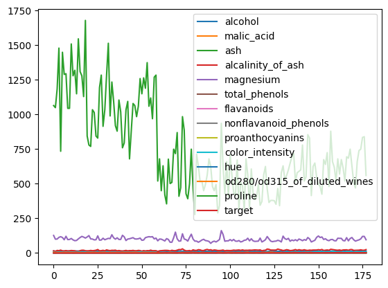
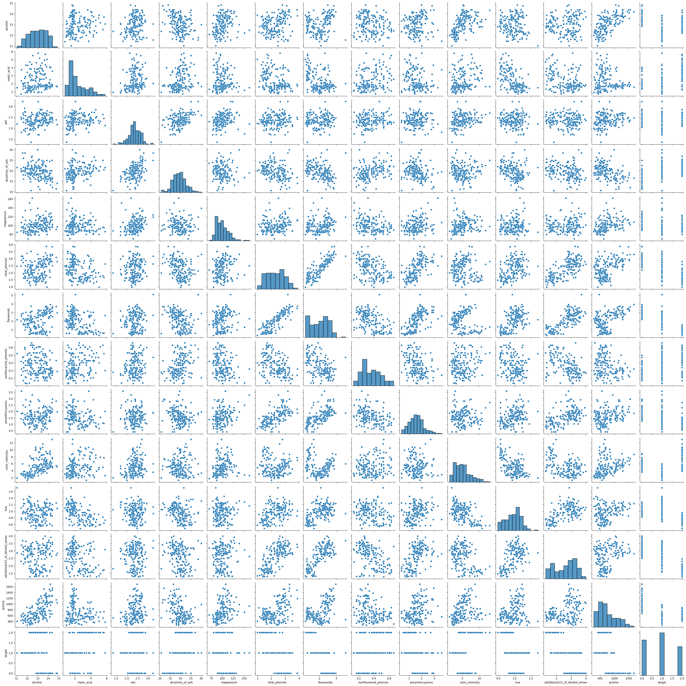
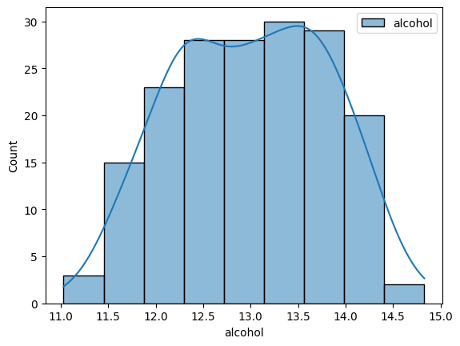
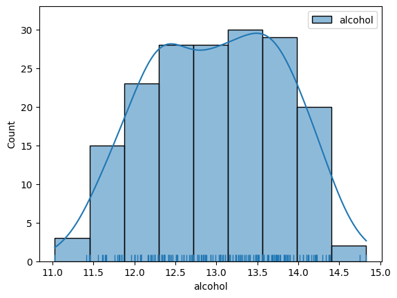
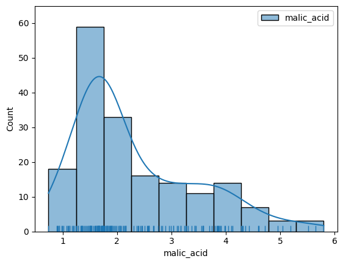
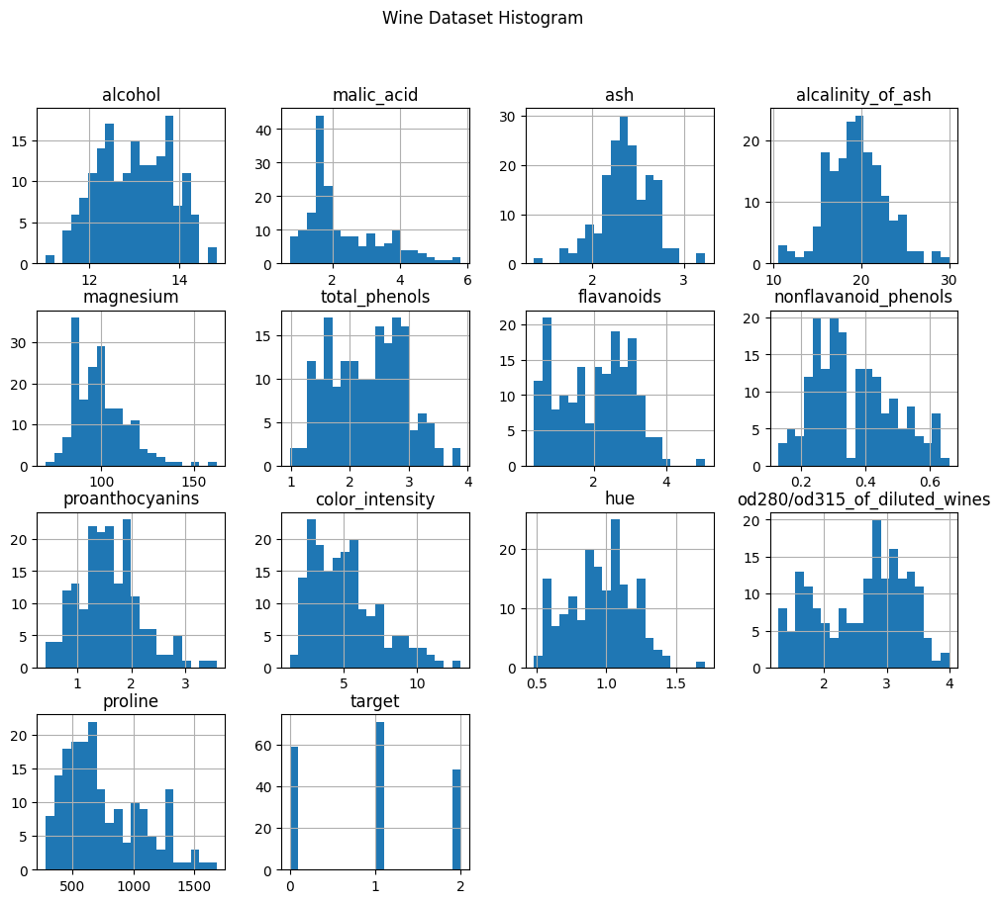
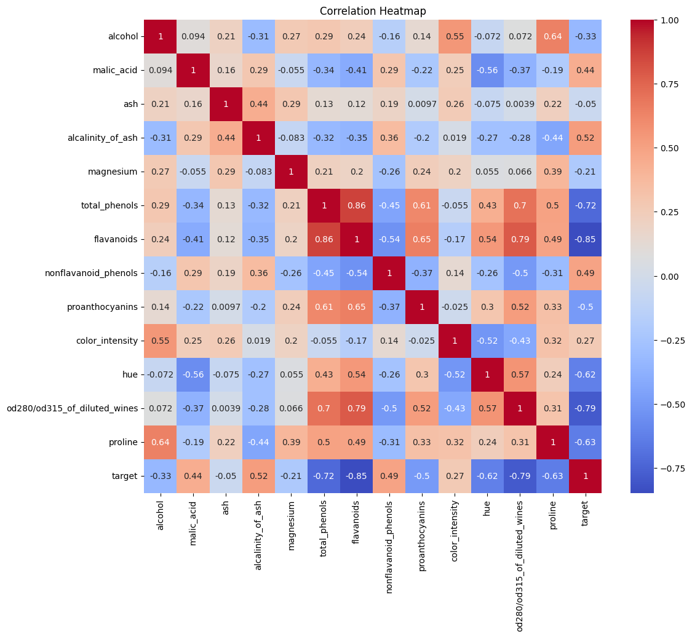
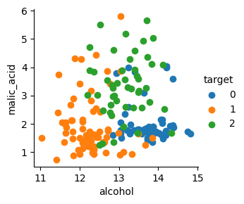
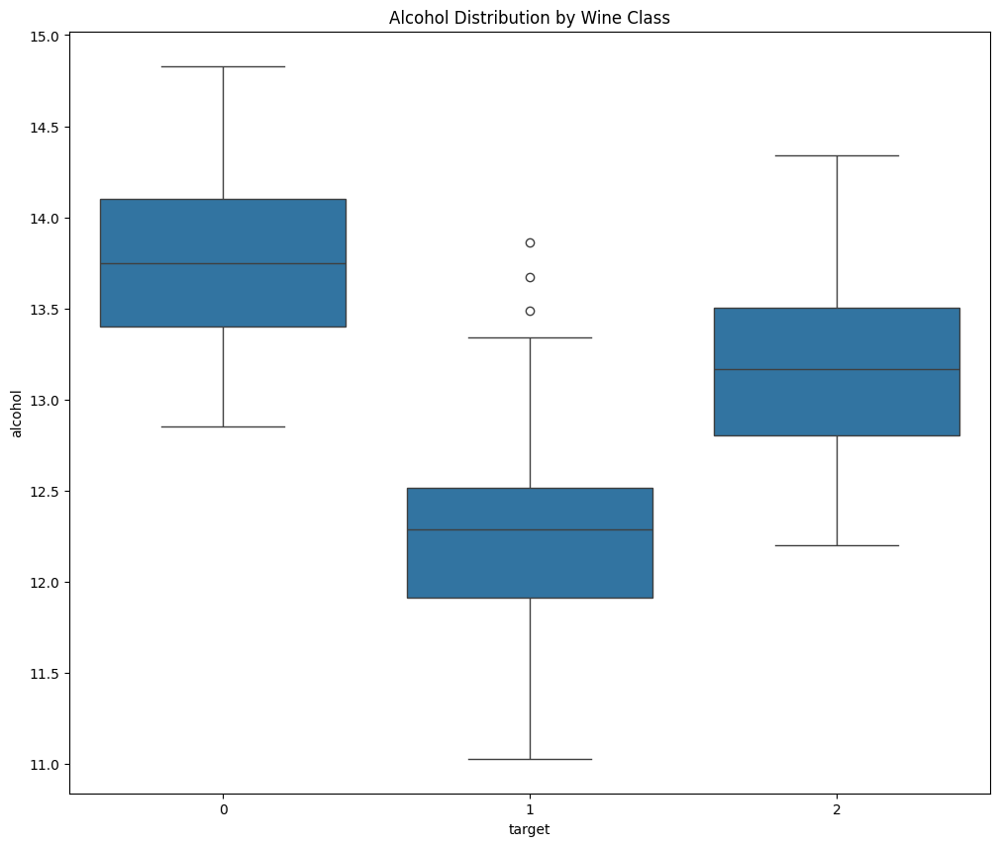

## load_wine

#### sklearn datasets를 모두 DataFrame으로 바꾸고 matplotlib과 seaborn을 이용하여 분석, 데이터를 탐색해보고 그래프를 그린다(load_wine)


```python
import sklearn.datasets
import numpy as np
import pandas as pd
import seaborn as sns
from matplotlib import pyplot as plt
%matplotlib inline
```

    /home/ubuntu/.local/lib/python3.10/site-packages/numpy/_core/getlimits.py:551: UserWarning: Signature b'\x00\xd0\xcc\xcc\xcc\xcc\xcc\xcc\xfb\xbf\x00\x00\x00\x00\x00\x00' for <class 'numpy.longdouble'> does not match any known type: falling back to type probe function.
    This warnings indicates broken support for the dtype!
      machar = _get_machar(dtype)


```python
data = sklearn.datasets.load_wine()
```


```python
print(data.keys())
for f in data.keys():
    t = type(data[f])
    print('key: {}, type: {}'.format(f, t))
    if t == np.ndarray:
        print('shape: {}'.format(data[f].shape))
```

    dict_keys(['data', 'target', 'frame', 'target_names', 'DESCR', 'feature_names'])
    key: data, type: <class 'numpy.ndarray'>
    shape: (178, 13)
    key: target, type: <class 'numpy.ndarray'>
    shape: (178,)
    key: frame, type: <class 'NoneType'>
    key: target_names, type: <class 'numpy.ndarray'>
    shape: (3,)
    key: DESCR, type: <class 'str'>
    key: feature_names, type: <class 'list'>


```python
print(data.DESCR)
```

    .. _wine_dataset:
    
    Wine recognition dataset
    ------------------------
    
    **Data Set Characteristics:**
    
    :Number of Instances: 178
    :Number of Attributes: 13 numeric, predictive attributes and the class
    :Attribute Information:
        - Alcohol
        - Malic acid
        - Ash
        - Alcalinity of ash
        - Magnesium
        - Total phenols
        - Flavanoids
        - Nonflavanoid phenols
        - Proanthocyanins
        - Color intensity
        - Hue
        - OD280/OD315 of diluted wines
        - Proline
        - class:
            - class_0
            - class_1
            - class_2
    
    :Summary Statistics:
    
    ============================= ==== ===== ======= =====
                                    Min   Max   Mean     SD
    ============================= ==== ===== ======= =====
    Alcohol:                      11.0  14.8    13.0   0.8
    Malic Acid:                   0.74  5.80    2.34  1.12
    Ash:                          1.36  3.23    2.36  0.27
    Alcalinity of Ash:            10.6  30.0    19.5   3.3
    Magnesium:                    70.0 162.0    99.7  14.3
    Total Phenols:                0.98  3.88    2.29  0.63
    Flavanoids:                   0.34  5.08    2.03  1.00
    Nonflavanoid Phenols:         0.13  0.66    0.36  0.12
    Proanthocyanins:              0.41  3.58    1.59  0.57
    Colour Intensity:              1.3  13.0     5.1   2.3
    Hue:                          0.48  1.71    0.96  0.23
    OD280/OD315 of diluted wines: 1.27  4.00    2.61  0.71
    Proline:                       278  1680     746   315
    ============================= ==== ===== ======= =====
    
    :Missing Attribute Values: None
    :Class Distribution: class_0 (59), class_1 (71), class_2 (48)
    :Creator: R.A. Fisher
    :Donor: Michael Marshall (MARSHALL%PLU@io.arc.nasa.gov)
    :Date: July, 1988
    
    This is a copy of UCI ML Wine recognition datasets.
    https://archive.ics.uci.edu/ml/machine-learning-databases/wine/wine.data
    
    The data is the results of a chemical analysis of wines grown in the same
    region in Italy by three different cultivators. There are thirteen different
    measurements taken for different constituents found in the three types of
    wine.
    
    Original Owners:
    
    Forina, M. et al, PARVUS -
    An Extendible Package for Data Exploration, Classification and Correlation.
    Institute of Pharmaceutical and Food Analysis and Technologies,
    Via Brigata Salerno, 16147 Genoa, Italy.
    
    Citation:
    
    Lichman, M. (2013). UCI Machine Learning Repository
    [https://archive.ics.uci.edu/ml]. Irvine, CA: University of California,
    School of Information and Computer Science.
    
    .. dropdown:: References
    
        (1) S. Aeberhard, D. Coomans and O. de Vel,
        Comparison of Classifiers in High Dimensional Settings,
        Tech. Rep. no. 92-02, (1992), Dept. of Computer Science and Dept. of
        Mathematics and Statistics, James Cook University of North Queensland.
        (Also submitted to Technometrics).
    
        The data was used with many others for comparing various
        classifiers. The classes are separable, though only RDA
        has achieved 100% correct classification.
        (RDA : 100%, QDA 99.4%, LDA 98.9%, 1NN 96.1% (z-transformed data))
        (All results using the leave-one-out technique)
    
        (2) S. Aeberhard, D. Coomans and O. de Vel,
        "THE CLASSIFICATION PERFORMANCE OF RDA"
        Tech. Rep. no. 92-01, (1992), Dept. of Computer Science and Dept. of
        Mathematics and Statistics, James Cook University of North Queensland.
        (Also submitted to Journal of Chemometrics).
    


```python
df = pd.DataFrame(data=data.data, columns=data.feature_names)
df['target'] = data.target
```


```python
print(df.head())
print(df.describe())
print(df.info())
```

       alcohol  malic_acid   ash  alcalinity_of_ash  magnesium  total_phenols  \
    0    14.23        1.71  2.43               15.6      127.0           2.80   
    1    13.20        1.78  2.14               11.2      100.0           2.65   
    2    13.16        2.36  2.67               18.6      101.0           2.80   
    3    14.37        1.95  2.50               16.8      113.0           3.85   
    4    13.24        2.59  2.87               21.0      118.0           2.80   
    
       flavanoids  nonflavanoid_phenols  proanthocyanins  color_intensity   hue  \
    0        3.06                  0.28             2.29             5.64  1.04   
    1        2.76                  0.26             1.28             4.38  1.05   
    2        3.24                  0.30             2.81             5.68  1.03   
    3        3.49                  0.24             2.18             7.80  0.86   
    4        2.69                  0.39             1.82             4.32  1.04   
    
       od280/od315_of_diluted_wines  proline  target  
    0                          3.92   1065.0       0  
    1                          3.40   1050.0       0  
    2                          3.17   1185.0       0  
    3                          3.45   1480.0       0  
    4                          2.93    735.0       0  
              alcohol  malic_acid         ash  alcalinity_of_ash   magnesium  \
    count  178.000000  178.000000  178.000000         178.000000  178.000000   
    mean    13.000618    2.336348    2.366517          19.494944   99.741573   
    std      0.811827    1.117146    0.274344           3.339564   14.282484   
    min     11.030000    0.740000    1.360000          10.600000   70.000000   
    25%     12.362500    1.602500    2.210000          17.200000   88.000000   
    50%     13.050000    1.865000    2.360000          19.500000   98.000000   
    75%     13.677500    3.082500    2.557500          21.500000  107.000000   
    max     14.830000    5.800000    3.230000          30.000000  162.000000   
    
           total_phenols  flavanoids  nonflavanoid_phenols  proanthocyanins  \
    count     178.000000  178.000000            178.000000       178.000000   
    mean        2.295112    2.029270              0.361854         1.590899   
    std         0.625851    0.998859              0.124453         0.572359   
    min         0.980000    0.340000              0.130000         0.410000   
    25%         1.742500    1.205000              0.270000         1.250000   
    50%         2.355000    2.135000              0.340000         1.555000   
    75%         2.800000    2.875000              0.437500         1.950000   
    max         3.880000    5.080000              0.660000         3.580000   
    
           color_intensity         hue  od280/od315_of_diluted_wines      proline  \
    count       178.000000  178.000000                    178.000000   178.000000   
    mean          5.058090    0.957449                      2.611685   746.893258   
    std           2.318286    0.228572                      0.709990   314.907474   
    min           1.280000    0.480000                      1.270000   278.000000   
    25%           3.220000    0.782500                      1.937500   500.500000   
    50%           4.690000    0.965000                      2.780000   673.500000   
    75%           6.200000    1.120000                      3.170000   985.000000   
    max          13.000000    1.710000                      4.000000  1680.000000   
    
               target  
    count  178.000000  
    mean     0.938202  
    std      0.775035  
    min      0.000000  
    25%      0.000000  
    50%      1.000000  
    75%      2.000000  
    max      2.000000  
    <class 'pandas.core.frame.DataFrame'>
    RangeIndex: 178 entries, 0 to 177
    Data columns (total 14 columns):
     #   Column                        Non-Null Count  Dtype  
    ---  ------                        --------------  -----  
     0   alcohol                       178 non-null    float64
     1   malic_acid                    178 non-null    float64
     2   ash                           178 non-null    float64
     3   alcalinity_of_ash             178 non-null    float64
     4   magnesium                     178 non-null    float64
     5   total_phenols                 178 non-null    float64
     6   flavanoids                    178 non-null    float64
     7   nonflavanoid_phenols          178 non-null    float64
     8   proanthocyanins               178 non-null    float64
     9   color_intensity               178 non-null    float64
     10  hue                           178 non-null    float64
     11  od280/od315_of_diluted_wines  178 non-null    float64
     12  proline                       178 non-null    float64
     13  target                        178 non-null    int64  
    dtypes: float64(13), int64(1)
    memory usage: 19.6 KB
    None


```python
df.plot()
```


    <Axes: >


    

    


```python
sns.pairplot(df)
```


    <seaborn.axisgrid.PairGrid at 0x7f157f898e80>


    

    


```python
sns.histplot(df["alcohol"], kde=True, label="alcohol")
plt.legend()
plt.show()
```


    

    


```python
sns.histplot(df["alcohol"], kde=True, label="alcohol")
sns.rugplot(df["alcohol"])
plt.legend()
plt.show()
```


    

    


```python
sns.histplot(df["malic_acid"], kde=True, label="malic_acid")
sns.rugplot(df["malic_acid"])
plt.legend()
plt.show()
```


    

    


```python
df.hist(figsize=(12, 10), bins=20)
plt.suptitle("Wine Dataset Histogram")
plt.show()
```


    

    


```python
plt.figure(figsize=(12, 10))
sns.heatmap(df.corr(), annot=True, cmap='coolwarm')
plt.title("Correlation Heatmap")
plt.show()

```


    

    


```python
sns.FacetGrid(df, hue='target') \
    .map(plt.scatter, 'alcohol', 'malic_acid') \
    .add_legend()
plt.show()
```


    

    


```python
plt.figure(figsize=(12,10))
sns.boxplot(x='target', y='alcohol', data=df)
plt.title("Alcohol Distribution by Wine Class")
plt.show()
```


    

    

