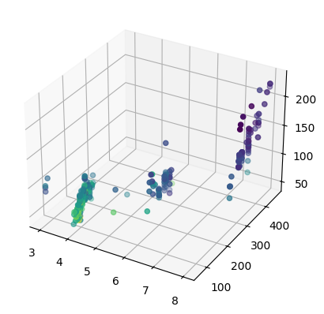
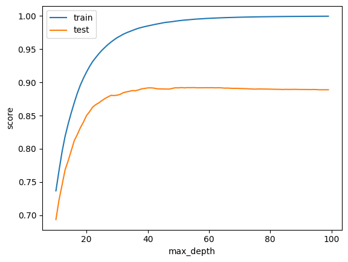

## mpg


```python
import seaborn as sns
import pandas as pd
from matplotlib import pyplot as plt
%matplotlib inline
```

    /home/ubuntu/.local/lib/python3.10/site-packages/numpy/_core/getlimits.py:551: UserWarning: Signature b'\x00\xd0\xcc\xcc\xcc\xcc\xcc\xcc\xfb\xbf\x00\x00\x00\x00\x00\x00' for <class 'numpy.longdouble'> does not match any known type: falling back to type probe function.
    This warnings indicates broken support for the dtype!
      machar = _get_machar(dtype)


```python
import os
import random
import numpy as np

def seed_everything(seed):
    random.seed(seed)
    os.environ['PYTHONHASHSEED'] = str(seed)
    np.random.seed(seed)

seed_everything(42)
```


```python
df = sns.load_dataset('mpg')
```


```python
print(type(df))
```

    <class 'pandas.core.frame.DataFrame'>


```python
df.head()
```


<div>
<style scoped>
    .dataframe tbody tr th:only-of-type {
        vertical-align: middle;
    }

    .dataframe tbody tr th {
        vertical-align: top;
    }

    .dataframe thead th {
        text-align: right;
    }
</style>
<table border="1" class="dataframe">
  <thead>
    <tr style="text-align: right;">
      <th></th>
      <th>mpg</th>
      <th>cylinders</th>
      <th>displacement</th>
      <th>horsepower</th>
      <th>weight</th>
      <th>acceleration</th>
      <th>model_year</th>
      <th>origin</th>
      <th>name</th>
    </tr>
  </thead>
  <tbody>
    <tr>
      <th>0</th>
      <td>18.0</td>
      <td>8</td>
      <td>307.0</td>
      <td>130.0</td>
      <td>3504</td>
      <td>12.0</td>
      <td>70</td>
      <td>usa</td>
      <td>chevrolet chevelle malibu</td>
    </tr>
    <tr>
      <th>1</th>
      <td>15.0</td>
      <td>8</td>
      <td>350.0</td>
      <td>165.0</td>
      <td>3693</td>
      <td>11.5</td>
      <td>70</td>
      <td>usa</td>
      <td>buick skylark 320</td>
    </tr>
    <tr>
      <th>2</th>
      <td>18.0</td>
      <td>8</td>
      <td>318.0</td>
      <td>150.0</td>
      <td>3436</td>
      <td>11.0</td>
      <td>70</td>
      <td>usa</td>
      <td>plymouth satellite</td>
    </tr>
    <tr>
      <th>3</th>
      <td>16.0</td>
      <td>8</td>
      <td>304.0</td>
      <td>150.0</td>
      <td>3433</td>
      <td>12.0</td>
      <td>70</td>
      <td>usa</td>
      <td>amc rebel sst</td>
    </tr>
    <tr>
      <th>4</th>
      <td>17.0</td>
      <td>8</td>
      <td>302.0</td>
      <td>140.0</td>
      <td>3449</td>
      <td>10.5</td>
      <td>70</td>
      <td>usa</td>
      <td>ford torino</td>
    </tr>
  </tbody>
</table>
</div>


```python
df.tail()
```


<div>
<style scoped>
    .dataframe tbody tr th:only-of-type {
        vertical-align: middle;
    }

    .dataframe tbody tr th {
        vertical-align: top;
    }

    .dataframe thead th {
        text-align: right;
    }
</style>
<table border="1" class="dataframe">
  <thead>
    <tr style="text-align: right;">
      <th></th>
      <th>mpg</th>
      <th>cylinders</th>
      <th>displacement</th>
      <th>horsepower</th>
      <th>weight</th>
      <th>acceleration</th>
      <th>model_year</th>
      <th>origin</th>
      <th>name</th>
    </tr>
  </thead>
  <tbody>
    <tr>
      <th>393</th>
      <td>27.0</td>
      <td>4</td>
      <td>140.0</td>
      <td>86.0</td>
      <td>2790</td>
      <td>15.6</td>
      <td>82</td>
      <td>usa</td>
      <td>ford mustang gl</td>
    </tr>
    <tr>
      <th>394</th>
      <td>44.0</td>
      <td>4</td>
      <td>97.0</td>
      <td>52.0</td>
      <td>2130</td>
      <td>24.6</td>
      <td>82</td>
      <td>europe</td>
      <td>vw pickup</td>
    </tr>
    <tr>
      <th>395</th>
      <td>32.0</td>
      <td>4</td>
      <td>135.0</td>
      <td>84.0</td>
      <td>2295</td>
      <td>11.6</td>
      <td>82</td>
      <td>usa</td>
      <td>dodge rampage</td>
    </tr>
    <tr>
      <th>396</th>
      <td>28.0</td>
      <td>4</td>
      <td>120.0</td>
      <td>79.0</td>
      <td>2625</td>
      <td>18.6</td>
      <td>82</td>
      <td>usa</td>
      <td>ford ranger</td>
    </tr>
    <tr>
      <th>397</th>
      <td>31.0</td>
      <td>4</td>
      <td>119.0</td>
      <td>82.0</td>
      <td>2720</td>
      <td>19.4</td>
      <td>82</td>
      <td>usa</td>
      <td>chevy s-10</td>
    </tr>
  </tbody>
</table>
</div>


```python
df.isnull().sum()
```


    mpg             0
    cylinders       0
    displacement    0
    horsepower      6
    weight          0
    acceleration    0
    model_year      0
    origin          0
    name            0
    dtype: int64


```python
df.dropna(inplace=True)
```


```python
df.isnull().sum()
```


    mpg             0
    cylinders       0
    displacement    0
    horsepower      0
    weight          0
    acceleration    0
    model_year      0
    origin          0
    name            0
    dtype: int64


```python
print(df.origin.unique())
```

    ['usa' 'japan' 'europe']


```python
from sklearn.preprocessing import LabelEncoder
label_encoder = LabelEncoder()

dfi = df.copy()

dfi['origin'] = label_encoder.fit_transform(dfi['origin'])
print(label_encoder.classes_)
```

    ['europe' 'japan' 'usa']


```python
dfi.head()
```


<div>
<style scoped>
    .dataframe tbody tr th:only-of-type {
        vertical-align: middle;
    }

    .dataframe tbody tr th {
        vertical-align: top;
    }

    .dataframe thead th {
        text-align: right;
    }
</style>
<table border="1" class="dataframe">
  <thead>
    <tr style="text-align: right;">
      <th></th>
      <th>mpg</th>
      <th>cylinders</th>
      <th>displacement</th>
      <th>horsepower</th>
      <th>weight</th>
      <th>acceleration</th>
      <th>model_year</th>
      <th>origin</th>
      <th>name</th>
    </tr>
  </thead>
  <tbody>
    <tr>
      <th>0</th>
      <td>18.0</td>
      <td>8</td>
      <td>307.0</td>
      <td>130.0</td>
      <td>3504</td>
      <td>12.0</td>
      <td>70</td>
      <td>2</td>
      <td>chevrolet chevelle malibu</td>
    </tr>
    <tr>
      <th>1</th>
      <td>15.0</td>
      <td>8</td>
      <td>350.0</td>
      <td>165.0</td>
      <td>3693</td>
      <td>11.5</td>
      <td>70</td>
      <td>2</td>
      <td>buick skylark 320</td>
    </tr>
    <tr>
      <th>2</th>
      <td>18.0</td>
      <td>8</td>
      <td>318.0</td>
      <td>150.0</td>
      <td>3436</td>
      <td>11.0</td>
      <td>70</td>
      <td>2</td>
      <td>plymouth satellite</td>
    </tr>
    <tr>
      <th>3</th>
      <td>16.0</td>
      <td>8</td>
      <td>304.0</td>
      <td>150.0</td>
      <td>3433</td>
      <td>12.0</td>
      <td>70</td>
      <td>2</td>
      <td>amc rebel sst</td>
    </tr>
    <tr>
      <th>4</th>
      <td>17.0</td>
      <td>8</td>
      <td>302.0</td>
      <td>140.0</td>
      <td>3449</td>
      <td>10.5</td>
      <td>70</td>
      <td>2</td>
      <td>ford torino</td>
    </tr>
  </tbody>
</table>
</div>


```python
dfi.drop('name', axis=1, inplace=True)
```


```python
y_data = dfi[['mpg']].values
dfi.drop('mpg', axis=1, inplace=True)
X_data = dfi.values
```


```python
import numpy as np
from sklearn.model_selection import train_test_split

X_train, X_test, y_train, y_test = train_test_split(X_data, y_data, test_size=0.2) # train과 test를 8:2로 분할
```


```python
%pip install xgboost
```

    Defaulting to user installation because normal site-packages is not writeable
    Collecting xgboost
      Downloading xgboost-3.0.4-py3-none-manylinux_2_28_x86_64.whl (94.9 MB)
         ━━━━━━━━━━━━━━━━━━━━━━━━━━━━━━━━━━━━━━━━ 94.9/94.9 MB 7.6 MB/s eta 0:00:00:00:0100:01
    [?25hRequirement already satisfied: numpy in /home/ubuntu/.local/lib/python3.10/site-packages (from xgboost) (2.2.6)
    Requirement already satisfied: nvidia-nccl-cu12 in /home/ubuntu/.local/lib/python3.10/site-packages (from xgboost) (2.26.2)
    Requirement already satisfied: scipy in /home/ubuntu/.local/lib/python3.10/site-packages (from xgboost) (1.15.3)
    Installing collected packages: xgboost
    Successfully installed xgboost-3.0.4
    Note: you may need to restart the kernel to use updated packages.


```python
import xgboost as xgb ## XGBoost 불러오기
from xgboost import plot_importance ## Feature Importance를 불러오기 위함
```


```python
model = xgb.XGBRegressor(n_estimators=100, learning_rate=0.08, gamma=0, subsample=0.75,
                           colsample_bytree=1, max_depth=7)
```


```python
model.fit(X_train, y_train)
```


<style>#sk-container-id-1 {
  /* Definition of color scheme common for light and dark mode */
  --sklearn-color-text: #000;
  --sklearn-color-text-muted: #666;
  --sklearn-color-line: gray;
  /* Definition of color scheme for unfitted estimators */
  --sklearn-color-unfitted-level-0: #fff5e6;
  --sklearn-color-unfitted-level-1: #f6e4d2;
  --sklearn-color-unfitted-level-2: #ffe0b3;
  --sklearn-color-unfitted-level-3: chocolate;
  /* Definition of color scheme for fitted estimators */
  --sklearn-color-fitted-level-0: #f0f8ff;
  --sklearn-color-fitted-level-1: #d4ebff;
  --sklearn-color-fitted-level-2: #b3dbfd;
  --sklearn-color-fitted-level-3: cornflowerblue;

  /* Specific color for light theme */
  --sklearn-color-text-on-default-background: var(--sg-text-color, var(--theme-code-foreground, var(--jp-content-font-color1, black)));
  --sklearn-color-background: var(--sg-background-color, var(--theme-background, var(--jp-layout-color0, white)));
  --sklearn-color-border-box: var(--sg-text-color, var(--theme-code-foreground, var(--jp-content-font-color1, black)));
  --sklearn-color-icon: #696969;

  @media (prefers-color-scheme: dark) {
    /* Redefinition of color scheme for dark theme */
    --sklearn-color-text-on-default-background: var(--sg-text-color, var(--theme-code-foreground, var(--jp-content-font-color1, white)));
    --sklearn-color-background: var(--sg-background-color, var(--theme-background, var(--jp-layout-color0, #111)));
    --sklearn-color-border-box: var(--sg-text-color, var(--theme-code-foreground, var(--jp-content-font-color1, white)));
    --sklearn-color-icon: #878787;
  }
}

#sk-container-id-1 {
  color: var(--sklearn-color-text);
}

#sk-container-id-1 pre {
  padding: 0;
}

#sk-container-id-1 input.sk-hidden--visually {
  border: 0;
  clip: rect(1px 1px 1px 1px);
  clip: rect(1px, 1px, 1px, 1px);
  height: 1px;
  margin: -1px;
  overflow: hidden;
  padding: 0;
  position: absolute;
  width: 1px;
}

#sk-container-id-1 div.sk-dashed-wrapped {
  border: 1px dashed var(--sklearn-color-line);
  margin: 0 0.4em 0.5em 0.4em;
  box-sizing: border-box;
  padding-bottom: 0.4em;
  background-color: var(--sklearn-color-background);
}

#sk-container-id-1 div.sk-container {
  /* jupyter's `normalize.less` sets `[hidden] { display: none; }`
     but bootstrap.min.css set `[hidden] { display: none !important; }`
     so we also need the `!important` here to be able to override the
     default hidden behavior on the sphinx rendered scikit-learn.org.
     See: https://github.com/scikit-learn/scikit-learn/issues/21755 */
  display: inline-block !important;
  position: relative;
}

#sk-container-id-1 div.sk-text-repr-fallback {
  display: none;
}

div.sk-parallel-item,
div.sk-serial,
div.sk-item {
  /* draw centered vertical line to link estimators */
  background-image: linear-gradient(var(--sklearn-color-text-on-default-background), var(--sklearn-color-text-on-default-background));
  background-size: 2px 100%;
  background-repeat: no-repeat;
  background-position: center center;
}

/* Parallel-specific style estimator block */

#sk-container-id-1 div.sk-parallel-item::after {
  content: "";
  width: 100%;
  border-bottom: 2px solid var(--sklearn-color-text-on-default-background);
  flex-grow: 1;
}

#sk-container-id-1 div.sk-parallel {
  display: flex;
  align-items: stretch;
  justify-content: center;
  background-color: var(--sklearn-color-background);
  position: relative;
}

#sk-container-id-1 div.sk-parallel-item {
  display: flex;
  flex-direction: column;
}

#sk-container-id-1 div.sk-parallel-item:first-child::after {
  align-self: flex-end;
  width: 50%;
}

#sk-container-id-1 div.sk-parallel-item:last-child::after {
  align-self: flex-start;
  width: 50%;
}

#sk-container-id-1 div.sk-parallel-item:only-child::after {
  width: 0;
}

/* Serial-specific style estimator block */

#sk-container-id-1 div.sk-serial {
  display: flex;
  flex-direction: column;
  align-items: center;
  background-color: var(--sklearn-color-background);
  padding-right: 1em;
  padding-left: 1em;
}


/* Toggleable style: style used for estimator/Pipeline/ColumnTransformer box that is
clickable and can be expanded/collapsed.
- Pipeline and ColumnTransformer use this feature and define the default style
- Estimators will overwrite some part of the style using the `sk-estimator` class
*/

/* Pipeline and ColumnTransformer style (default) */

#sk-container-id-1 div.sk-toggleable {
  /* Default theme specific background. It is overwritten whether we have a
  specific estimator or a Pipeline/ColumnTransformer */
  background-color: var(--sklearn-color-background);
}

/* Toggleable label */
#sk-container-id-1 label.sk-toggleable__label {
  cursor: pointer;
  display: flex;
  width: 100%;
  margin-bottom: 0;
  padding: 0.5em;
  box-sizing: border-box;
  text-align: center;
  align-items: start;
  justify-content: space-between;
  gap: 0.5em;
}

#sk-container-id-1 label.sk-toggleable__label .caption {
  font-size: 0.6rem;
  font-weight: lighter;
  color: var(--sklearn-color-text-muted);
}

#sk-container-id-1 label.sk-toggleable__label-arrow:before {
  /* Arrow on the left of the label */
  content: "▸";
  float: left;
  margin-right: 0.25em;
  color: var(--sklearn-color-icon);
}

#sk-container-id-1 label.sk-toggleable__label-arrow:hover:before {
  color: var(--sklearn-color-text);
}

/* Toggleable content - dropdown */

#sk-container-id-1 div.sk-toggleable__content {
  display: none;
  text-align: left;
  /* unfitted */
  background-color: var(--sklearn-color-unfitted-level-0);
}

#sk-container-id-1 div.sk-toggleable__content.fitted {
  /* fitted */
  background-color: var(--sklearn-color-fitted-level-0);
}

#sk-container-id-1 div.sk-toggleable__content pre {
  margin: 0.2em;
  border-radius: 0.25em;
  color: var(--sklearn-color-text);
  /* unfitted */
  background-color: var(--sklearn-color-unfitted-level-0);
}

#sk-container-id-1 div.sk-toggleable__content.fitted pre {
  /* unfitted */
  background-color: var(--sklearn-color-fitted-level-0);
}

#sk-container-id-1 input.sk-toggleable__control:checked~div.sk-toggleable__content {
  /* Expand drop-down */
  display: block;
  width: 100%;
  overflow: visible;
}

#sk-container-id-1 input.sk-toggleable__control:checked~label.sk-toggleable__label-arrow:before {
  content: "▾";
}

/* Pipeline/ColumnTransformer-specific style */

#sk-container-id-1 div.sk-label input.sk-toggleable__control:checked~label.sk-toggleable__label {
  color: var(--sklearn-color-text);
  background-color: var(--sklearn-color-unfitted-level-2);
}

#sk-container-id-1 div.sk-label.fitted input.sk-toggleable__control:checked~label.sk-toggleable__label {
  background-color: var(--sklearn-color-fitted-level-2);
}

/* Estimator-specific style */

/* Colorize estimator box */
#sk-container-id-1 div.sk-estimator input.sk-toggleable__control:checked~label.sk-toggleable__label {
  /* unfitted */
  background-color: var(--sklearn-color-unfitted-level-2);
}

#sk-container-id-1 div.sk-estimator.fitted input.sk-toggleable__control:checked~label.sk-toggleable__label {
  /* fitted */
  background-color: var(--sklearn-color-fitted-level-2);
}

#sk-container-id-1 div.sk-label label.sk-toggleable__label,
#sk-container-id-1 div.sk-label label {
  /* The background is the default theme color */
  color: var(--sklearn-color-text-on-default-background);
}

/* On hover, darken the color of the background */
#sk-container-id-1 div.sk-label:hover label.sk-toggleable__label {
  color: var(--sklearn-color-text);
  background-color: var(--sklearn-color-unfitted-level-2);
}

/* Label box, darken color on hover, fitted */
#sk-container-id-1 div.sk-label.fitted:hover label.sk-toggleable__label.fitted {
  color: var(--sklearn-color-text);
  background-color: var(--sklearn-color-fitted-level-2);
}

/* Estimator label */

#sk-container-id-1 div.sk-label label {
  font-family: monospace;
  font-weight: bold;
  display: inline-block;
  line-height: 1.2em;
}

#sk-container-id-1 div.sk-label-container {
  text-align: center;
}

/* Estimator-specific */
#sk-container-id-1 div.sk-estimator {
  font-family: monospace;
  border: 1px dotted var(--sklearn-color-border-box);
  border-radius: 0.25em;
  box-sizing: border-box;
  margin-bottom: 0.5em;
  /* unfitted */
  background-color: var(--sklearn-color-unfitted-level-0);
}

#sk-container-id-1 div.sk-estimator.fitted {
  /* fitted */
  background-color: var(--sklearn-color-fitted-level-0);
}

/* on hover */
#sk-container-id-1 div.sk-estimator:hover {
  /* unfitted */
  background-color: var(--sklearn-color-unfitted-level-2);
}

#sk-container-id-1 div.sk-estimator.fitted:hover {
  /* fitted */
  background-color: var(--sklearn-color-fitted-level-2);
}

/* Specification for estimator info (e.g. "i" and "?") */

/* Common style for "i" and "?" */

.sk-estimator-doc-link,
a:link.sk-estimator-doc-link,
a:visited.sk-estimator-doc-link {
  float: right;
  font-size: smaller;
  line-height: 1em;
  font-family: monospace;
  background-color: var(--sklearn-color-background);
  border-radius: 1em;
  height: 1em;
  width: 1em;
  text-decoration: none !important;
  margin-left: 0.5em;
  text-align: center;
  /* unfitted */
  border: var(--sklearn-color-unfitted-level-1) 1pt solid;
  color: var(--sklearn-color-unfitted-level-1);
}

.sk-estimator-doc-link.fitted,
a:link.sk-estimator-doc-link.fitted,
a:visited.sk-estimator-doc-link.fitted {
  /* fitted */
  border: var(--sklearn-color-fitted-level-1) 1pt solid;
  color: var(--sklearn-color-fitted-level-1);
}

/* On hover */
div.sk-estimator:hover .sk-estimator-doc-link:hover,
.sk-estimator-doc-link:hover,
div.sk-label-container:hover .sk-estimator-doc-link:hover,
.sk-estimator-doc-link:hover {
  /* unfitted */
  background-color: var(--sklearn-color-unfitted-level-3);
  color: var(--sklearn-color-background);
  text-decoration: none;
}

div.sk-estimator.fitted:hover .sk-estimator-doc-link.fitted:hover,
.sk-estimator-doc-link.fitted:hover,
div.sk-label-container:hover .sk-estimator-doc-link.fitted:hover,
.sk-estimator-doc-link.fitted:hover {
  /* fitted */
  background-color: var(--sklearn-color-fitted-level-3);
  color: var(--sklearn-color-background);
  text-decoration: none;
}

/* Span, style for the box shown on hovering the info icon */
.sk-estimator-doc-link span {
  display: none;
  z-index: 9999;
  position: relative;
  font-weight: normal;
  right: .2ex;
  padding: .5ex;
  margin: .5ex;
  width: min-content;
  min-width: 20ex;
  max-width: 50ex;
  color: var(--sklearn-color-text);
  box-shadow: 2pt 2pt 4pt #999;
  /* unfitted */
  background: var(--sklearn-color-unfitted-level-0);
  border: .5pt solid var(--sklearn-color-unfitted-level-3);
}

.sk-estimator-doc-link.fitted span {
  /* fitted */
  background: var(--sklearn-color-fitted-level-0);
  border: var(--sklearn-color-fitted-level-3);
}

.sk-estimator-doc-link:hover span {
  display: block;
}

/* "?"-specific style due to the `<a>` HTML tag */

#sk-container-id-1 a.estimator_doc_link {
  float: right;
  font-size: 1rem;
  line-height: 1em;
  font-family: monospace;
  background-color: var(--sklearn-color-background);
  border-radius: 1rem;
  height: 1rem;
  width: 1rem;
  text-decoration: none;
  /* unfitted */
  color: var(--sklearn-color-unfitted-level-1);
  border: var(--sklearn-color-unfitted-level-1) 1pt solid;
}

#sk-container-id-1 a.estimator_doc_link.fitted {
  /* fitted */
  border: var(--sklearn-color-fitted-level-1) 1pt solid;
  color: var(--sklearn-color-fitted-level-1);
}

/* On hover */
#sk-container-id-1 a.estimator_doc_link:hover {
  /* unfitted */
  background-color: var(--sklearn-color-unfitted-level-3);
  color: var(--sklearn-color-background);
  text-decoration: none;
}

#sk-container-id-1 a.estimator_doc_link.fitted:hover {
  /* fitted */
  background-color: var(--sklearn-color-fitted-level-3);
}

.estimator-table summary {
    padding: .5rem;
    font-family: monospace;
    cursor: pointer;
}

.estimator-table details[open] {
    padding-left: 0.1rem;
    padding-right: 0.1rem;
    padding-bottom: 0.3rem;
}

.estimator-table .parameters-table {
    margin-left: auto !important;
    margin-right: auto !important;
}

.estimator-table .parameters-table tr:nth-child(odd) {
    background-color: #fff;
}

.estimator-table .parameters-table tr:nth-child(even) {
    background-color: #f6f6f6;
}

.estimator-table .parameters-table tr:hover {
    background-color: #e0e0e0;
}

.estimator-table table td {
    border: 1px solid rgba(106, 105, 104, 0.232);
}

.user-set td {
    color:rgb(255, 94, 0);
    text-align: left;
}

.user-set td.value pre {
    color:rgb(255, 94, 0) !important;
    background-color: transparent !important;
}

.default td {
    color: black;
    text-align: left;
}

.user-set td i,
.default td i {
    color: black;
}

.copy-paste-icon {
    background-image: url(data:image/svg+xml;base64,PHN2ZyB4bWxucz0iaHR0cDovL3d3dy53My5vcmcvMjAwMC9zdmciIHZpZXdCb3g9IjAgMCA0NDggNTEyIj48IS0tIUZvbnQgQXdlc29tZSBGcmVlIDYuNy4yIGJ5IEBmb250YXdlc29tZSAtIGh0dHBzOi8vZm9udGF3ZXNvbWUuY29tIExpY2Vuc2UgLSBodHRwczovL2ZvbnRhd2Vzb21lLmNvbS9saWNlbnNlL2ZyZWUgQ29weXJpZ2h0IDIwMjUgRm9udGljb25zLCBJbmMuLS0+PHBhdGggZD0iTTIwOCAwTDMzMi4xIDBjMTIuNyAwIDI0LjkgNS4xIDMzLjkgMTQuMWw2Ny45IDY3LjljOSA5IDE0LjEgMjEuMiAxNC4xIDMzLjlMNDQ4IDMzNmMwIDI2LjUtMjEuNSA0OC00OCA0OGwtMTkyIDBjLTI2LjUgMC00OC0yMS41LTQ4LTQ4bDAtMjg4YzAtMjYuNSAyMS41LTQ4IDQ4LTQ4ek00OCAxMjhsODAgMCAwIDY0LTY0IDAgMCAyNTYgMTkyIDAgMC0zMiA2NCAwIDAgNDhjMCAyNi41LTIxLjUgNDgtNDggNDhMNDggNTEyYy0yNi41IDAtNDgtMjEuNS00OC00OEwwIDE3NmMwLTI2LjUgMjEuNS00OCA0OC00OHoiLz48L3N2Zz4=);
    background-repeat: no-repeat;
    background-size: 14px 14px;
    background-position: 0;
    display: inline-block;
    width: 14px;
    height: 14px;
    cursor: pointer;
}
</style><body><div id="sk-container-id-1" class="sk-top-container"><div class="sk-text-repr-fallback"><pre>XGBRegressor(base_score=None, booster=None, callbacks=None,
             colsample_bylevel=None, colsample_bynode=None, colsample_bytree=1,
             device=None, early_stopping_rounds=None, enable_categorical=False,
             eval_metric=None, feature_types=None, feature_weights=None,
             gamma=0, grow_policy=None, importance_type=None,
             interaction_constraints=None, learning_rate=0.08, max_bin=None,
             max_cat_threshold=None, max_cat_to_onehot=None,
             max_delta_step=None, max_depth=7, max_leaves=None,
             min_child_weight=None, missing=nan, monotone_constraints=None,
             multi_strategy=None, n_estimators=100, n_jobs=None,
             num_parallel_tree=None, ...)</pre><b>In a Jupyter environment, please rerun this cell to show the HTML representation or trust the notebook. <br />On GitHub, the HTML representation is unable to render, please try loading this page with nbviewer.org.</b></div><div class="sk-container" hidden><div class="sk-item"><div class="sk-estimator fitted sk-toggleable"><input class="sk-toggleable__control sk-hidden--visually" id="sk-estimator-id-1" type="checkbox" checked><label for="sk-estimator-id-1" class="sk-toggleable__label fitted sk-toggleable__label-arrow"><div><div>XGBRegressor</div></div><div><a class="sk-estimator-doc-link fitted" rel="noreferrer" target="_blank" href="https://xgboost.readthedocs.io/en/release_3.0.0/python/python_api.html#xgboost.XGBRegressor">?<span>Documentation for XGBRegressor</span></a><span class="sk-estimator-doc-link fitted">i<span>Fitted</span></span></div></label><div class="sk-toggleable__content fitted" data-param-prefix="">
        <div class="estimator-table">
            <details>
                <summary>Parameters</summary>
                <table class="parameters-table">
                  <tbody>

        <tr class="default">
            <td><i class="copy-paste-icon"
                 onclick="copyToClipboard('objective',
                          this.parentElement.nextElementSibling)"
            ></i></td>
            <td class="param">objective&nbsp;</td>
            <td class="value">&#x27;reg:squarederror&#x27;</td>
        </tr>


        <tr class="user-set">
            <td><i class="copy-paste-icon"
                 onclick="copyToClipboard('base_score',
                          this.parentElement.nextElementSibling)"
            ></i></td>
            <td class="param">base_score&nbsp;</td>
            <td class="value">None</td>
        </tr>


        <tr class="user-set">
            <td><i class="copy-paste-icon"
                 onclick="copyToClipboard('booster',
                          this.parentElement.nextElementSibling)"
            ></i></td>
            <td class="param">booster&nbsp;</td>
            <td class="value">None</td>
        </tr>


        <tr class="user-set">
            <td><i class="copy-paste-icon"
                 onclick="copyToClipboard('callbacks',
                          this.parentElement.nextElementSibling)"
            ></i></td>
            <td class="param">callbacks&nbsp;</td>
            <td class="value">None</td>
        </tr>


        <tr class="user-set">
            <td><i class="copy-paste-icon"
                 onclick="copyToClipboard('colsample_bylevel',
                          this.parentElement.nextElementSibling)"
            ></i></td>
            <td class="param">colsample_bylevel&nbsp;</td>
            <td class="value">None</td>
        </tr>


        <tr class="user-set">
            <td><i class="copy-paste-icon"
                 onclick="copyToClipboard('colsample_bynode',
                          this.parentElement.nextElementSibling)"
            ></i></td>
            <td class="param">colsample_bynode&nbsp;</td>
            <td class="value">None</td>
        </tr>


        <tr class="user-set">
            <td><i class="copy-paste-icon"
                 onclick="copyToClipboard('colsample_bytree',
                          this.parentElement.nextElementSibling)"
            ></i></td>
            <td class="param">colsample_bytree&nbsp;</td>
            <td class="value">1</td>
        </tr>


        <tr class="user-set">
            <td><i class="copy-paste-icon"
                 onclick="copyToClipboard('device',
                          this.parentElement.nextElementSibling)"
            ></i></td>
            <td class="param">device&nbsp;</td>
            <td class="value">None</td>
        </tr>


        <tr class="user-set">
            <td><i class="copy-paste-icon"
                 onclick="copyToClipboard('early_stopping_rounds',
                          this.parentElement.nextElementSibling)"
            ></i></td>
            <td class="param">early_stopping_rounds&nbsp;</td>
            <td class="value">None</td>
        </tr>


        <tr class="user-set">
            <td><i class="copy-paste-icon"
                 onclick="copyToClipboard('enable_categorical',
                          this.parentElement.nextElementSibling)"
            ></i></td>
            <td class="param">enable_categorical&nbsp;</td>
            <td class="value">False</td>
        </tr>


        <tr class="user-set">
            <td><i class="copy-paste-icon"
                 onclick="copyToClipboard('eval_metric',
                          this.parentElement.nextElementSibling)"
            ></i></td>
            <td class="param">eval_metric&nbsp;</td>
            <td class="value">None</td>
        </tr>


        <tr class="user-set">
            <td><i class="copy-paste-icon"
                 onclick="copyToClipboard('feature_types',
                          this.parentElement.nextElementSibling)"
            ></i></td>
            <td class="param">feature_types&nbsp;</td>
            <td class="value">None</td>
        </tr>


        <tr class="user-set">
            <td><i class="copy-paste-icon"
                 onclick="copyToClipboard('feature_weights',
                          this.parentElement.nextElementSibling)"
            ></i></td>
            <td class="param">feature_weights&nbsp;</td>
            <td class="value">None</td>
        </tr>


        <tr class="user-set">
            <td><i class="copy-paste-icon"
                 onclick="copyToClipboard('gamma',
                          this.parentElement.nextElementSibling)"
            ></i></td>
            <td class="param">gamma&nbsp;</td>
            <td class="value">0</td>
        </tr>


        <tr class="user-set">
            <td><i class="copy-paste-icon"
                 onclick="copyToClipboard('grow_policy',
                          this.parentElement.nextElementSibling)"
            ></i></td>
            <td class="param">grow_policy&nbsp;</td>
            <td class="value">None</td>
        </tr>


        <tr class="user-set">
            <td><i class="copy-paste-icon"
                 onclick="copyToClipboard('importance_type',
                          this.parentElement.nextElementSibling)"
            ></i></td>
            <td class="param">importance_type&nbsp;</td>
            <td class="value">None</td>
        </tr>


        <tr class="user-set">
            <td><i class="copy-paste-icon"
                 onclick="copyToClipboard('interaction_constraints',
                          this.parentElement.nextElementSibling)"
            ></i></td>
            <td class="param">interaction_constraints&nbsp;</td>
            <td class="value">None</td>
        </tr>


        <tr class="user-set">
            <td><i class="copy-paste-icon"
                 onclick="copyToClipboard('learning_rate',
                          this.parentElement.nextElementSibling)"
            ></i></td>
            <td class="param">learning_rate&nbsp;</td>
            <td class="value">0.08</td>
        </tr>


        <tr class="user-set">
            <td><i class="copy-paste-icon"
                 onclick="copyToClipboard('max_bin',
                          this.parentElement.nextElementSibling)"
            ></i></td>
            <td class="param">max_bin&nbsp;</td>
            <td class="value">None</td>
        </tr>


        <tr class="user-set">
            <td><i class="copy-paste-icon"
                 onclick="copyToClipboard('max_cat_threshold',
                          this.parentElement.nextElementSibling)"
            ></i></td>
            <td class="param">max_cat_threshold&nbsp;</td>
            <td class="value">None</td>
        </tr>


        <tr class="user-set">
            <td><i class="copy-paste-icon"
                 onclick="copyToClipboard('max_cat_to_onehot',
                          this.parentElement.nextElementSibling)"
            ></i></td>
            <td class="param">max_cat_to_onehot&nbsp;</td>
            <td class="value">None</td>
        </tr>


        <tr class="user-set">
            <td><i class="copy-paste-icon"
                 onclick="copyToClipboard('max_delta_step',
                          this.parentElement.nextElementSibling)"
            ></i></td>
            <td class="param">max_delta_step&nbsp;</td>
            <td class="value">None</td>
        </tr>


        <tr class="user-set">
            <td><i class="copy-paste-icon"
                 onclick="copyToClipboard('max_depth',
                          this.parentElement.nextElementSibling)"
            ></i></td>
            <td class="param">max_depth&nbsp;</td>
            <td class="value">7</td>
        </tr>


        <tr class="user-set">
            <td><i class="copy-paste-icon"
                 onclick="copyToClipboard('max_leaves',
                          this.parentElement.nextElementSibling)"
            ></i></td>
            <td class="param">max_leaves&nbsp;</td>
            <td class="value">None</td>
        </tr>


        <tr class="user-set">
            <td><i class="copy-paste-icon"
                 onclick="copyToClipboard('min_child_weight',
                          this.parentElement.nextElementSibling)"
            ></i></td>
            <td class="param">min_child_weight&nbsp;</td>
            <td class="value">None</td>
        </tr>


        <tr class="user-set">
            <td><i class="copy-paste-icon"
                 onclick="copyToClipboard('missing',
                          this.parentElement.nextElementSibling)"
            ></i></td>
            <td class="param">missing&nbsp;</td>
            <td class="value">nan</td>
        </tr>


        <tr class="user-set">
            <td><i class="copy-paste-icon"
                 onclick="copyToClipboard('monotone_constraints',
                          this.parentElement.nextElementSibling)"
            ></i></td>
            <td class="param">monotone_constraints&nbsp;</td>
            <td class="value">None</td>
        </tr>


        <tr class="user-set">
            <td><i class="copy-paste-icon"
                 onclick="copyToClipboard('multi_strategy',
                          this.parentElement.nextElementSibling)"
            ></i></td>
            <td class="param">multi_strategy&nbsp;</td>
            <td class="value">None</td>
        </tr>


        <tr class="user-set">
            <td><i class="copy-paste-icon"
                 onclick="copyToClipboard('n_estimators',
                          this.parentElement.nextElementSibling)"
            ></i></td>
            <td class="param">n_estimators&nbsp;</td>
            <td class="value">100</td>
        </tr>


        <tr class="user-set">
            <td><i class="copy-paste-icon"
                 onclick="copyToClipboard('n_jobs',
                          this.parentElement.nextElementSibling)"
            ></i></td>
            <td class="param">n_jobs&nbsp;</td>
            <td class="value">None</td>
        </tr>


        <tr class="user-set">
            <td><i class="copy-paste-icon"
                 onclick="copyToClipboard('num_parallel_tree',
                          this.parentElement.nextElementSibling)"
            ></i></td>
            <td class="param">num_parallel_tree&nbsp;</td>
            <td class="value">None</td>
        </tr>


        <tr class="user-set">
            <td><i class="copy-paste-icon"
                 onclick="copyToClipboard('random_state',
                          this.parentElement.nextElementSibling)"
            ></i></td>
            <td class="param">random_state&nbsp;</td>
            <td class="value">None</td>
        </tr>


        <tr class="user-set">
            <td><i class="copy-paste-icon"
                 onclick="copyToClipboard('reg_alpha',
                          this.parentElement.nextElementSibling)"
            ></i></td>
            <td class="param">reg_alpha&nbsp;</td>
            <td class="value">None</td>
        </tr>


        <tr class="user-set">
            <td><i class="copy-paste-icon"
                 onclick="copyToClipboard('reg_lambda',
                          this.parentElement.nextElementSibling)"
            ></i></td>
            <td class="param">reg_lambda&nbsp;</td>
            <td class="value">None</td>
        </tr>


        <tr class="user-set">
            <td><i class="copy-paste-icon"
                 onclick="copyToClipboard('sampling_method',
                          this.parentElement.nextElementSibling)"
            ></i></td>
            <td class="param">sampling_method&nbsp;</td>
            <td class="value">None</td>
        </tr>


        <tr class="user-set">
            <td><i class="copy-paste-icon"
                 onclick="copyToClipboard('scale_pos_weight',
                          this.parentElement.nextElementSibling)"
            ></i></td>
            <td class="param">scale_pos_weight&nbsp;</td>
            <td class="value">None</td>
        </tr>


        <tr class="user-set">
            <td><i class="copy-paste-icon"
                 onclick="copyToClipboard('subsample',
                          this.parentElement.nextElementSibling)"
            ></i></td>
            <td class="param">subsample&nbsp;</td>
            <td class="value">0.75</td>
        </tr>


        <tr class="user-set">
            <td><i class="copy-paste-icon"
                 onclick="copyToClipboard('tree_method',
                          this.parentElement.nextElementSibling)"
            ></i></td>
            <td class="param">tree_method&nbsp;</td>
            <td class="value">None</td>
        </tr>


        <tr class="user-set">
            <td><i class="copy-paste-icon"
                 onclick="copyToClipboard('validate_parameters',
                          this.parentElement.nextElementSibling)"
            ></i></td>
            <td class="param">validate_parameters&nbsp;</td>
            <td class="value">None</td>
        </tr>


        <tr class="user-set">
            <td><i class="copy-paste-icon"
                 onclick="copyToClipboard('verbosity',
                          this.parentElement.nextElementSibling)"
            ></i></td>
            <td class="param">verbosity&nbsp;</td>
            <td class="value">None</td>
        </tr>

                  </tbody>
                </table>
            </details>
        </div>
    </div></div></div></div></div><script>function copyToClipboard(text, element) {
    // Get the parameter prefix from the closest toggleable content
    const toggleableContent = element.closest('.sk-toggleable__content');
    const paramPrefix = toggleableContent ? toggleableContent.dataset.paramPrefix : '';
    const fullParamName = paramPrefix ? `${paramPrefix}${text}` : text;

    const originalStyle = element.style;
    const computedStyle = window.getComputedStyle(element);
    const originalWidth = computedStyle.width;
    const originalHTML = element.innerHTML.replace('Copied!', '');

    navigator.clipboard.writeText(fullParamName)
        .then(() => {
            element.style.width = originalWidth;
            element.style.color = 'green';
            element.innerHTML = "Copied!";

            setTimeout(() => {
                element.innerHTML = originalHTML;
                element.style = originalStyle;
            }, 2000);
        })
        .catch(err => {
            console.error('Failed to copy:', err);
            element.style.color = 'red';
            element.innerHTML = "Failed!";
            setTimeout(() => {
                element.innerHTML = originalHTML;
                element.style = originalStyle;
            }, 2000);
        });
    return false;
}

document.querySelectorAll('.fa-regular.fa-copy').forEach(function(element) {
    const toggleableContent = element.closest('.sk-toggleable__content');
    const paramPrefix = toggleableContent ? toggleableContent.dataset.paramPrefix : '';
    const paramName = element.parentElement.nextElementSibling.textContent.trim();
    const fullParamName = paramPrefix ? `${paramPrefix}${paramName}` : paramName;

    element.setAttribute('title', fullParamName);
});
</script></body>


```python
y = model.predict(X_train)
```


```python
print(y.shape)
print(y_train.shape)
```

    (313,)
    (313, 1)


```python
import matplotlib.pyplot as plt
from mpl_toolkits.mplot3d import axes3d, Axes3D 

fig = plt.figure()
ax = fig.add_subplot(111, projection='3d')
ax.scatter(X_train[:,0], X_train[:,1], X_train[:,2], c = y_train.reshape(-1))
plt.show()
```


    

    


```python
import matplotlib.pyplot as plt
from mpl_toolkits.mplot3d import axes3d, Axes3D 

fig = plt.figure()
ax = fig.add_subplot(111, projection='3d')
ax.scatter(X_train[:,0], X_train[:,1], X_train[:,2], c = y)
plt.show()
```


    

    


```python
print(model.score(X_train, y_train))
```

    0.9982957227618893


```python
print(model.score(X_test, y_test))
```

    0.8739675076519198


```python
train_score = []
test_score = []
n_range = range(10, 100)

for n in n_range:
    model = xgb.XGBRegressor(n_estimators=n, learning_rate=0.08, gamma=0, subsample=0.75,
                           colsample_bytree=1, max_depth=10)
    model.fit(X_train, y_train)
    train_score.append(model.score(X_train, y_train))
    test_score.append(model.score(X_test, y_test))

plt.figure()
plt.plot(n_range, train_score, label='train')
plt.plot(n_range, test_score, label='test')
plt.legend()
plt.xlabel('max_depth')
plt.ylabel('score')
plt.show()
```


    

    


```python
from sklearn import metrics

y_pred = model.predict(X_test)
print('mean_absolute_error: ', metrics.mean_absolute_error(y_test, y_pred)) # best는 0.0
print('mean_squared_error: ', metrics.mean_squared_error(y_test, y_pred)) # best는 0.0
print(f'MAPE: ', metrics.mean_absolute_percentage_error(y_test, y_pred) * 100) # best는 0.0%
print('r2_score: ', metrics.r2_score(y_test, y_pred)) # best는 1.0
```

    mean_absolute_error:  1.8212147024613394
    mean_squared_error:  6.646111468453183
    MAPE:  8.248983251163907
    r2_score:  0.8888607084859222

