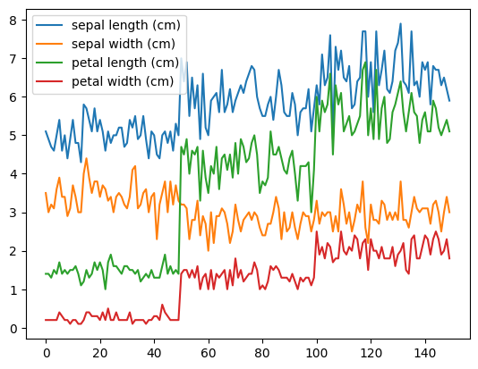
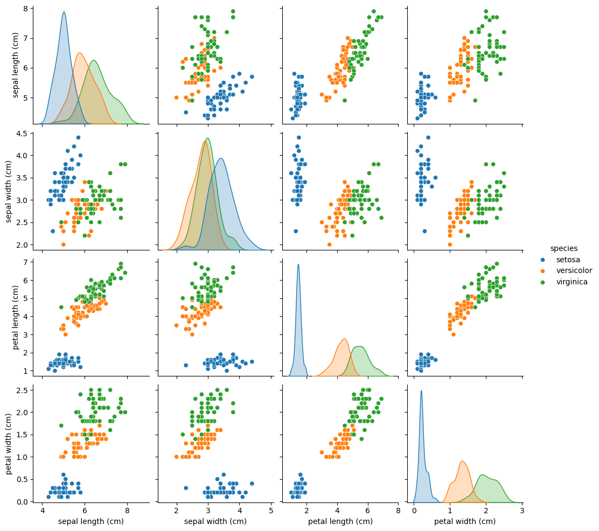
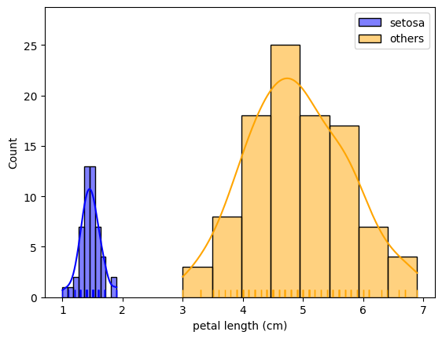
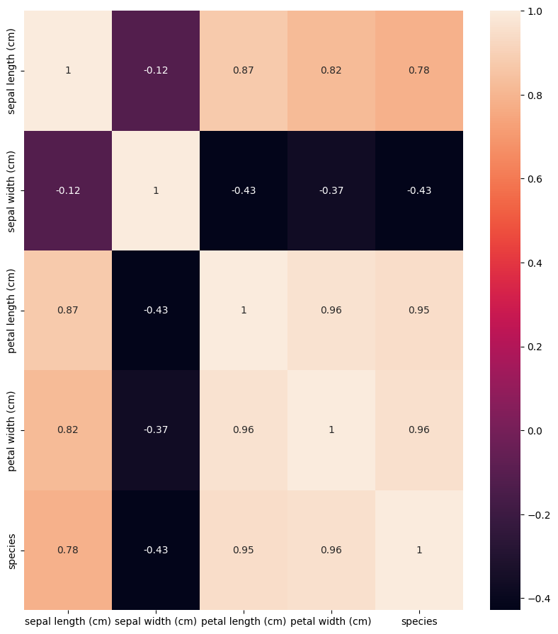
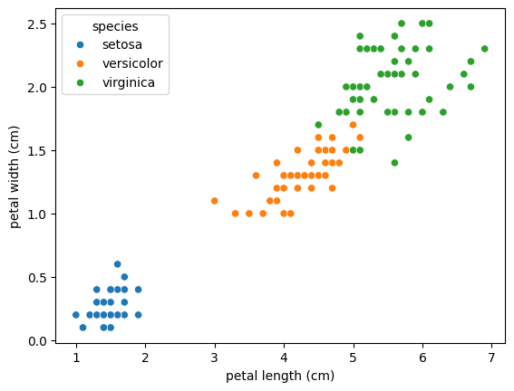
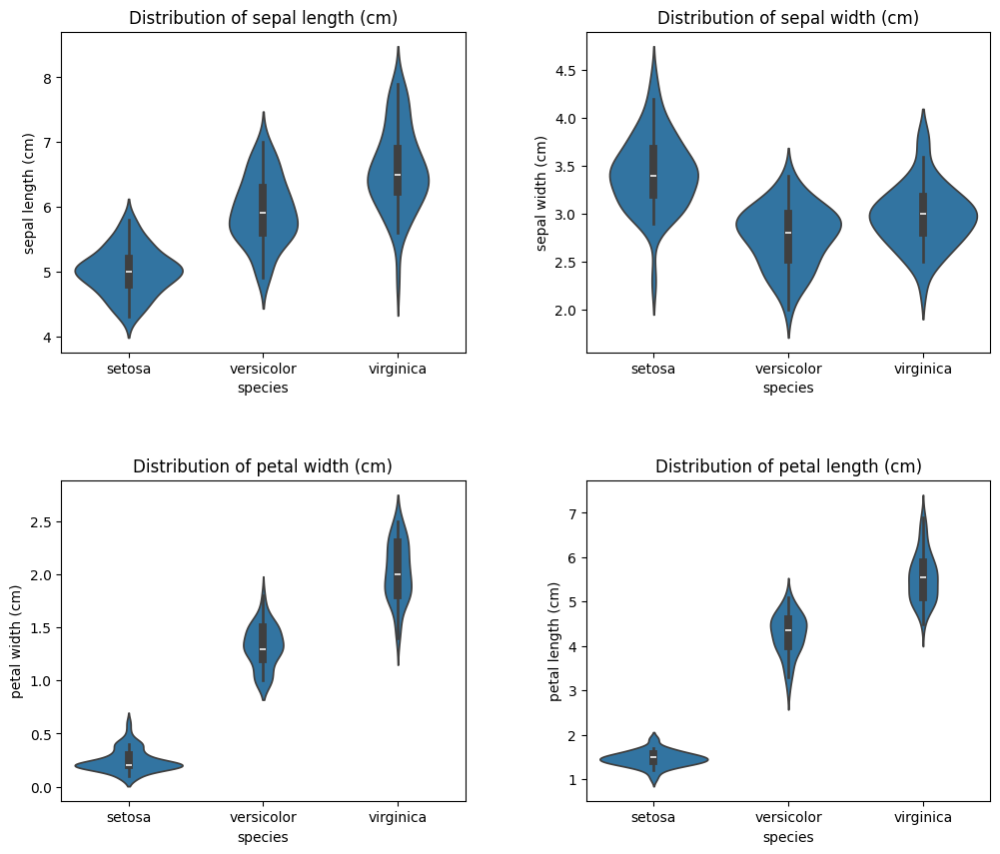

# load_iris


```python
%pip install scikit-learn seaborn matplotlib
```


```python
import sklearn.datasets
import numpy as np
import pandas as pd
import seaborn as sns
from matplotlib import pyplot as plt
%matplotlib inline
```


```python
data = sklearn.datasets.load_iris()
```


```python
print(type(data))
print(data.keys())
```

    <class 'sklearn.utils._bunch.Bunch'>
    dict_keys(['data', 'target', 'frame', 'target_names', 'DESCR', 'feature_names', 'filename', 'data_module'])


```python
print(type(data.data))
print(type(data.target))
print(type(data.feature_names))
print(type(data.target_names))
print(type(data.DESCR))
print(type(data.filename))
```

    <class 'numpy.ndarray'>
    <class 'numpy.ndarray'>
    <class 'list'>
    <class 'numpy.ndarray'>
    <class 'str'>
    <class 'str'>


```python
print(data.feature_names)
print(data.target_names)
print(data.DESCR)
print(data.filename)
```

    ['sepal length (cm)', 'sepal width (cm)', 'petal length (cm)', 'petal width (cm)']
    ['setosa' 'versicolor' 'virginica']
    .. _iris_dataset:
    
    Iris plants dataset
    --------------------
    
    **Data Set Characteristics:**
    
    :Number of Instances: 150 (50 in each of three classes)
    :Number of Attributes: 4 numeric, predictive attributes and the class
    :Attribute Information:
        - sepal length in cm
        - sepal width in cm
        - petal length in cm
        - petal width in cm
        - class:
                - Iris-Setosa
                - Iris-Versicolour
                - Iris-Virginica
    
    :Summary Statistics:
    
    ============== ==== ==== ======= ===== ====================
                    Min  Max   Mean    SD   Class Correlation
    ============== ==== ==== ======= ===== ====================
    sepal length:   4.3  7.9   5.84   0.83    0.7826
    sepal width:    2.0  4.4   3.05   0.43   -0.4194
    petal length:   1.0  6.9   3.76   1.76    0.9490  (high!)
    petal width:    0.1  2.5   1.20   0.76    0.9565  (high!)
    ============== ==== ==== ======= ===== ====================
    
    :Missing Attribute Values: None
    :Class Distribution: 33.3% for each of 3 classes.
    :Creator: R.A. Fisher
    :Donor: Michael Marshall (MARSHALL%PLU@io.arc.nasa.gov)
    :Date: July, 1988
    
    The famous Iris database, first used by Sir R.A. Fisher. The dataset is taken
    from Fisher's paper. Note that it's the same as in R, but not as in the UCI
    Machine Learning Repository, which has two wrong data points.
    
    This is perhaps the best known database to be found in the
    pattern recognition literature.  Fisher's paper is a classic in the field and
    is referenced frequently to this day.  (See Duda & Hart, for example.)  The
    data set contains 3 classes of 50 instances each, where each class refers to a
    type of iris plant.  One class is linearly separable from the other 2; the
    latter are NOT linearly separable from each other.
    
    .. dropdown:: References
    
      - Fisher, R.A. "The use of multiple measurements in taxonomic problems"
        Annual Eugenics, 7, Part II, 179-188 (1936); also in "Contributions to
        Mathematical Statistics" (John Wiley, NY, 1950).
      - Duda, R.O., & Hart, P.E. (1973) Pattern Classification and Scene Analysis.
        (Q327.D83) John Wiley & Sons.  ISBN 0-471-22361-1.  See page 218.
      - Dasarathy, B.V. (1980) "Nosing Around the Neighborhood: A New System
        Structure and Classification Rule for Recognition in Partially Exposed
        Environments".  IEEE Transactions on Pattern Analysis and Machine
        Intelligence, Vol. PAMI-2, No. 1, 67-71.
      - Gates, G.W. (1972) "The Reduced Nearest Neighbor Rule".  IEEE Transactions
        on Information Theory, May 1972, 431-433.
      - See also: 1988 MLC Proceedings, 54-64.  Cheeseman et al"s AUTOCLASS II
        conceptual clustering system finds 3 classes in the data.
      - Many, many more ...
    
    iris.csv


```python
print(data.keys())
for f in data.keys():
    t = type(data[f])
    print('key: {}, type: {}'.format(f, t))
    if t == np.ndarray:
        print('shape: {}'.format(data[f].shape))
```

    dict_keys(['data', 'target', 'frame', 'target_names', 'DESCR', 'feature_names', 'filename', 'data_module'])
    key: data, type: <class 'numpy.ndarray'>
    shape: (150, 4)
    key: target, type: <class 'numpy.ndarray'>
    shape: (150,)
    key: frame, type: <class 'NoneType'>
    key: target_names, type: <class 'numpy.ndarray'>
    shape: (3,)
    key: DESCR, type: <class 'str'>
    key: feature_names, type: <class 'list'>
    key: filename, type: <class 'str'>
    key: data_module, type: <class 'str'>


```python
df = pd.DataFrame(data=data.data, columns=data.feature_names)
df['species'] = data.target
df['species'] = df['species'].apply(lambda x: data['target_names'][x])
```


```python
df.head()
```


<div>
<style scoped>
    .dataframe tbody tr th:only-of-type {
        vertical-align: middle;
    }

    .dataframe tbody tr th {
        vertical-align: top;
    }

    .dataframe thead th {
        text-align: right;
    }
</style>
<table border="1" class="dataframe">
  <thead>
    <tr style="text-align: right;">
      <th></th>
      <th>sepal length (cm)</th>
      <th>sepal width (cm)</th>
      <th>petal length (cm)</th>
      <th>petal width (cm)</th>
      <th>species</th>
    </tr>
  </thead>
  <tbody>
    <tr>
      <th>0</th>
      <td>5.1</td>
      <td>3.5</td>
      <td>1.4</td>
      <td>0.2</td>
      <td>setosa</td>
    </tr>
    <tr>
      <th>1</th>
      <td>4.9</td>
      <td>3.0</td>
      <td>1.4</td>
      <td>0.2</td>
      <td>setosa</td>
    </tr>
    <tr>
      <th>2</th>
      <td>4.7</td>
      <td>3.2</td>
      <td>1.3</td>
      <td>0.2</td>
      <td>setosa</td>
    </tr>
    <tr>
      <th>3</th>
      <td>4.6</td>
      <td>3.1</td>
      <td>1.5</td>
      <td>0.2</td>
      <td>setosa</td>
    </tr>
    <tr>
      <th>4</th>
      <td>5.0</td>
      <td>3.6</td>
      <td>1.4</td>
      <td>0.2</td>
      <td>setosa</td>
    </tr>
  </tbody>
</table>
</div>


```python
df.tail()
```


<div>
<style scoped>
    .dataframe tbody tr th:only-of-type {
        vertical-align: middle;
    }

    .dataframe tbody tr th {
        vertical-align: top;
    }

    .dataframe thead th {
        text-align: right;
    }
</style>
<table border="1" class="dataframe">
  <thead>
    <tr style="text-align: right;">
      <th></th>
      <th>sepal length (cm)</th>
      <th>sepal width (cm)</th>
      <th>petal length (cm)</th>
      <th>petal width (cm)</th>
      <th>species</th>
    </tr>
  </thead>
  <tbody>
    <tr>
      <th>145</th>
      <td>6.7</td>
      <td>3.0</td>
      <td>5.2</td>
      <td>2.3</td>
      <td>virginica</td>
    </tr>
    <tr>
      <th>146</th>
      <td>6.3</td>
      <td>2.5</td>
      <td>5.0</td>
      <td>1.9</td>
      <td>virginica</td>
    </tr>
    <tr>
      <th>147</th>
      <td>6.5</td>
      <td>3.0</td>
      <td>5.2</td>
      <td>2.0</td>
      <td>virginica</td>
    </tr>
    <tr>
      <th>148</th>
      <td>6.2</td>
      <td>3.4</td>
      <td>5.4</td>
      <td>2.3</td>
      <td>virginica</td>
    </tr>
    <tr>
      <th>149</th>
      <td>5.9</td>
      <td>3.0</td>
      <td>5.1</td>
      <td>1.8</td>
      <td>virginica</td>
    </tr>
  </tbody>
</table>
</div>


```python
print(df.shape)
```

    (150, 5)


```python
df.describe()
```


<div>
<style scoped>
    .dataframe tbody tr th:only-of-type {
        vertical-align: middle;
    }

    .dataframe tbody tr th {
        vertical-align: top;
    }

    .dataframe thead th {
        text-align: right;
    }
</style>
<table border="1" class="dataframe">
  <thead>
    <tr style="text-align: right;">
      <th></th>
      <th>sepal length (cm)</th>
      <th>sepal width (cm)</th>
      <th>petal length (cm)</th>
      <th>petal width (cm)</th>
    </tr>
  </thead>
  <tbody>
    <tr>
      <th>count</th>
      <td>150.000000</td>
      <td>150.000000</td>
      <td>150.000000</td>
      <td>150.000000</td>
    </tr>
    <tr>
      <th>mean</th>
      <td>5.843333</td>
      <td>3.057333</td>
      <td>3.758000</td>
      <td>1.199333</td>
    </tr>
    <tr>
      <th>std</th>
      <td>0.828066</td>
      <td>0.435866</td>
      <td>1.765298</td>
      <td>0.762238</td>
    </tr>
    <tr>
      <th>min</th>
      <td>4.300000</td>
      <td>2.000000</td>
      <td>1.000000</td>
      <td>0.100000</td>
    </tr>
    <tr>
      <th>25%</th>
      <td>5.100000</td>
      <td>2.800000</td>
      <td>1.600000</td>
      <td>0.300000</td>
    </tr>
    <tr>
      <th>50%</th>
      <td>5.800000</td>
      <td>3.000000</td>
      <td>4.350000</td>
      <td>1.300000</td>
    </tr>
    <tr>
      <th>75%</th>
      <td>6.400000</td>
      <td>3.300000</td>
      <td>5.100000</td>
      <td>1.800000</td>
    </tr>
    <tr>
      <th>max</th>
      <td>7.900000</td>
      <td>4.400000</td>
      <td>6.900000</td>
      <td>2.500000</td>
    </tr>
  </tbody>
</table>
</div>


```python
df.info()
```

    <class 'pandas.core.frame.DataFrame'>
    RangeIndex: 150 entries, 0 to 149
    Data columns (total 5 columns):
     #   Column             Non-Null Count  Dtype  
    ---  ------             --------------  -----  
     0   sepal length (cm)  150 non-null    float64
     1   sepal width (cm)   150 non-null    float64
     2   petal length (cm)  150 non-null    float64
     3   petal width (cm)   150 non-null    float64
     4   species            150 non-null    object 
    dtypes: float64(4), object(1)
    memory usage: 6.0+ KB


```python
df.isnull().sum()
```


    sepal length (cm)    0
    sepal width (cm)     0
    petal length (cm)    0
    petal width (cm)     0
    species              0
    dtype: int64


```python
df.plot()
#df.plot.bar()
#df.plot.line()
#df.plot.box()
```


    <Axes: >


    

    


```python
sns.pairplot(df) #데이터에 들어 있는 각 컬럼(열)들의 모든 상관 관계를 출력
```


```python
sns.pairplot(df, hue="species") # species에 따라 hue(색조)를 변경, 즉 이 값은 discret해야 한다
plt.show()
```


    

    


```python
sns.histplot(df[df.species == "setosa"]["petal length (cm)"],
             kde=True, label="setosa", color="blue", alpha=0.5)
sns.rugplot(df[df.species == "setosa"]["petal length (cm)"], color="blue")

sns.histplot(df[df.species != "setosa"]["petal length (cm)"],
             kde=True, label="others", color="orange", alpha=0.5)
sns.rugplot(df[df.species != "setosa"]["petal length (cm)"], color="orange")

plt.legend()
plt.show()
```


    

    


```python
# KDE 곡선
sns.kdeplot(df[df.species == "setosa"]["petal length (cm)"], 
            label="setosa", color="blue")
# rug plot
sns.rugplot(df[df.species == "setosa"]["petal length (cm)"], 
            color="blue")

plt.legend()
plt.show()
```


    

    


```python
df_org = pd.DataFrame(data=data.data, columns=data.feature_names)
df_org['species'] = data.target
```


```python
df_org.tail()
```


<div>
<style scoped>
    .dataframe tbody tr th:only-of-type {
        vertical-align: middle;
    }

    .dataframe tbody tr th {
        vertical-align: top;
    }

    .dataframe thead th {
        text-align: right;
    }
</style>
<table border="1" class="dataframe">
  <thead>
    <tr style="text-align: right;">
      <th></th>
      <th>sepal length (cm)</th>
      <th>sepal width (cm)</th>
      <th>petal length (cm)</th>
      <th>petal width (cm)</th>
      <th>species</th>
    </tr>
  </thead>
  <tbody>
    <tr>
      <th>145</th>
      <td>6.7</td>
      <td>3.0</td>
      <td>5.2</td>
      <td>2.3</td>
      <td>2</td>
    </tr>
    <tr>
      <th>146</th>
      <td>6.3</td>
      <td>2.5</td>
      <td>5.0</td>
      <td>1.9</td>
      <td>2</td>
    </tr>
    <tr>
      <th>147</th>
      <td>6.5</td>
      <td>3.0</td>
      <td>5.2</td>
      <td>2.0</td>
      <td>2</td>
    </tr>
    <tr>
      <th>148</th>
      <td>6.2</td>
      <td>3.4</td>
      <td>5.4</td>
      <td>2.3</td>
      <td>2</td>
    </tr>
    <tr>
      <th>149</th>
      <td>5.9</td>
      <td>3.0</td>
      <td>5.1</td>
      <td>1.8</td>
      <td>2</td>
    </tr>
  </tbody>
</table>
</div>


```python
plt.figure(figsize=(10,11))
sns.heatmap(df_org.corr(),annot=True)
plt.show()
```


    []


    

    


```python
# FacetGrid - 복수개 그래프를 그린다. 여기서는 hue와 species(문자열)를 쉽게 쓰기 위해 사용
sns.FacetGrid(df,hue='species') \
.map(plt.scatter,'sepal length (cm)','sepal width (cm)') \
.add_legend()
```


    <seaborn.axisgrid.FacetGrid at 0x7f6c14ebbe20>


    

    


```python
sns.scatterplot(
    data=df,
    x='petal length (cm)',
    y='petal width (cm)',
    hue='species'
)
plt.show()
```


    

    


```python
fig, axes = plt.subplots(2, 2, figsize=(12, 10))

# 그래프 간 간격 조정
fig.subplots_adjust(hspace=0.4, wspace=0.3)

# 각 특징(feature) 리스트
features = [
    'sepal length (cm)',
    'sepal width (cm)',
    'petal width (cm)',
    'petal length (cm)'
]

# 축을 1차원으로 평탄화
axes = axes.flatten()

# 4개의 violinplot 생성
for ax, feature in zip(axes, features):
    sns.violinplot(x='species', y=feature, data=df, ax=ax)
    ax.set_title(f"Distribution of {feature}")

plt.show()
```


    

    


```python
fig, axes = plt.subplots(2, 2, figsize=(12, 10))
fig.subplots_adjust(hspace=0.4, wspace=0.3)  # 간격 조정

# 특징(feature) 리스트
features = [
    'sepal length (cm)',
    'sepal width (cm)',
    'petal width (cm)',
    'petal length (cm)'
]

# subplot 축 1차원으로 평탄화
axes = axes.flatten()

# 반복문으로 boxplot 생성
for ax, feature in zip(axes, features):
    sns.boxplot(x='species', y=feature, data=df, ax=ax)
    ax.set_title(f"Boxplot of {feature}")

plt.show()
```


    

    


```python
df['species'] = data.target  # 문자열 품종 이름 대신 숫자(0, 1, 2)로 저장
plt.scatter(
    x=df['petal length (cm)'],  # x축: 꽃잎 길이
    y=df['petal width (cm)'],   # y축: 꽃잎 너비
    c=df['species']             # 색상 구분: 품종 번호
)
```


    <matplotlib.collections.PathCollection at 0x7fb714311450>


    

    

