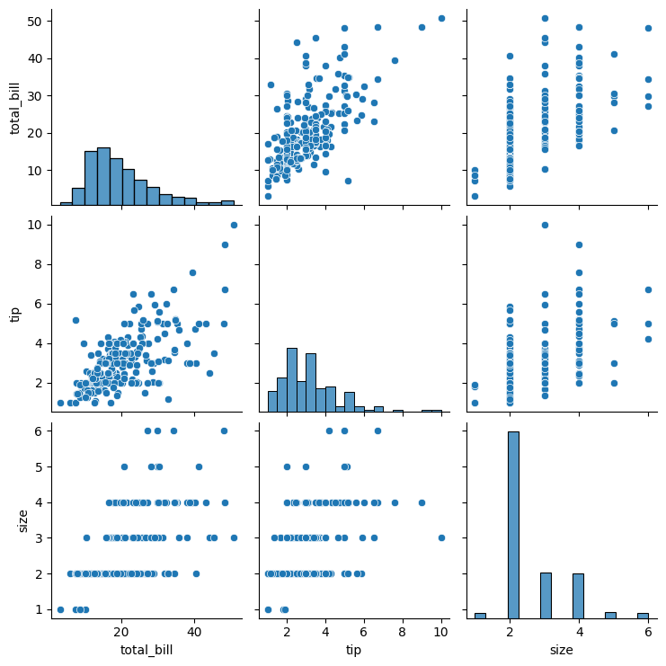
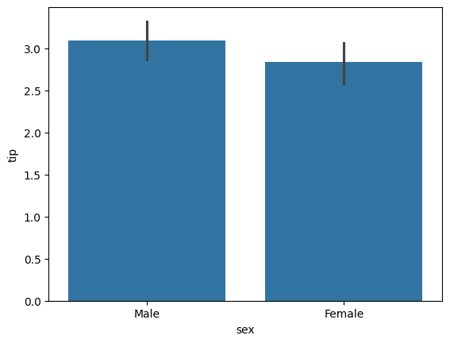
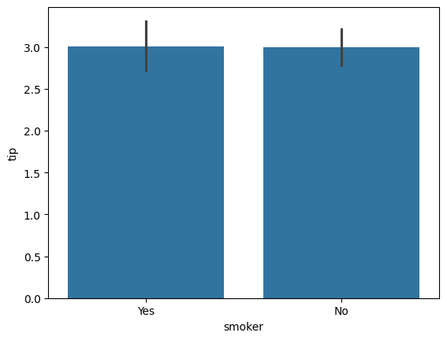
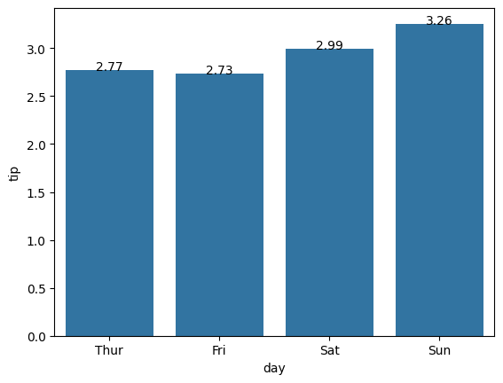
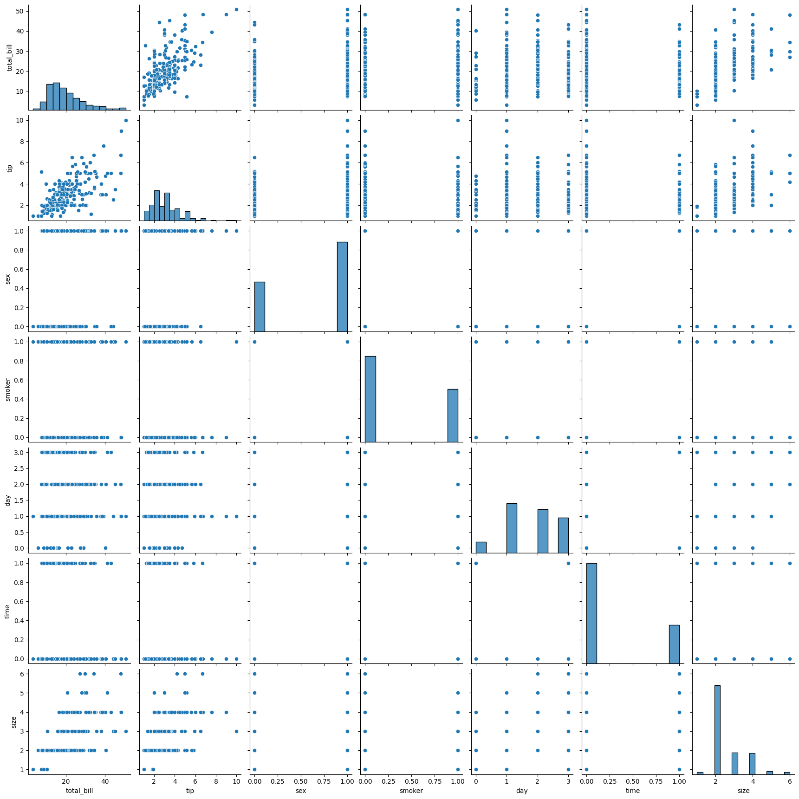
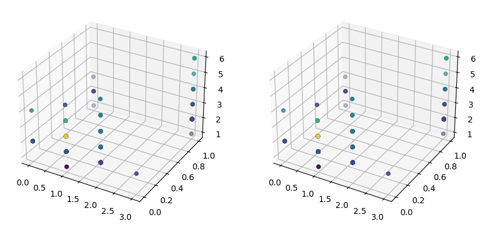

## tips


```python
import seaborn as sns
import pandas as pd
from matplotlib import pyplot as plt
%matplotlib inline
```

    /home/ubuntu/.local/lib/python3.10/site-packages/numpy/_core/getlimits.py:551: UserWarning: Signature b'\x00\xd0\xcc\xcc\xcc\xcc\xcc\xcc\xfb\xbf\x00\x00\x00\x00\x00\x00' for <class 'numpy.longdouble'> does not match any known type: falling back to type probe function.
    This warnings indicates broken support for the dtype!
      machar = _get_machar(dtype)


```python
df = sns.load_dataset('tips')
print(type(df))

```

    <class 'pandas.core.frame.DataFrame'>


<div>
<style scoped>
    .dataframe tbody tr th:only-of-type {
        vertical-align: middle;
    }

    .dataframe tbody tr th {
        vertical-align: top;
    }

    .dataframe thead th {
        text-align: right;
    }
</style>
<table border="1" class="dataframe">
  <thead>
    <tr style="text-align: right;">
      <th></th>
      <th>total_bill</th>
      <th>tip</th>
      <th>size</th>
    </tr>
  </thead>
  <tbody>
    <tr>
      <th>count</th>
      <td>244.000000</td>
      <td>244.000000</td>
      <td>244.000000</td>
    </tr>
    <tr>
      <th>mean</th>
      <td>19.785943</td>
      <td>2.998279</td>
      <td>2.569672</td>
    </tr>
    <tr>
      <th>std</th>
      <td>8.902412</td>
      <td>1.383638</td>
      <td>0.951100</td>
    </tr>
    <tr>
      <th>min</th>
      <td>3.070000</td>
      <td>1.000000</td>
      <td>1.000000</td>
    </tr>
    <tr>
      <th>25%</th>
      <td>13.347500</td>
      <td>2.000000</td>
      <td>2.000000</td>
    </tr>
    <tr>
      <th>50%</th>
      <td>17.795000</td>
      <td>2.900000</td>
      <td>2.000000</td>
    </tr>
    <tr>
      <th>75%</th>
      <td>24.127500</td>
      <td>3.562500</td>
      <td>3.000000</td>
    </tr>
    <tr>
      <th>max</th>
      <td>50.810000</td>
      <td>10.000000</td>
      <td>6.000000</td>
    </tr>
  </tbody>
</table>
</div>


```python
df.head()
```


<div>
<style scoped>
    .dataframe tbody tr th:only-of-type {
        vertical-align: middle;
    }

    .dataframe tbody tr th {
        vertical-align: top;
    }

    .dataframe thead th {
        text-align: right;
    }
</style>
<table border="1" class="dataframe">
  <thead>
    <tr style="text-align: right;">
      <th></th>
      <th>total_bill</th>
      <th>tip</th>
      <th>sex</th>
      <th>smoker</th>
      <th>day</th>
      <th>time</th>
      <th>size</th>
    </tr>
  </thead>
  <tbody>
    <tr>
      <th>0</th>
      <td>16.99</td>
      <td>1.01</td>
      <td>Female</td>
      <td>No</td>
      <td>Sun</td>
      <td>Dinner</td>
      <td>2</td>
    </tr>
    <tr>
      <th>1</th>
      <td>10.34</td>
      <td>1.66</td>
      <td>Male</td>
      <td>No</td>
      <td>Sun</td>
      <td>Dinner</td>
      <td>3</td>
    </tr>
    <tr>
      <th>2</th>
      <td>21.01</td>
      <td>3.50</td>
      <td>Male</td>
      <td>No</td>
      <td>Sun</td>
      <td>Dinner</td>
      <td>3</td>
    </tr>
    <tr>
      <th>3</th>
      <td>23.68</td>
      <td>3.31</td>
      <td>Male</td>
      <td>No</td>
      <td>Sun</td>
      <td>Dinner</td>
      <td>2</td>
    </tr>
    <tr>
      <th>4</th>
      <td>24.59</td>
      <td>3.61</td>
      <td>Female</td>
      <td>No</td>
      <td>Sun</td>
      <td>Dinner</td>
      <td>4</td>
    </tr>
  </tbody>
</table>
</div>


```python

df.tail()
```


<div>
<style scoped>
    .dataframe tbody tr th:only-of-type {
        vertical-align: middle;
    }

    .dataframe tbody tr th {
        vertical-align: top;
    }

    .dataframe thead th {
        text-align: right;
    }
</style>
<table border="1" class="dataframe">
  <thead>
    <tr style="text-align: right;">
      <th></th>
      <th>total_bill</th>
      <th>tip</th>
      <th>sex</th>
      <th>smoker</th>
      <th>day</th>
      <th>time</th>
      <th>size</th>
    </tr>
  </thead>
  <tbody>
    <tr>
      <th>239</th>
      <td>29.03</td>
      <td>5.92</td>
      <td>Male</td>
      <td>No</td>
      <td>Sat</td>
      <td>Dinner</td>
      <td>3</td>
    </tr>
    <tr>
      <th>240</th>
      <td>27.18</td>
      <td>2.00</td>
      <td>Female</td>
      <td>Yes</td>
      <td>Sat</td>
      <td>Dinner</td>
      <td>2</td>
    </tr>
    <tr>
      <th>241</th>
      <td>22.67</td>
      <td>2.00</td>
      <td>Male</td>
      <td>Yes</td>
      <td>Sat</td>
      <td>Dinner</td>
      <td>2</td>
    </tr>
    <tr>
      <th>242</th>
      <td>17.82</td>
      <td>1.75</td>
      <td>Male</td>
      <td>No</td>
      <td>Sat</td>
      <td>Dinner</td>
      <td>2</td>
    </tr>
    <tr>
      <th>243</th>
      <td>18.78</td>
      <td>3.00</td>
      <td>Female</td>
      <td>No</td>
      <td>Thur</td>
      <td>Dinner</td>
      <td>2</td>
    </tr>
  </tbody>
</table>
</div>


```python

df.describe()
```


<div>
<style scoped>
    .dataframe tbody tr th:only-of-type {
        vertical-align: middle;
    }

    .dataframe tbody tr th {
        vertical-align: top;
    }

    .dataframe thead th {
        text-align: right;
    }
</style>
<table border="1" class="dataframe">
  <thead>
    <tr style="text-align: right;">
      <th></th>
      <th>total_bill</th>
      <th>tip</th>
      <th>size</th>
    </tr>
  </thead>
  <tbody>
    <tr>
      <th>count</th>
      <td>244.000000</td>
      <td>244.000000</td>
      <td>244.000000</td>
    </tr>
    <tr>
      <th>mean</th>
      <td>19.785943</td>
      <td>2.998279</td>
      <td>2.569672</td>
    </tr>
    <tr>
      <th>std</th>
      <td>8.902412</td>
      <td>1.383638</td>
      <td>0.951100</td>
    </tr>
    <tr>
      <th>min</th>
      <td>3.070000</td>
      <td>1.000000</td>
      <td>1.000000</td>
    </tr>
    <tr>
      <th>25%</th>
      <td>13.347500</td>
      <td>2.000000</td>
      <td>2.000000</td>
    </tr>
    <tr>
      <th>50%</th>
      <td>17.795000</td>
      <td>2.900000</td>
      <td>2.000000</td>
    </tr>
    <tr>
      <th>75%</th>
      <td>24.127500</td>
      <td>3.562500</td>
      <td>3.000000</td>
    </tr>
    <tr>
      <th>max</th>
      <td>50.810000</td>
      <td>10.000000</td>
      <td>6.000000</td>
    </tr>
  </tbody>
</table>
</div>


```python
sns.pairplot(df)
```


    <seaborn.axisgrid.PairGrid at 0x7fb569c873a0>


    

    


```python
sns.barplot(x='sex', y='tip', data=df)
```


    <Axes: xlabel='sex', ylabel='tip'>


    

    


```python
sns.barplot(x='smoker', y='tip', data=df)
```


    <Axes: xlabel='smoker', ylabel='tip'>


    

    


```python
import pandas as pd

def agg_func(col):
    if pd.api.types.is_categorical_dtype(col) or pd.api.types.is_object_dtype(col):
        return 'count'
    elif pd.api.types.is_numeric_dtype(col):
        return 'mean'
    else:
        return 'first'
```


```python
columns_to_agg = [col for col in df.columns if col != 'day']

groupedvalues = df.groupby('day').agg({col: agg_func(df[col]) for col in columns_to_agg}).reset_index()
groupedvalues.head()
```

    /tmp/ipykernel_990/2268038312.py:3: FutureWarning: The default of observed=False is deprecated and will be changed to True in a future version of pandas. Pass observed=False to retain current behavior or observed=True to adopt the future default and silence this warning.
      groupedvalues = df.groupby('day').agg({col: agg_func(df[col]) for col in columns_to_agg}).reset_index()
    /tmp/ipykernel_990/594790445.py:4: DeprecationWarning: is_categorical_dtype is deprecated and will be removed in a future version. Use isinstance(dtype, pd.CategoricalDtype) instead
      if pd.api.types.is_categorical_dtype(col) or pd.api.types.is_object_dtype(col):


<div>
<style scoped>
    .dataframe tbody tr th:only-of-type {
        vertical-align: middle;
    }

    .dataframe tbody tr th {
        vertical-align: top;
    }

    .dataframe thead th {
        text-align: right;
    }
</style>
<table border="1" class="dataframe">
  <thead>
    <tr style="text-align: right;">
      <th></th>
      <th>day</th>
      <th>total_bill</th>
      <th>tip</th>
      <th>sex</th>
      <th>smoker</th>
      <th>time</th>
      <th>size</th>
    </tr>
  </thead>
  <tbody>
    <tr>
      <th>0</th>
      <td>Thur</td>
      <td>17.682742</td>
      <td>2.771452</td>
      <td>62</td>
      <td>62</td>
      <td>62</td>
      <td>2.451613</td>
    </tr>
    <tr>
      <th>1</th>
      <td>Fri</td>
      <td>17.151579</td>
      <td>2.734737</td>
      <td>19</td>
      <td>19</td>
      <td>19</td>
      <td>2.105263</td>
    </tr>
    <tr>
      <th>2</th>
      <td>Sat</td>
      <td>20.441379</td>
      <td>2.993103</td>
      <td>87</td>
      <td>87</td>
      <td>87</td>
      <td>2.517241</td>
    </tr>
    <tr>
      <th>3</th>
      <td>Sun</td>
      <td>21.410000</td>
      <td>3.255132</td>
      <td>76</td>
      <td>76</td>
      <td>76</td>
      <td>2.842105</td>
    </tr>
  </tbody>
</table>
</div>


```python
g =sns.barplot(x='day',y='tip',data=groupedvalues)

for index, row in groupedvalues.iterrows():
    g.text(row.name, row.tip, round(row.tip, 2), color='black', ha="center")
```


    

    


```python
print(df.sex.unique())
print(df.smoker.unique())
print(df.day.unique())
print(df.time.unique())
```

    ['Female', 'Male']
    Categories (2, object): ['Male', 'Female']
    ['No', 'Yes']
    Categories (2, object): ['Yes', 'No']
    ['Sun', 'Sat', 'Thur', 'Fri']
    Categories (4, object): ['Thur', 'Fri', 'Sat', 'Sun']
    ['Dinner', 'Lunch']
    Categories (2, object): ['Lunch', 'Dinner']


```python
from sklearn.preprocessing import LabelEncoder
label_encoder = LabelEncoder()

dfi = df.copy()

dfi['sex'] = label_encoder.fit_transform(dfi['sex'])
print(label_encoder.classes_)
dfi['smoker'] = label_encoder.fit_transform(dfi['smoker'])
print(label_encoder.classes_)
dfi['day'] = label_encoder.fit_transform(dfi['day'])
print(label_encoder.classes_)
dfi['time'] = label_encoder.fit_transform(dfi['time'])
print(label_encoder.classes_)
```

    ['Female' 'Male']
    ['No' 'Yes']
    ['Fri' 'Sat' 'Sun' 'Thur']
    ['Dinner' 'Lunch']


```python
sns.pairplot(dfi)
```


    <seaborn.axisgrid.PairGrid at 0x7fb5221d4340>


    

    


```python
y_train = dfi[['tip']].values
dfi.drop('tip', axis=1, inplace=True)
X_train = dfi.values
```


```python
from sklearn import tree
```


```python
model = tree.DecisionTreeRegressor()
model.fit(X_train, y_train)
```


<style>#sk-container-id-1 {
  /* Definition of color scheme common for light and dark mode */
  --sklearn-color-text: #000;
  --sklearn-color-text-muted: #666;
  --sklearn-color-line: gray;
  /* Definition of color scheme for unfitted estimators */
  --sklearn-color-unfitted-level-0: #fff5e6;
  --sklearn-color-unfitted-level-1: #f6e4d2;
  --sklearn-color-unfitted-level-2: #ffe0b3;
  --sklearn-color-unfitted-level-3: chocolate;
  /* Definition of color scheme for fitted estimators */
  --sklearn-color-fitted-level-0: #f0f8ff;
  --sklearn-color-fitted-level-1: #d4ebff;
  --sklearn-color-fitted-level-2: #b3dbfd;
  --sklearn-color-fitted-level-3: cornflowerblue;

  /* Specific color for light theme */
  --sklearn-color-text-on-default-background: var(--sg-text-color, var(--theme-code-foreground, var(--jp-content-font-color1, black)));
  --sklearn-color-background: var(--sg-background-color, var(--theme-background, var(--jp-layout-color0, white)));
  --sklearn-color-border-box: var(--sg-text-color, var(--theme-code-foreground, var(--jp-content-font-color1, black)));
  --sklearn-color-icon: #696969;

  @media (prefers-color-scheme: dark) {
    /* Redefinition of color scheme for dark theme */
    --sklearn-color-text-on-default-background: var(--sg-text-color, var(--theme-code-foreground, var(--jp-content-font-color1, white)));
    --sklearn-color-background: var(--sg-background-color, var(--theme-background, var(--jp-layout-color0, #111)));
    --sklearn-color-border-box: var(--sg-text-color, var(--theme-code-foreground, var(--jp-content-font-color1, white)));
    --sklearn-color-icon: #878787;
  }
}

#sk-container-id-1 {
  color: var(--sklearn-color-text);
}

#sk-container-id-1 pre {
  padding: 0;
}

#sk-container-id-1 input.sk-hidden--visually {
  border: 0;
  clip: rect(1px 1px 1px 1px);
  clip: rect(1px, 1px, 1px, 1px);
  height: 1px;
  margin: -1px;
  overflow: hidden;
  padding: 0;
  position: absolute;
  width: 1px;
}

#sk-container-id-1 div.sk-dashed-wrapped {
  border: 1px dashed var(--sklearn-color-line);
  margin: 0 0.4em 0.5em 0.4em;
  box-sizing: border-box;
  padding-bottom: 0.4em;
  background-color: var(--sklearn-color-background);
}

#sk-container-id-1 div.sk-container {
  /* jupyter's `normalize.less` sets `[hidden] { display: none; }`
     but bootstrap.min.css set `[hidden] { display: none !important; }`
     so we also need the `!important` here to be able to override the
     default hidden behavior on the sphinx rendered scikit-learn.org.
     See: https://github.com/scikit-learn/scikit-learn/issues/21755 */
  display: inline-block !important;
  position: relative;
}

#sk-container-id-1 div.sk-text-repr-fallback {
  display: none;
}

div.sk-parallel-item,
div.sk-serial,
div.sk-item {
  /* draw centered vertical line to link estimators */
  background-image: linear-gradient(var(--sklearn-color-text-on-default-background), var(--sklearn-color-text-on-default-background));
  background-size: 2px 100%;
  background-repeat: no-repeat;
  background-position: center center;
}

/* Parallel-specific style estimator block */

#sk-container-id-1 div.sk-parallel-item::after {
  content: "";
  width: 100%;
  border-bottom: 2px solid var(--sklearn-color-text-on-default-background);
  flex-grow: 1;
}

#sk-container-id-1 div.sk-parallel {
  display: flex;
  align-items: stretch;
  justify-content: center;
  background-color: var(--sklearn-color-background);
  position: relative;
}

#sk-container-id-1 div.sk-parallel-item {
  display: flex;
  flex-direction: column;
}

#sk-container-id-1 div.sk-parallel-item:first-child::after {
  align-self: flex-end;
  width: 50%;
}

#sk-container-id-1 div.sk-parallel-item:last-child::after {
  align-self: flex-start;
  width: 50%;
}

#sk-container-id-1 div.sk-parallel-item:only-child::after {
  width: 0;
}

/* Serial-specific style estimator block */

#sk-container-id-1 div.sk-serial {
  display: flex;
  flex-direction: column;
  align-items: center;
  background-color: var(--sklearn-color-background);
  padding-right: 1em;
  padding-left: 1em;
}


/* Toggleable style: style used for estimator/Pipeline/ColumnTransformer box that is
clickable and can be expanded/collapsed.
- Pipeline and ColumnTransformer use this feature and define the default style
- Estimators will overwrite some part of the style using the `sk-estimator` class
*/

/* Pipeline and ColumnTransformer style (default) */

#sk-container-id-1 div.sk-toggleable {
  /* Default theme specific background. It is overwritten whether we have a
  specific estimator or a Pipeline/ColumnTransformer */
  background-color: var(--sklearn-color-background);
}

/* Toggleable label */
#sk-container-id-1 label.sk-toggleable__label {
  cursor: pointer;
  display: flex;
  width: 100%;
  margin-bottom: 0;
  padding: 0.5em;
  box-sizing: border-box;
  text-align: center;
  align-items: start;
  justify-content: space-between;
  gap: 0.5em;
}

#sk-container-id-1 label.sk-toggleable__label .caption {
  font-size: 0.6rem;
  font-weight: lighter;
  color: var(--sklearn-color-text-muted);
}

#sk-container-id-1 label.sk-toggleable__label-arrow:before {
  /* Arrow on the left of the label */
  content: "▸";
  float: left;
  margin-right: 0.25em;
  color: var(--sklearn-color-icon);
}

#sk-container-id-1 label.sk-toggleable__label-arrow:hover:before {
  color: var(--sklearn-color-text);
}

/* Toggleable content - dropdown */

#sk-container-id-1 div.sk-toggleable__content {
  display: none;
  text-align: left;
  /* unfitted */
  background-color: var(--sklearn-color-unfitted-level-0);
}

#sk-container-id-1 div.sk-toggleable__content.fitted {
  /* fitted */
  background-color: var(--sklearn-color-fitted-level-0);
}

#sk-container-id-1 div.sk-toggleable__content pre {
  margin: 0.2em;
  border-radius: 0.25em;
  color: var(--sklearn-color-text);
  /* unfitted */
  background-color: var(--sklearn-color-unfitted-level-0);
}

#sk-container-id-1 div.sk-toggleable__content.fitted pre {
  /* unfitted */
  background-color: var(--sklearn-color-fitted-level-0);
}

#sk-container-id-1 input.sk-toggleable__control:checked~div.sk-toggleable__content {
  /* Expand drop-down */
  display: block;
  width: 100%;
  overflow: visible;
}

#sk-container-id-1 input.sk-toggleable__control:checked~label.sk-toggleable__label-arrow:before {
  content: "▾";
}

/* Pipeline/ColumnTransformer-specific style */

#sk-container-id-1 div.sk-label input.sk-toggleable__control:checked~label.sk-toggleable__label {
  color: var(--sklearn-color-text);
  background-color: var(--sklearn-color-unfitted-level-2);
}

#sk-container-id-1 div.sk-label.fitted input.sk-toggleable__control:checked~label.sk-toggleable__label {
  background-color: var(--sklearn-color-fitted-level-2);
}

/* Estimator-specific style */

/* Colorize estimator box */
#sk-container-id-1 div.sk-estimator input.sk-toggleable__control:checked~label.sk-toggleable__label {
  /* unfitted */
  background-color: var(--sklearn-color-unfitted-level-2);
}

#sk-container-id-1 div.sk-estimator.fitted input.sk-toggleable__control:checked~label.sk-toggleable__label {
  /* fitted */
  background-color: var(--sklearn-color-fitted-level-2);
}

#sk-container-id-1 div.sk-label label.sk-toggleable__label,
#sk-container-id-1 div.sk-label label {
  /* The background is the default theme color */
  color: var(--sklearn-color-text-on-default-background);
}

/* On hover, darken the color of the background */
#sk-container-id-1 div.sk-label:hover label.sk-toggleable__label {
  color: var(--sklearn-color-text);
  background-color: var(--sklearn-color-unfitted-level-2);
}

/* Label box, darken color on hover, fitted */
#sk-container-id-1 div.sk-label.fitted:hover label.sk-toggleable__label.fitted {
  color: var(--sklearn-color-text);
  background-color: var(--sklearn-color-fitted-level-2);
}

/* Estimator label */

#sk-container-id-1 div.sk-label label {
  font-family: monospace;
  font-weight: bold;
  display: inline-block;
  line-height: 1.2em;
}

#sk-container-id-1 div.sk-label-container {
  text-align: center;
}

/* Estimator-specific */
#sk-container-id-1 div.sk-estimator {
  font-family: monospace;
  border: 1px dotted var(--sklearn-color-border-box);
  border-radius: 0.25em;
  box-sizing: border-box;
  margin-bottom: 0.5em;
  /* unfitted */
  background-color: var(--sklearn-color-unfitted-level-0);
}

#sk-container-id-1 div.sk-estimator.fitted {
  /* fitted */
  background-color: var(--sklearn-color-fitted-level-0);
}

/* on hover */
#sk-container-id-1 div.sk-estimator:hover {
  /* unfitted */
  background-color: var(--sklearn-color-unfitted-level-2);
}

#sk-container-id-1 div.sk-estimator.fitted:hover {
  /* fitted */
  background-color: var(--sklearn-color-fitted-level-2);
}

/* Specification for estimator info (e.g. "i" and "?") */

/* Common style for "i" and "?" */

.sk-estimator-doc-link,
a:link.sk-estimator-doc-link,
a:visited.sk-estimator-doc-link {
  float: right;
  font-size: smaller;
  line-height: 1em;
  font-family: monospace;
  background-color: var(--sklearn-color-background);
  border-radius: 1em;
  height: 1em;
  width: 1em;
  text-decoration: none !important;
  margin-left: 0.5em;
  text-align: center;
  /* unfitted */
  border: var(--sklearn-color-unfitted-level-1) 1pt solid;
  color: var(--sklearn-color-unfitted-level-1);
}

.sk-estimator-doc-link.fitted,
a:link.sk-estimator-doc-link.fitted,
a:visited.sk-estimator-doc-link.fitted {
  /* fitted */
  border: var(--sklearn-color-fitted-level-1) 1pt solid;
  color: var(--sklearn-color-fitted-level-1);
}

/* On hover */
div.sk-estimator:hover .sk-estimator-doc-link:hover,
.sk-estimator-doc-link:hover,
div.sk-label-container:hover .sk-estimator-doc-link:hover,
.sk-estimator-doc-link:hover {
  /* unfitted */
  background-color: var(--sklearn-color-unfitted-level-3);
  color: var(--sklearn-color-background);
  text-decoration: none;
}

div.sk-estimator.fitted:hover .sk-estimator-doc-link.fitted:hover,
.sk-estimator-doc-link.fitted:hover,
div.sk-label-container:hover .sk-estimator-doc-link.fitted:hover,
.sk-estimator-doc-link.fitted:hover {
  /* fitted */
  background-color: var(--sklearn-color-fitted-level-3);
  color: var(--sklearn-color-background);
  text-decoration: none;
}

/* Span, style for the box shown on hovering the info icon */
.sk-estimator-doc-link span {
  display: none;
  z-index: 9999;
  position: relative;
  font-weight: normal;
  right: .2ex;
  padding: .5ex;
  margin: .5ex;
  width: min-content;
  min-width: 20ex;
  max-width: 50ex;
  color: var(--sklearn-color-text);
  box-shadow: 2pt 2pt 4pt #999;
  /* unfitted */
  background: var(--sklearn-color-unfitted-level-0);
  border: .5pt solid var(--sklearn-color-unfitted-level-3);
}

.sk-estimator-doc-link.fitted span {
  /* fitted */
  background: var(--sklearn-color-fitted-level-0);
  border: var(--sklearn-color-fitted-level-3);
}

.sk-estimator-doc-link:hover span {
  display: block;
}

/* "?"-specific style due to the `<a>` HTML tag */

#sk-container-id-1 a.estimator_doc_link {
  float: right;
  font-size: 1rem;
  line-height: 1em;
  font-family: monospace;
  background-color: var(--sklearn-color-background);
  border-radius: 1rem;
  height: 1rem;
  width: 1rem;
  text-decoration: none;
  /* unfitted */
  color: var(--sklearn-color-unfitted-level-1);
  border: var(--sklearn-color-unfitted-level-1) 1pt solid;
}

#sk-container-id-1 a.estimator_doc_link.fitted {
  /* fitted */
  border: var(--sklearn-color-fitted-level-1) 1pt solid;
  color: var(--sklearn-color-fitted-level-1);
}

/* On hover */
#sk-container-id-1 a.estimator_doc_link:hover {
  /* unfitted */
  background-color: var(--sklearn-color-unfitted-level-3);
  color: var(--sklearn-color-background);
  text-decoration: none;
}

#sk-container-id-1 a.estimator_doc_link.fitted:hover {
  /* fitted */
  background-color: var(--sklearn-color-fitted-level-3);
}

.estimator-table summary {
    padding: .5rem;
    font-family: monospace;
    cursor: pointer;
}

.estimator-table details[open] {
    padding-left: 0.1rem;
    padding-right: 0.1rem;
    padding-bottom: 0.3rem;
}

.estimator-table .parameters-table {
    margin-left: auto !important;
    margin-right: auto !important;
}

.estimator-table .parameters-table tr:nth-child(odd) {
    background-color: #fff;
}

.estimator-table .parameters-table tr:nth-child(even) {
    background-color: #f6f6f6;
}

.estimator-table .parameters-table tr:hover {
    background-color: #e0e0e0;
}

.estimator-table table td {
    border: 1px solid rgba(106, 105, 104, 0.232);
}

.user-set td {
    color:rgb(255, 94, 0);
    text-align: left;
}

.user-set td.value pre {
    color:rgb(255, 94, 0) !important;
    background-color: transparent !important;
}

.default td {
    color: black;
    text-align: left;
}

.user-set td i,
.default td i {
    color: black;
}

.copy-paste-icon {
    background-image: url(data:image/svg+xml;base64,PHN2ZyB4bWxucz0iaHR0cDovL3d3dy53My5vcmcvMjAwMC9zdmciIHZpZXdCb3g9IjAgMCA0NDggNTEyIj48IS0tIUZvbnQgQXdlc29tZSBGcmVlIDYuNy4yIGJ5IEBmb250YXdlc29tZSAtIGh0dHBzOi8vZm9udGF3ZXNvbWUuY29tIExpY2Vuc2UgLSBodHRwczovL2ZvbnRhd2Vzb21lLmNvbS9saWNlbnNlL2ZyZWUgQ29weXJpZ2h0IDIwMjUgRm9udGljb25zLCBJbmMuLS0+PHBhdGggZD0iTTIwOCAwTDMzMi4xIDBjMTIuNyAwIDI0LjkgNS4xIDMzLjkgMTQuMWw2Ny45IDY3LjljOSA5IDE0LjEgMjEuMiAxNC4xIDMzLjlMNDQ4IDMzNmMwIDI2LjUtMjEuNSA0OC00OCA0OGwtMTkyIDBjLTI2LjUgMC00OC0yMS41LTQ4LTQ4bDAtMjg4YzAtMjYuNSAyMS41LTQ4IDQ4LTQ4ek00OCAxMjhsODAgMCAwIDY0LTY0IDAgMCAyNTYgMTkyIDAgMC0zMiA2NCAwIDAgNDhjMCAyNi41LTIxLjUgNDgtNDggNDhMNDggNTEyYy0yNi41IDAtNDgtMjEuNS00OC00OEwwIDE3NmMwLTI2LjUgMjEuNS00OCA0OC00OHoiLz48L3N2Zz4=);
    background-repeat: no-repeat;
    background-size: 14px 14px;
    background-position: 0;
    display: inline-block;
    width: 14px;
    height: 14px;
    cursor: pointer;
}
</style><body><div id="sk-container-id-1" class="sk-top-container"><div class="sk-text-repr-fallback"><pre>DecisionTreeRegressor()</pre><b>In a Jupyter environment, please rerun this cell to show the HTML representation or trust the notebook. <br />On GitHub, the HTML representation is unable to render, please try loading this page with nbviewer.org.</b></div><div class="sk-container" hidden><div class="sk-item"><div class="sk-estimator fitted sk-toggleable"><input class="sk-toggleable__control sk-hidden--visually" id="sk-estimator-id-1" type="checkbox" checked><label for="sk-estimator-id-1" class="sk-toggleable__label fitted sk-toggleable__label-arrow"><div><div>DecisionTreeRegressor</div></div><div><a class="sk-estimator-doc-link fitted" rel="noreferrer" target="_blank" href="https://scikit-learn.org/1.7/modules/generated/sklearn.tree.DecisionTreeRegressor.html">?<span>Documentation for DecisionTreeRegressor</span></a><span class="sk-estimator-doc-link fitted">i<span>Fitted</span></span></div></label><div class="sk-toggleable__content fitted" data-param-prefix="">
        <div class="estimator-table">
            <details>
                <summary>Parameters</summary>
                <table class="parameters-table">
                  <tbody>

        <tr class="default">
            <td><i class="copy-paste-icon"
                 onclick="copyToClipboard('criterion',
                          this.parentElement.nextElementSibling)"
            ></i></td>
            <td class="param">criterion&nbsp;</td>
            <td class="value">&#x27;squared_error&#x27;</td>
        </tr>


        <tr class="default">
            <td><i class="copy-paste-icon"
                 onclick="copyToClipboard('splitter',
                          this.parentElement.nextElementSibling)"
            ></i></td>
            <td class="param">splitter&nbsp;</td>
            <td class="value">&#x27;best&#x27;</td>
        </tr>


        <tr class="default">
            <td><i class="copy-paste-icon"
                 onclick="copyToClipboard('max_depth',
                          this.parentElement.nextElementSibling)"
            ></i></td>
            <td class="param">max_depth&nbsp;</td>
            <td class="value">None</td>
        </tr>


        <tr class="default">
            <td><i class="copy-paste-icon"
                 onclick="copyToClipboard('min_samples_split',
                          this.parentElement.nextElementSibling)"
            ></i></td>
            <td class="param">min_samples_split&nbsp;</td>
            <td class="value">2</td>
        </tr>


        <tr class="default">
            <td><i class="copy-paste-icon"
                 onclick="copyToClipboard('min_samples_leaf',
                          this.parentElement.nextElementSibling)"
            ></i></td>
            <td class="param">min_samples_leaf&nbsp;</td>
            <td class="value">1</td>
        </tr>


        <tr class="default">
            <td><i class="copy-paste-icon"
                 onclick="copyToClipboard('min_weight_fraction_leaf',
                          this.parentElement.nextElementSibling)"
            ></i></td>
            <td class="param">min_weight_fraction_leaf&nbsp;</td>
            <td class="value">0.0</td>
        </tr>


        <tr class="default">
            <td><i class="copy-paste-icon"
                 onclick="copyToClipboard('max_features',
                          this.parentElement.nextElementSibling)"
            ></i></td>
            <td class="param">max_features&nbsp;</td>
            <td class="value">None</td>
        </tr>


        <tr class="default">
            <td><i class="copy-paste-icon"
                 onclick="copyToClipboard('random_state',
                          this.parentElement.nextElementSibling)"
            ></i></td>
            <td class="param">random_state&nbsp;</td>
            <td class="value">None</td>
        </tr>


        <tr class="default">
            <td><i class="copy-paste-icon"
                 onclick="copyToClipboard('max_leaf_nodes',
                          this.parentElement.nextElementSibling)"
            ></i></td>
            <td class="param">max_leaf_nodes&nbsp;</td>
            <td class="value">None</td>
        </tr>


        <tr class="default">
            <td><i class="copy-paste-icon"
                 onclick="copyToClipboard('min_impurity_decrease',
                          this.parentElement.nextElementSibling)"
            ></i></td>
            <td class="param">min_impurity_decrease&nbsp;</td>
            <td class="value">0.0</td>
        </tr>


        <tr class="default">
            <td><i class="copy-paste-icon"
                 onclick="copyToClipboard('ccp_alpha',
                          this.parentElement.nextElementSibling)"
            ></i></td>
            <td class="param">ccp_alpha&nbsp;</td>
            <td class="value">0.0</td>
        </tr>


        <tr class="default">
            <td><i class="copy-paste-icon"
                 onclick="copyToClipboard('monotonic_cst',
                          this.parentElement.nextElementSibling)"
            ></i></td>
            <td class="param">monotonic_cst&nbsp;</td>
            <td class="value">None</td>
        </tr>

                  </tbody>
                </table>
            </details>
        </div>
    </div></div></div></div></div><script>function copyToClipboard(text, element) {
    // Get the parameter prefix from the closest toggleable content
    const toggleableContent = element.closest('.sk-toggleable__content');
    const paramPrefix = toggleableContent ? toggleableContent.dataset.paramPrefix : '';
    const fullParamName = paramPrefix ? `${paramPrefix}${text}` : text;

    const originalStyle = element.style;
    const computedStyle = window.getComputedStyle(element);
    const originalWidth = computedStyle.width;
    const originalHTML = element.innerHTML.replace('Copied!', '');

    navigator.clipboard.writeText(fullParamName)
        .then(() => {
            element.style.width = originalWidth;
            element.style.color = 'green';
            element.innerHTML = "Copied!";

            setTimeout(() => {
                element.innerHTML = originalHTML;
                element.style = originalStyle;
            }, 2000);
        })
        .catch(err => {
            console.error('Failed to copy:', err);
            element.style.color = 'red';
            element.innerHTML = "Failed!";
            setTimeout(() => {
                element.innerHTML = originalHTML;
                element.style = originalStyle;
            }, 2000);
        });
    return false;
}

document.querySelectorAll('.fa-regular.fa-copy').forEach(function(element) {
    const toggleableContent = element.closest('.sk-toggleable__content');
    const paramPrefix = toggleableContent ? toggleableContent.dataset.paramPrefix : '';
    const paramName = element.parentElement.nextElementSibling.textContent.trim();
    const fullParamName = paramPrefix ? `${paramPrefix}${paramName}` : paramName;

    element.setAttribute('title', fullParamName);
});
</script></body>


```python
y = model.predict(X_train)
```


```python
import matplotlib.pyplot as plt
from mpl_toolkits.mplot3d import axes3d, Axes3D 

fig, axs = plt.subplots(ncols=2, figsize=(10, 5), subplot_kw={"projection":"3d"})
for ax, data in zip(axs, [y, y_train.reshape(-1)]):
    ax.scatter(X_train[:,3], X_train[:,4],X_train[:,5], c=data)
plt.show()
```


    

    


```python
print(model.score(X_train, y_train))
```

    1.0

