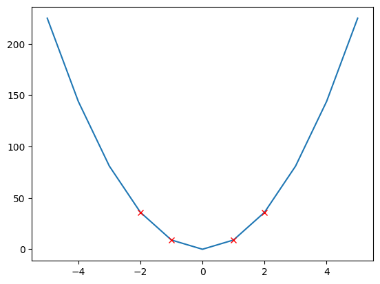
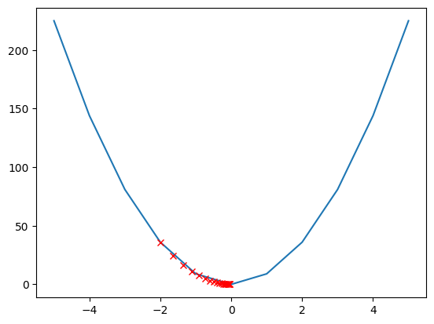
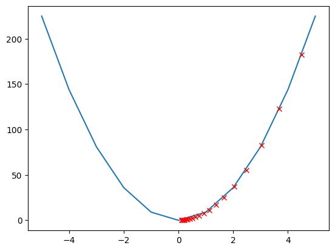
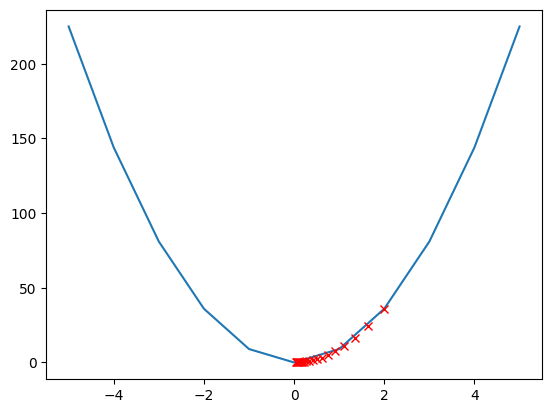

## torch basic


```python
!pip3 install torch numpy matplotlib
```

    Defaulting to user installation because normal site-packages is not writeable
    Requirement already satisfied: torch in /home/ubuntu/.local/lib/python3.10/site-packages (2.7.1)
    Requirement already satisfied: numpy in /home/ubuntu/.local/lib/python3.10/site-packages (2.2.6)
    Requirement already satisfied: matplotlib in /home/ubuntu/.local/lib/python3.10/site-packages (3.10.5)
    Requirement already satisfied: triton==3.3.1 in /home/ubuntu/.local/lib/python3.10/site-packages (from torch) (3.3.1)
    Requirement already satisfied: fsspec in /home/ubuntu/.local/lib/python3.10/site-packages (from torch) (2025.7.0)
    Requirement already satisfied: nvidia-cuda-runtime-cu12==12.6.77 in /home/ubuntu/.local/lib/python3.10/site-packages (from torch) (12.6.77)
    Requirement already satisfied: nvidia-nccl-cu12==2.26.2 in /home/ubuntu/.local/lib/python3.10/site-packages (from torch) (2.26.2)
    Requirement already satisfied: nvidia-cufile-cu12==1.11.1.6 in /home/ubuntu/.local/lib/python3.10/site-packages (from torch) (1.11.1.6)
    Requirement already satisfied: nvidia-cusparse-cu12==12.5.4.2 in /home/ubuntu/.local/lib/python3.10/site-packages (from torch) (12.5.4.2)
    Requirement already satisfied: nvidia-nvtx-cu12==12.6.77 in /home/ubuntu/.local/lib/python3.10/site-packages (from torch) (12.6.77)
    Requirement already satisfied: nvidia-cufft-cu12==11.3.0.4 in /home/ubuntu/.local/lib/python3.10/site-packages (from torch) (11.3.0.4)
    Requirement already satisfied: nvidia-cusolver-cu12==11.7.1.2 in /home/ubuntu/.local/lib/python3.10/site-packages (from torch) (11.7.1.2)
    Requirement already satisfied: networkx in /home/ubuntu/.local/lib/python3.10/site-packages (from torch) (3.4.2)
    Requirement already satisfied: nvidia-curand-cu12==10.3.7.77 in /home/ubuntu/.local/lib/python3.10/site-packages (from torch) (10.3.7.77)
    Requirement already satisfied: nvidia-cusparselt-cu12==0.6.3 in /home/ubuntu/.local/lib/python3.10/site-packages (from torch) (0.6.3)
    Requirement already satisfied: sympy>=1.13.3 in /home/ubuntu/.local/lib/python3.10/site-packages (from torch) (1.14.0)
    Requirement already satisfied: jinja2 in /usr/lib/python3/dist-packages (from torch) (3.0.3)
    Requirement already satisfied: typing-extensions>=4.10.0 in /home/ubuntu/.local/lib/python3.10/site-packages (from torch) (4.14.1)
    Requirement already satisfied: nvidia-cudnn-cu12==9.5.1.17 in /home/ubuntu/.local/lib/python3.10/site-packages (from torch) (9.5.1.17)
    Requirement already satisfied: nvidia-cublas-cu12==12.6.4.1 in /home/ubuntu/.local/lib/python3.10/site-packages (from torch) (12.6.4.1)
    Requirement already satisfied: filelock in /home/ubuntu/.local/lib/python3.10/site-packages (from torch) (3.18.0)
    Requirement already satisfied: nvidia-nvjitlink-cu12==12.6.85 in /home/ubuntu/.local/lib/python3.10/site-packages (from torch) (12.6.85)
    Requirement already satisfied: nvidia-cuda-cupti-cu12==12.6.80 in /home/ubuntu/.local/lib/python3.10/site-packages (from torch) (12.6.80)
    Requirement already satisfied: nvidia-cuda-nvrtc-cu12==12.6.77 in /home/ubuntu/.local/lib/python3.10/site-packages (from torch) (12.6.77)
    Requirement already satisfied: setuptools>=40.8.0 in /usr/lib/python3/dist-packages (from triton==3.3.1->torch) (59.6.0)
    Requirement already satisfied: kiwisolver>=1.3.1 in /home/ubuntu/.local/lib/python3.10/site-packages (from matplotlib) (1.4.8)
    Requirement already satisfied: fonttools>=4.22.0 in /home/ubuntu/.local/lib/python3.10/site-packages (from matplotlib) (4.59.0)
    Requirement already satisfied: cycler>=0.10 in /home/ubuntu/.local/lib/python3.10/site-packages (from matplotlib) (0.12.1)
    Requirement already satisfied: pyparsing>=2.3.1 in /usr/lib/python3/dist-packages (from matplotlib) (2.4.7)
    Requirement already satisfied: python-dateutil>=2.7 in /home/ubuntu/.local/lib/python3.10/site-packages (from matplotlib) (2.9.0.post0)
    Requirement already satisfied: contourpy>=1.0.1 in /home/ubuntu/.local/lib/python3.10/site-packages (from matplotlib) (1.3.2)
    Requirement already satisfied: packaging>=20.0 in /home/ubuntu/.local/lib/python3.10/site-packages (from matplotlib) (25.0)
    Requirement already satisfied: pillow>=8 in /home/ubuntu/.local/lib/python3.10/site-packages (from matplotlib) (11.3.0)
    Requirement already satisfied: six>=1.5 in /usr/lib/python3/dist-packages (from python-dateutil>=2.7->matplotlib) (1.16.0)
    Requirement already satisfied: mpmath<1.4,>=1.1.0 in /home/ubuntu/.local/lib/python3.10/site-packages (from sympy>=1.13.3->torch) (1.3.0)


## tensor 벡터와 행렬을 일반화한 것


```python
import torch

x = torch.tensor([[1,2,3], [4,5,6], [7,8,9]])
print(x)
print("Size:", x.size())
print("Shape:", x.shape)
print("랭크(차원):", x.ndimension())
```

    tensor([[1, 2, 3],
            [4, 5, 6],
            [7, 8, 9]])
    Size: torch.Size([3, 3])
    Shape: torch.Size([3, 3])
    랭크(차원): 2


```python
# 랭크 늘리기
x = torch.unsqueeze(x, 1) # 인덱스는 앞부터 0, 1, 2, -1(마지막 차원)
#x = x.unsqueeze(0)
print(x)
print("Size:", x.size())
print("Shape:", x.shape)
print("랭크(차원):", x.ndimension())
```

    tensor([[[1, 2, 3]],
    
            [[4, 5, 6]],
    
            [[7, 8, 9]]])
    Size: torch.Size([3, 1, 3])
    Shape: torch.Size([3, 1, 3])
    랭크(차원): 3


```python
# 랭크 줄이기
x = torch.squeeze(x) # 크기가 1인 차원을 모두 제거한다
#x = x.squeeze()
print(x)
print("Size:", x.size())
print("Shape:", x.shape) #[3, 3] 2개의 차원에 각 3개의 원소를 가진 텐서
print("랭크(차원):", x.ndimension())
```

    tensor([[1, 2, 3],
            [4, 5, 6],
            [7, 8, 9]])
    Size: torch.Size([3, 3])
    Shape: torch.Size([3, 3])
    랭크(차원): 2


```python
import torch
import numpy as np

array = [[1,2], [3, 4]]
x = torch.tensor(array)
print(x)
#x = torch.from_numpy(array)
x = torch.LongTensor(array)
print(x)
x = torch.Tensor(array)
print(x)
x = torch.FloatTensor(array)
print(x)
x = np.array([[1,2], [3, 4]])
print(x)
```

    tensor([[1, 2],
            [3, 4]])
    tensor([[1, 2],
            [3, 4]])
    tensor([[1., 2.],
            [3., 4.]])
    tensor([[1., 2.],
            [3., 4.]])
    [[1 2]
     [3 4]]


## view


```python
x = torch.randint(1, 10, size=(3,3))
print(x.shape)
```

    torch.Size([3, 3])


```python
print(x)
```

    tensor([[7, 7, 7],
            [3, 5, 8],
            [4, 4, 7]])


```python
x = x.view(-1, 3, 3, 1, 1, 1)
print(x.ndimension())
```

    6


```python
print(x)
print(x.shape)
```

    tensor([[[[[[7]]],
    
    
              [[[7]]],
    
    
              [[[7]]]],
    
    
    
             [[[[3]]],
    
    
              [[[5]]],
    
    
              [[[8]]]],
    
    
    
             [[[[4]]],
    
    
              [[[4]]],
    
    
              [[[7]]]]]])
    torch.Size([1, 3, 3, 1, 1, 1])


```python
print('x.view(2,4)')
try:
    x = x.view(2,4)
except Exception as e:
    print(e) #에러 출력
```

    x.view(2,4)
    shape '[2, 4]' is invalid for input of size 9


```python
print('x.view(1,9)')
try:
    x = x.view(1,9)
    print(x)
except Exception as e:
    print(e) #에러 출력
    
print('x.view(1,-1)')
try:
    x = x.view(1,-1)
    print(x)
except Exception as e:
    print(e) #에러 출력
    
print('x.view(-1,1)')
try:
    x = x.view(-1,1)
    print(x)
except Exception as e:
    print(e) #에러 출력
```

    x.view(1,9)
    tensor([[7, 7, 7, 3, 5, 8, 4, 4, 7]])
    x.view(1,-1)
    tensor([[7, 7, 7, 3, 5, 8, 4, 4, 7]])
    x.view(-1,1)
    tensor([[7],
            [7],
            [7],
            [3],
            [5],
            [8],
            [4],
            [4],
            [7]])


## requires_grad


```python
import torch

x = torch.FloatTensor(2, 2)
y = torch.FloatTensor(2, 2)

y.requires_grad_(True) # 향후 gradient를 계산하기 위해 이 tensor가 포함된 모든 연산을 추적(track)한다
z = ( x + y ) + torch.Tensor(2, 2)
print(z)
```

    tensor([[-2.6971e-24,  9.1283e-41],
            [-4.1813e+23,  9.1558e-41]], grad_fn=<AddBackward0>)


```python
import torch

x = torch.FloatTensor(2, 2)
y = torch.FloatTensor(2, 2)

y.requires_grad_(True) # leaf node, 역전파로 계산된 grad이 최종 저장됨
with torch.no_grad(): # 이 연산은 추적하지 않는다
    z = ( x + y ) + torch.Tensor(2, 2)
print(z)
```

    tensor([[-1.3670e+24,  1.3775e-40],
            [-8.3462e+23,  1.3775e-40]])


```python
import torch

w = torch.tensor(2.0, requires_grad=True)
w
```


    tensor(2., requires_grad=True)


```python
a = w*3 # 3 
l = a**2 # 9
print(l)
l.backward() # l = (w*3)^2 = 9w^2
print(w.grad) # 미분하면 9 * 2w = 18w
print('l을 w로 미분한 값은 {}'.format(w.grad))
```

    tensor(36., grad_fn=<PowBackward0>)
    tensor(36.)
    l을 w로 미분한 값은 36.0


```python
w = torch.tensor(1.0, requires_grad=True)
a = w*3 # 3 
l = a**2 # 9
l.backward() # l = (w*3)^2 = 9w^2
print(w.grad) # 미분하면 9 * 2w = 18w
print('l을 w로 미분한 값은 {}'.format(w.grad))
```

    tensor(18.)
    l을 w로 미분한 값은 18.0


```python
w = torch.tensor(-1.0, requires_grad=True)
a = w*3 # 3 
l = a**2 # 9
l.backward() # l = (w*3)^2 = 9w^2
print(w.grad) # 미분하면 9 * 2w = 18w
print('l을 w로 미분한 값은 {}'.format(w.grad))
```

    tensor(-18.)
    l을 w로 미분한 값은 -18.0


```python
w = torch.tensor(-2.0, requires_grad=True)
a = w*3 # 3 
l = a**2 # 9
l.backward() # l = (w*3)^2 = 9w^2
print(w.grad) # 미분하면 9 * 2w = 18w
print('l을 w로 미분한 값은 {}'.format(w.grad))
```

    tensor(-36.)
    l을 w로 미분한 값은 -36.0


```python
import matplotlib.pyplot as plt
%matplotlib inline

x = [a for a in range(-5, 6)]
y = [9 * (b * b) for b in range(-5, 6)]

plt.plot(x, y) # 전체 값의 그래프
for i in [-2, -1, 1, 2]:
    plt.plot(i, 9 * (i*i), 'rx')
plt.show()
```

    /home/ubuntu/.local/lib/python3.10/site-packages/numpy/_core/getlimits.py:551: UserWarning: Signature b'\x00\xd0\xcc\xcc\xcc\xcc\xcc\xcc\xfb\xbf\x00\x00\x00\x00\x00\x00' for <class 'numpy.longdouble'> does not match any known type: falling back to type probe function.
    This warnings indicates broken support for the dtype!
      machar = _get_machar(dtype)


    

    


```python
# 임의의 x로부터 y가 최소화 되는 위치를 찾는다. 통상 ML에서 x는 param, y는 loss이다.

import matplotlib.pyplot as plt

w = 9
lr = 0.01
x = [a for a in range(-5, 6)]
y = [w * (b * b) for b in range(-5, 6)]

plt.plot(x, y) # 전체 값의 그래프

px = torch.tensor(-2.0)

for i in range(20):
    px.requires_grad = True
    py = w * (px * px)
    plt.plot(float(px), float(py), 'rx')
    py.backward()
    grad = px.grad
    print(grad)
    with torch.no_grad():
        px = px - grad * lr
```

    tensor(-36.)
    tensor(-29.5200)
    tensor(-24.2064)
    tensor(-19.8492)
    tensor(-16.2764)
    tensor(-13.3466)
    tensor(-10.9442)
    tensor(-8.9743)
    tensor(-7.3589)
    tensor(-6.0343)
    tensor(-4.9481)
    tensor(-4.0575)
    tensor(-3.3271)
    tensor(-2.7282)
    tensor(-2.2372)
    tensor(-1.8345)
    tensor(-1.5043)
    tensor(-1.2335)
    tensor(-1.0115)
    tensor(-0.8294)


    

    


```python
# 임의의 x로부터 y가 최소화 되는 위치를 찾는다. 통상 ML에서 x는 param, y는 loss이다.

import matplotlib.pyplot as plt

w = 9
lr = 0.01
x = [a for a in range(-5, 6)]
y = [w * (b * b) for b in range(-5, 6)]

plt.plot(x, y) # 전체 값의 그래프

px = torch.tensor(4.5)

for i in range(20):
    px.requires_grad = True
    py = w * (px * px)
    plt.plot(float(px), float(py), 'rx')
    py.backward()
    grad = px.grad
    print(grad)
    with torch.no_grad():
        px = px - grad * lr
```

    tensor(81.)
    tensor(66.4200)
    tensor(54.4644)
    tensor(44.6608)
    tensor(36.6219)
    tensor(30.0299)
    tensor(24.6245)
    tensor(20.1921)
    tensor(16.5575)
    tensor(13.5772)
    tensor(11.1333)
    tensor(9.1293)
    tensor(7.4860)
    tensor(6.1385)
    tensor(5.0336)
    tensor(4.1276)
    tensor(3.3846)
    tensor(2.7754)
    tensor(2.2758)
    tensor(1.8662)


    

    


```python
import matplotlib.pyplot as plt

w = 9
lr = 0.01
param = [a for a in range(-5, 6)]
loss = [w * (b * b) for b in range(-5, 6)]

plt.plot(param, loss) # 전체 값의 그래프

p_param = torch.tensor(2.0)

for i in range(20):
    p_param.requires_grad = True # param에 대한 연산을 track
    p_loss = w * (p_param * p_param) # loss를 계산한다(계산식은 여러가지)
    plt.plot(float(p_param), float(p_loss), 'rx') 
    p_loss.backward() # loss에 대한 param의 기울기를 구한다
    grad = p_param.grad
    print(grad)
    with torch.no_grad():
        p_param = p_param - grad * lr # 기울기의 반대쪽으로 lr만큼 이동한다. pytorch에서 이 과정은 optimizer가 담당한다. 
```

    tensor(36.)
    tensor(29.5200)
    tensor(24.2064)
    tensor(19.8492)
    tensor(16.2764)
    tensor(13.3466)
    tensor(10.9442)
    tensor(8.9743)
    tensor(7.3589)
    tensor(6.0343)
    tensor(4.9481)
    tensor(4.0575)
    tensor(3.3271)
    tensor(2.7282)
    tensor(2.2372)
    tensor(1.8345)
    tensor(1.5043)
    tensor(1.2335)
    tensor(1.0115)
    tensor(0.8294)


    

    


## tensor operations


```python
import torch

# load_iris
x = torch.randn(150, 4, dtype=torch.float)
#w = torch.tensor([[1.0,2.0], [3.0,4.0], [5.0,6.0]])
w = torch.rand(4, 3, requires_grad=True)
print("x size:", x.size())
print("w size:", w.size())
```

    x size: torch.Size([150, 4])
    w size: torch.Size([4, 3])


```python
b = torch.randn(150, 3, dtype=torch.float, requires_grad=True)
print("b:", b.size())
```

    b: torch.Size([150, 3])


```python
xw = torch.mm(x, w)
print("xw size:", xw.size())
```

    xw size: torch.Size([150, 3])


```python
result = xw + b
print("result size:", result.size())
```

    result size: torch.Size([150, 3])


```python
result
```


    tensor([[ 8.9888e-01, -2.2228e-01, -1.8960e-02],
            [ 1.5737e+00,  1.2378e-01,  1.2694e+00],
            [-1.7851e-01, -1.8597e+00, -2.8383e+00],
            [-1.0719e+00, -9.0883e-01,  5.6991e-01],
            [ 1.2687e+00, -3.4487e-01,  1.7205e+00],
            [-7.3908e-01,  1.9155e-01, -4.6450e-01],
            [ 1.3403e+00,  1.0996e+00,  7.3250e-01],
            [ 3.3538e-01, -9.3984e-01,  2.5451e-01],
            [ 1.5383e+00,  1.1956e+00,  9.1559e-01],
            [-2.1428e+00, -3.0885e+00, -1.3895e-02],
            [ 1.7610e+00, -1.9399e+00,  8.9787e-01],
            [-9.8785e-01, -1.1974e+00, -2.3851e+00],
            [ 8.1792e-01,  2.3904e+00,  1.6425e+00],
            [ 2.5362e-01,  2.3262e+00,  2.9171e+00],
            [ 1.9896e+00,  8.5660e-01, -5.2361e-01],
            [ 8.5953e-01,  9.3205e-01, -1.2290e+00],
            [-1.3858e+00, -7.8260e-01, -1.8646e+00],
            [-4.1883e+00, -4.0277e+00, -1.7644e+00],
            [ 1.5034e+00,  2.7259e+00,  3.1731e+00],
            [ 1.3520e+00,  1.7144e+00,  8.1452e-01],
            [-4.8174e+00, -3.4732e+00, -2.4339e+00],
            [ 1.0896e+00,  1.4916e+00, -4.2281e-01],
            [ 1.2629e+00,  1.9224e+00,  6.8196e-01],
            [-1.3292e+00,  1.2049e+00, -9.5333e-02],
            [ 3.3018e+00,  3.1129e+00,  2.5977e+00],
            [ 7.8614e-01,  1.3463e+00,  1.5929e+00],
            [ 7.5206e-01,  9.5248e-01, -1.6020e+00],
            [-6.5790e-01, -7.5571e-01, -1.0379e+00],
            [ 2.1895e+00,  8.5197e-01,  2.2262e+00],
            [-4.6377e-01, -9.9128e-01, -9.0956e-01],
            [-6.4896e-01, -8.7166e-01,  1.8055e+00],
            [-3.8220e+00, -9.4316e-01, -3.7889e-01],
            [ 1.0518e-01, -4.5973e-01, -1.8044e+00],
            [ 2.5821e-01,  2.7998e+00,  1.6428e+00],
            [ 5.5403e-01, -2.0223e+00,  8.9306e-01],
            [-1.4019e+00, -3.5091e-01,  2.4256e-01],
            [-4.1245e-01, -2.7194e-01,  7.6824e-02],
            [-2.2429e+00, -3.4332e-01, -3.7420e-01],
            [ 2.7398e+00,  1.2520e+00,  1.2199e+00],
            [-1.4876e+00, -3.4686e-01, -1.1360e+00],
            [ 1.0713e+00, -1.3395e+00, -5.0966e-01],
            [ 1.6492e+00, -1.7471e+00, -8.0891e-01],
            [-2.7383e+00, -1.5549e+00, -3.5483e-01],
            [ 2.2741e+00,  2.8395e+00,  2.7661e-01],
            [-1.5675e+00, -1.4689e+00,  1.0258e+00],
            [-1.3441e+00, -3.4423e+00, -3.3343e-02],
            [-6.2634e-01, -1.4860e+00,  7.5508e-01],
            [ 1.1746e+00, -3.2067e-01,  5.3016e-01],
            [-5.9229e-01, -9.0871e-02, -1.1162e-01],
            [ 5.1224e-01,  2.0313e+00,  1.8584e+00],
            [ 2.4632e+00,  1.3960e-01,  1.2918e-02],
            [ 1.3524e-01, -1.7015e+00,  1.4807e+00],
            [-3.4230e-01,  5.0702e-02,  2.1860e+00],
            [ 4.1233e-01, -2.0458e-01,  1.0697e+00],
            [ 2.6149e+00,  1.3384e+00, -3.2427e-01],
            [ 1.6016e+00,  1.5702e+00, -5.5333e-01],
            [-3.0498e+00, -2.4942e+00, -1.1789e+00],
            [-1.6725e+00,  9.3480e-01, -6.1805e-02],
            [-6.4250e-01, -3.9837e-01,  2.2786e+00],
            [ 1.2856e+00,  6.5177e-01, -1.4205e-01],
            [-1.8399e+00, -9.3056e-01, -1.0646e+00],
            [ 3.2563e+00,  1.1539e+00, -1.4515e-01],
            [ 1.0218e-01, -1.0272e+00,  1.2024e+00],
            [ 1.0057e+00,  1.2637e+00,  7.4044e-01],
            [ 1.3924e+00,  1.2769e+00,  8.3001e-01],
            [-1.2954e+00, -3.8389e-01, -1.4179e+00],
            [-5.5696e-01,  8.8130e-01, -4.2190e-01],
            [-1.7841e+00, -2.0259e+00, -6.7720e-02],
            [-1.4768e+00, -2.3043e+00, -7.6922e-01],
            [ 3.3254e+00,  8.9347e-01,  2.5717e+00],
            [-5.1842e-02,  1.2350e+00, -6.3717e-01],
            [ 2.0773e+00,  1.0057e+00,  4.5611e-01],
            [-1.0246e+00, -1.5480e+00, -9.0834e-01],
            [ 3.3375e-01,  4.2162e-01, -9.1549e-01],
            [-3.4880e+00, -2.7102e+00, -2.8412e+00],
            [ 5.5874e-02, -1.9898e+00, -1.7778e+00],
            [ 1.4562e+00, -3.9880e-01,  1.1785e+00],
            [-1.4859e+00,  1.4145e+00,  5.8439e-01],
            [-1.3291e+00, -3.1256e+00, -1.0474e+00],
            [-2.2341e+00,  5.4736e-01, -1.2847e+00],
            [ 1.0890e+00, -1.2850e+00,  1.0405e+00],
            [-1.7847e-01, -2.5249e+00, -9.4790e-02],
            [ 1.6295e+00,  2.6987e+00,  1.7013e+00],
            [-2.1525e+00, -5.7963e-01, -1.2768e+00],
            [-4.9606e-01, -1.1391e+00,  2.8294e-01],
            [-4.9850e-01, -6.9422e-01,  2.4340e-01],
            [ 5.0987e-01, -4.4931e-02,  2.0717e+00],
            [-8.9286e-01,  7.0767e-01,  1.6372e-01],
            [-1.4505e+00, -3.0267e-01,  4.6861e-01],
            [ 1.0297e+00,  2.4202e+00, -9.8946e-01],
            [ 2.7769e-01, -5.0953e-01, -2.1489e+00],
            [ 1.0483e+00,  4.3243e+00,  3.0069e+00],
            [-7.2168e-01, -9.9350e-01, -6.7666e-01],
            [ 1.1104e+00,  5.4066e-01,  1.8398e-01],
            [-2.1909e+00, -1.5375e+00,  1.9987e-01],
            [ 9.4887e-01,  5.0301e-01,  1.7036e+00],
            [ 2.6637e+00,  1.7524e+00,  1.6649e+00],
            [-9.3220e-01, -8.2354e-01, -4.5484e-01],
            [-3.2424e+00, -1.1337e+00,  8.3108e-01],
            [ 1.3771e+00, -1.4488e-01, -2.9971e-01],
            [-8.6836e-01, -1.3003e+00, -3.3010e+00],
            [-1.3067e+00, -2.3442e+00,  2.3887e+00],
            [ 1.0161e+00, -2.1759e+00, -1.3919e+00],
            [-4.5836e-01, -1.0392e+00,  3.1204e-01],
            [-2.7765e+00, -1.8078e+00, -1.0615e-01],
            [ 8.5545e-01,  8.0724e-01, -1.0481e+00],
            [-3.3579e-03, -1.4117e+00, -4.3439e-01],
            [ 3.0843e+00,  1.2336e+00,  3.3203e+00],
            [-1.0889e+00, -9.5301e-01,  3.6991e-01],
            [-5.1961e-01, -2.1633e-01, -1.3535e+00],
            [-1.9948e+00, -3.1094e+00,  2.8985e-01],
            [ 1.9438e+00,  5.4494e-01, -3.4181e-01],
            [ 2.1349e-01,  1.0995e-01, -1.7961e-01],
            [ 1.8418e+00, -9.6110e-01, -3.0656e-01],
            [-4.8308e-01, -5.9076e-01, -4.4461e-01],
            [ 7.8099e-01, -1.3981e+00, -6.6680e-01],
            [-3.0582e+00, -2.1623e+00, -1.6555e+00],
            [ 2.9739e+00, -9.1955e-01, -8.6102e-01],
            [-8.8385e-01, -4.9302e-01, -2.4203e-01],
            [ 2.5975e+00,  1.4186e+00,  5.0393e-01],
            [-5.8331e-01, -8.2301e-01,  4.7729e-02],
            [-3.5703e+00, -2.2916e+00, -6.2516e-01],
            [ 3.4603e-01,  1.1240e+00,  3.5617e-01],
            [-1.6049e+00, -1.7540e+00, -1.1577e+00],
            [ 1.5042e+00, -3.4981e-01, -5.2089e-01],
            [ 1.3596e+00,  1.7558e+00, -3.1993e-01],
            [ 2.3233e+00,  1.9820e+00,  8.0482e-01],
            [ 1.9613e+00,  1.5125e+00,  1.8797e-01],
            [-3.1324e+00, -3.3312e+00, -2.3990e+00],
            [ 2.3901e+00,  1.3063e+00,  1.3200e+00],
            [-2.4466e+00, -8.3203e-01, -2.7172e+00],
            [-5.0466e-02,  3.2507e-01,  7.0454e-03],
            [-3.5257e-01,  2.4698e+00, -9.5088e-02],
            [ 3.5690e-01, -2.0901e+00, -1.5893e+00],
            [-1.2058e+00, -4.5963e+00, -3.1945e+00],
            [-5.9818e-01,  2.4258e-02,  7.9087e-01],
            [ 8.9361e-01,  4.2373e-01,  1.4816e+00],
            [-6.2493e-01,  1.7723e-01, -5.8458e-01],
            [ 2.3814e+00,  3.1531e+00, -5.9809e-01],
            [-3.2468e-01, -2.7886e-01,  1.2221e+00],
            [ 1.4746e+00,  7.4942e-01, -2.7289e-01],
            [-1.1854e+00, -3.2654e-01, -7.4940e-01],
            [ 2.9273e+00,  3.4957e+00,  2.2367e-01],
            [-1.4841e+00,  3.6268e-01,  8.7750e-01],
            [ 1.6284e+00,  4.4447e-01,  6.5669e-01],
            [ 1.5730e+00, -6.1296e-01, -2.4192e-02],
            [ 9.0721e-01,  2.5097e+00,  1.6319e+00],
            [ 7.2692e-01,  1.4134e-01,  2.4947e-01],
            [ 8.5915e-01,  5.4872e-01,  1.1071e+00],
            [-2.3913e+00, -7.0129e-01,  1.8281e+00]], grad_fn=<AddBackward0>)


## broadcasting


```python
m1 = torch.FloatTensor([[3, 3]])
m2 = torch.FloatTensor([[2, 2]])
print(m1.shape, m2.shape)
print(m1 + m2)
```

    torch.Size([1, 2]) torch.Size([1, 2])
    tensor([[5., 5.]])


```python
# Vector + scalar
m1 = torch.FloatTensor([[1, 2]])
m2 = torch.FloatTensor([3]) # [3] -> [3, 3]
print(m1.shape, m2.shape)
print(m1 + m2)
```

    torch.Size([1, 2]) torch.Size([1])
    tensor([[4., 5.]])


```python
# 2 x 1 Vector + 1 x 2 Vector
m1 = torch.FloatTensor([[1, 2]])
print(m1.shape)
m2 = torch.FloatTensor([[3], [4]])
print(m2.shape)
print(m1 + m2)
```

    torch.Size([1, 2])
    torch.Size([2, 1])
    tensor([[4., 5.],
            [5., 6.]])


## mean


```python
t = torch.FloatTensor([1, 2])
print(t.mean())
```

    tensor(1.5000)


```python
t = torch.FloatTensor([[1, 2], [3, 4]])
print(t)
print(t.mean())
```

    tensor([[1., 2.],
            [3., 4.]])
    tensor(2.5000)


```python
print(t.mean(dim=0))
print(t.mean(dim=1))
print(t.mean(dim=-1))
```

    tensor([2., 3.])
    tensor([1.5000, 3.5000])
    tensor([1.5000, 3.5000])

