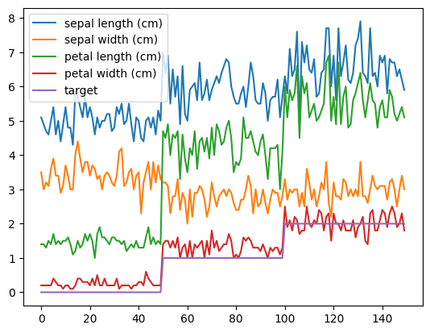
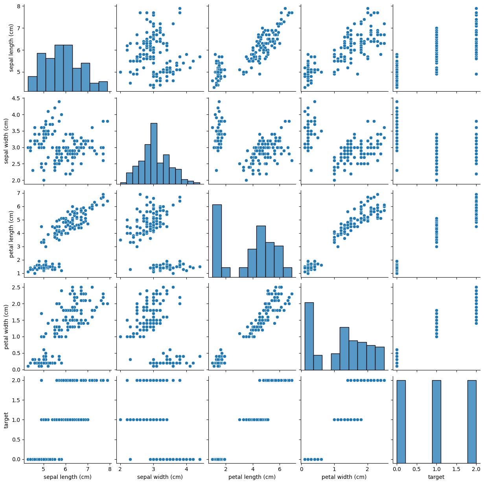

## torch classification


```python
%pip install scikit-learn seaborn matplotlib
```

    Defaulting to user installation because normal site-packages is not writeable
    Requirement already satisfied: scikit-learn in /home/ubuntu/.local/lib/python3.10/site-packages (1.7.1)
    Requirement already satisfied: seaborn in /home/ubuntu/.local/lib/python3.10/site-packages (0.13.2)
    Requirement already satisfied: matplotlib in /home/ubuntu/.local/lib/python3.10/site-packages (3.10.5)
    Requirement already satisfied: scipy>=1.8.0 in /home/ubuntu/.local/lib/python3.10/site-packages (from scikit-learn) (1.15.3)
    Requirement already satisfied: threadpoolctl>=3.1.0 in /home/ubuntu/.local/lib/python3.10/site-packages (from scikit-learn) (3.6.0)
    Requirement already satisfied: joblib>=1.2.0 in /home/ubuntu/.local/lib/python3.10/site-packages (from scikit-learn) (1.5.1)
    Requirement already satisfied: numpy>=1.22.0 in /home/ubuntu/.local/lib/python3.10/site-packages (from scikit-learn) (2.2.6)
    Requirement already satisfied: pandas>=1.2 in /home/ubuntu/.local/lib/python3.10/site-packages (from seaborn) (2.3.1)
    Requirement already satisfied: cycler>=0.10 in /home/ubuntu/.local/lib/python3.10/site-packages (from matplotlib) (0.12.1)
    Requirement already satisfied: pillow>=8 in /home/ubuntu/.local/lib/python3.10/site-packages (from matplotlib) (11.3.0)
    Requirement already satisfied: fonttools>=4.22.0 in /home/ubuntu/.local/lib/python3.10/site-packages (from matplotlib) (4.59.0)
    Requirement already satisfied: contourpy>=1.0.1 in /home/ubuntu/.local/lib/python3.10/site-packages (from matplotlib) (1.3.2)
    Requirement already satisfied: packaging>=20.0 in /home/ubuntu/.local/lib/python3.10/site-packages (from matplotlib) (25.0)
    Requirement already satisfied: pyparsing>=2.3.1 in /usr/lib/python3/dist-packages (from matplotlib) (2.4.7)
    Requirement already satisfied: kiwisolver>=1.3.1 in /home/ubuntu/.local/lib/python3.10/site-packages (from matplotlib) (1.4.8)
    Requirement already satisfied: python-dateutil>=2.7 in /home/ubuntu/.local/lib/python3.10/site-packages (from matplotlib) (2.9.0.post0)
    Requirement already satisfied: tzdata>=2022.7 in /home/ubuntu/.local/lib/python3.10/site-packages (from pandas>=1.2->seaborn) (2025.2)
    Requirement already satisfied: pytz>=2020.1 in /usr/lib/python3/dist-packages (from pandas>=1.2->seaborn) (2022.1)
    Requirement already satisfied: six>=1.5 in /usr/lib/python3/dist-packages (from python-dateutil>=2.7->matplotlib) (1.16.0)
    Note: you may need to restart the kernel to use updated packages.


```python
from sklearn.datasets import load_iris
import pandas as pd
import seaborn as sns
%matplotlib inline
```

    /home/ubuntu/.local/lib/python3.10/site-packages/numpy/_core/getlimits.py:551: UserWarning: Signature b'\x00\xd0\xcc\xcc\xcc\xcc\xcc\xcc\xfb\xbf\x00\x00\x00\x00\x00\x00' for <class 'numpy.longdouble'> does not match any known type: falling back to type probe function.
    This warnings indicates broken support for the dtype!
      machar = _get_machar(dtype)


```python
data = load_iris()
```


```python
print(type(data))
```

    <class 'sklearn.utils._bunch.Bunch'>


```python
print(data.keys())
```

    dict_keys(['data', 'target', 'frame', 'target_names', 'DESCR', 'feature_names', 'filename', 'data_module'])


```python
print(data.DESCR)
```

    .. _iris_dataset:
    
    Iris plants dataset
    --------------------
    
    **Data Set Characteristics:**
    
    :Number of Instances: 150 (50 in each of three classes)
    :Number of Attributes: 4 numeric, predictive attributes and the class
    :Attribute Information:
        - sepal length in cm
        - sepal width in cm
        - petal length in cm
        - petal width in cm
        - class:
                - Iris-Setosa
                - Iris-Versicolour
                - Iris-Virginica
    
    :Summary Statistics:
    
    ============== ==== ==== ======= ===== ====================
                    Min  Max   Mean    SD   Class Correlation
    ============== ==== ==== ======= ===== ====================
    sepal length:   4.3  7.9   5.84   0.83    0.7826
    sepal width:    2.0  4.4   3.05   0.43   -0.4194
    petal length:   1.0  6.9   3.76   1.76    0.9490  (high!)
    petal width:    0.1  2.5   1.20   0.76    0.9565  (high!)
    ============== ==== ==== ======= ===== ====================
    
    :Missing Attribute Values: None
    :Class Distribution: 33.3% for each of 3 classes.
    :Creator: R.A. Fisher
    :Donor: Michael Marshall (MARSHALL%PLU@io.arc.nasa.gov)
    :Date: July, 1988
    
    The famous Iris database, first used by Sir R.A. Fisher. The dataset is taken
    from Fisher's paper. Note that it's the same as in R, but not as in the UCI
    Machine Learning Repository, which has two wrong data points.
    
    This is perhaps the best known database to be found in the
    pattern recognition literature.  Fisher's paper is a classic in the field and
    is referenced frequently to this day.  (See Duda & Hart, for example.)  The
    data set contains 3 classes of 50 instances each, where each class refers to a
    type of iris plant.  One class is linearly separable from the other 2; the
    latter are NOT linearly separable from each other.
    
    .. dropdown:: References
    
      - Fisher, R.A. "The use of multiple measurements in taxonomic problems"
        Annual Eugenics, 7, Part II, 179-188 (1936); also in "Contributions to
        Mathematical Statistics" (John Wiley, NY, 1950).
      - Duda, R.O., & Hart, P.E. (1973) Pattern Classification and Scene Analysis.
        (Q327.D83) John Wiley & Sons.  ISBN 0-471-22361-1.  See page 218.
      - Dasarathy, B.V. (1980) "Nosing Around the Neighborhood: A New System
        Structure and Classification Rule for Recognition in Partially Exposed
        Environments".  IEEE Transactions on Pattern Analysis and Machine
        Intelligence, Vol. PAMI-2, No. 1, 67-71.
      - Gates, G.W. (1972) "The Reduced Nearest Neighbor Rule".  IEEE Transactions
        on Information Theory, May 1972, 431-433.
      - See also: 1988 MLC Proceedings, 54-64.  Cheeseman et al"s AUTOCLASS II
        conceptual clustering system finds 3 classes in the data.
      - Many, many more ...
    


```python
df = pd.DataFrame(data=data.data, columns=data.feature_names)
df['target'] = data.target
```


```python
print(data.target_names)
```

    ['setosa' 'versicolor' 'virginica']


```python
df.head()
```


<div>
<style scoped>
    .dataframe tbody tr th:only-of-type {
        vertical-align: middle;
    }

    .dataframe tbody tr th {
        vertical-align: top;
    }

    .dataframe thead th {
        text-align: right;
    }
</style>
<table border="1" class="dataframe">
  <thead>
    <tr style="text-align: right;">
      <th></th>
      <th>sepal length (cm)</th>
      <th>sepal width (cm)</th>
      <th>petal length (cm)</th>
      <th>petal width (cm)</th>
      <th>target</th>
    </tr>
  </thead>
  <tbody>
    <tr>
      <th>0</th>
      <td>5.1</td>
      <td>3.5</td>
      <td>1.4</td>
      <td>0.2</td>
      <td>0</td>
    </tr>
    <tr>
      <th>1</th>
      <td>4.9</td>
      <td>3.0</td>
      <td>1.4</td>
      <td>0.2</td>
      <td>0</td>
    </tr>
    <tr>
      <th>2</th>
      <td>4.7</td>
      <td>3.2</td>
      <td>1.3</td>
      <td>0.2</td>
      <td>0</td>
    </tr>
    <tr>
      <th>3</th>
      <td>4.6</td>
      <td>3.1</td>
      <td>1.5</td>
      <td>0.2</td>
      <td>0</td>
    </tr>
    <tr>
      <th>4</th>
      <td>5.0</td>
      <td>3.6</td>
      <td>1.4</td>
      <td>0.2</td>
      <td>0</td>
    </tr>
  </tbody>
</table>
</div>


```python
df.tail()
```


<div>
<style scoped>
    .dataframe tbody tr th:only-of-type {
        vertical-align: middle;
    }

    .dataframe tbody tr th {
        vertical-align: top;
    }

    .dataframe thead th {
        text-align: right;
    }
</style>
<table border="1" class="dataframe">
  <thead>
    <tr style="text-align: right;">
      <th></th>
      <th>sepal length (cm)</th>
      <th>sepal width (cm)</th>
      <th>petal length (cm)</th>
      <th>petal width (cm)</th>
      <th>target</th>
    </tr>
  </thead>
  <tbody>
    <tr>
      <th>145</th>
      <td>6.7</td>
      <td>3.0</td>
      <td>5.2</td>
      <td>2.3</td>
      <td>2</td>
    </tr>
    <tr>
      <th>146</th>
      <td>6.3</td>
      <td>2.5</td>
      <td>5.0</td>
      <td>1.9</td>
      <td>2</td>
    </tr>
    <tr>
      <th>147</th>
      <td>6.5</td>
      <td>3.0</td>
      <td>5.2</td>
      <td>2.0</td>
      <td>2</td>
    </tr>
    <tr>
      <th>148</th>
      <td>6.2</td>
      <td>3.4</td>
      <td>5.4</td>
      <td>2.3</td>
      <td>2</td>
    </tr>
    <tr>
      <th>149</th>
      <td>5.9</td>
      <td>3.0</td>
      <td>5.1</td>
      <td>1.8</td>
      <td>2</td>
    </tr>
  </tbody>
</table>
</div>


```python
df.describe()
```


<div>
<style scoped>
    .dataframe tbody tr th:only-of-type {
        vertical-align: middle;
    }

    .dataframe tbody tr th {
        vertical-align: top;
    }

    .dataframe thead th {
        text-align: right;
    }
</style>
<table border="1" class="dataframe">
  <thead>
    <tr style="text-align: right;">
      <th></th>
      <th>sepal length (cm)</th>
      <th>sepal width (cm)</th>
      <th>petal length (cm)</th>
      <th>petal width (cm)</th>
      <th>target</th>
    </tr>
  </thead>
  <tbody>
    <tr>
      <th>count</th>
      <td>150.000000</td>
      <td>150.000000</td>
      <td>150.000000</td>
      <td>150.000000</td>
      <td>150.000000</td>
    </tr>
    <tr>
      <th>mean</th>
      <td>5.843333</td>
      <td>3.057333</td>
      <td>3.758000</td>
      <td>1.199333</td>
      <td>1.000000</td>
    </tr>
    <tr>
      <th>std</th>
      <td>0.828066</td>
      <td>0.435866</td>
      <td>1.765298</td>
      <td>0.762238</td>
      <td>0.819232</td>
    </tr>
    <tr>
      <th>min</th>
      <td>4.300000</td>
      <td>2.000000</td>
      <td>1.000000</td>
      <td>0.100000</td>
      <td>0.000000</td>
    </tr>
    <tr>
      <th>25%</th>
      <td>5.100000</td>
      <td>2.800000</td>
      <td>1.600000</td>
      <td>0.300000</td>
      <td>0.000000</td>
    </tr>
    <tr>
      <th>50%</th>
      <td>5.800000</td>
      <td>3.000000</td>
      <td>4.350000</td>
      <td>1.300000</td>
      <td>1.000000</td>
    </tr>
    <tr>
      <th>75%</th>
      <td>6.400000</td>
      <td>3.300000</td>
      <td>5.100000</td>
      <td>1.800000</td>
      <td>2.000000</td>
    </tr>
    <tr>
      <th>max</th>
      <td>7.900000</td>
      <td>4.400000</td>
      <td>6.900000</td>
      <td>2.500000</td>
      <td>2.000000</td>
    </tr>
  </tbody>
</table>
</div>


```python
df.info()
```

    <class 'pandas.core.frame.DataFrame'>
    RangeIndex: 150 entries, 0 to 149
    Data columns (total 5 columns):
     #   Column             Non-Null Count  Dtype  
    ---  ------             --------------  -----  
     0   sepal length (cm)  150 non-null    float64
     1   sepal width (cm)   150 non-null    float64
     2   petal length (cm)  150 non-null    float64
     3   petal width (cm)   150 non-null    float64
     4   target             150 non-null    int64  
    dtypes: float64(4), int64(1)
    memory usage: 6.0 KB


```python
print(df.isnull().sum())
```

    sepal length (cm)    0
    sepal width (cm)     0
    petal length (cm)    0
    petal width (cm)     0
    target               0
    dtype: int64


```python
df.plot()
```


    <Axes: >


    

    


```python
sns.pairplot(df)
```


    <seaborn.axisgrid.PairGrid at 0x7f3448277790>


    

    


```python
import torch
import torch.nn as nn
import torch.nn.functional as F
import torch.optim as optim
import torch.utils.data as data_utils
```


```python
class IrisModel(nn.Module):
    def __init__(self, input_size, output_size):
        super(IrisModel, self).__init__()
        self.model = nn.Sequential(
            nn.Linear(input_size, 16),
            nn.ReLU(),
            nn.Linear(16, output_size)
        )
        
    def forward(self, x):
        output = self.model(x)
        result = F.softmax(output, dim=1)
        with torch.no_grad():
            value = torch.argmax(result, dim=1)
        return output, value
```


```python
X = torch.Tensor(data.data)
y = torch.LongTensor(data.target)
```


```python
import numpy as np
from sklearn.model_selection import train_test_split

X_train, X_test, y_train, y_test = train_test_split(X, y, test_size=0.2) # train과 test를 8:2로 분할
```


```python
model = IrisModel(4, 3) # 입력은 4, 출력은 3종류의 확률
```


```python
print(X_train.shape)
```

    torch.Size([120, 4])


```python
print(y_train.shape) 
```

    torch.Size([120])


```python
print(X_train[0].shape)
```

    torch.Size([4])


```python
print(torch.unsqueeze(X_train[0], dim=0).shape)
```

    torch.Size([1, 4])


```python
print(torch.unsqueeze(X_train[0], dim=0).shape)
```

    torch.Size([1, 4])


```python
print(y.shape)
```

    torch.Size([150])


```python
optimizer = torch.optim.Adam(model.parameters(), lr=0.001)
```


```python
print(model)
```

    IrisModel(
      (model): Sequential(
        (0): Linear(in_features=4, out_features=16, bias=True)
        (1): ReLU()
        (2): Linear(in_features=16, out_features=3, bias=True)
      )
    )

