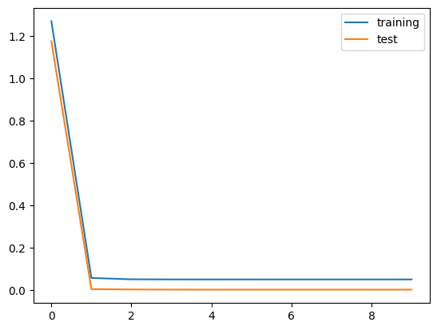

## torch classification


```python
from sklearn.datasets import load_iris
import pandas as pd
import seaborn as sns
%matplotlib inline
```

    /home/ubuntu/.local/lib/python3.10/site-packages/numpy/_core/getlimits.py:551: UserWarning: Signature b'\x00\xd0\xcc\xcc\xcc\xcc\xcc\xcc\xfb\xbf\x00\x00\x00\x00\x00\x00' for <class 'numpy.longdouble'> does not match any known type: falling back to type probe function.
    This warnings indicates broken support for the dtype!
      machar = _get_machar(dtype)


```python
data = load_iris()
```


```python
import torch
import torch.nn as nn
import torch.nn.functional as F
import torch.optim as optim
import torch.utils.data as data_utils
```


```python
class IrisModel(nn.Module):
    def __init__(self, input_size, output_size):
        super(IrisModel, self).__init__()
        self.model = nn.Sequential(
            nn.Linear(input_size, 16),
            nn.ReLU(),
            nn.Linear(16, output_size)
        )
        
    def forward(self, x):
        output = self.model(x)
        result = F.softmax(output, dim=1)
        with torch.no_grad():
            value = torch.argmax(result, dim=1)
        return output, value
```


```python
X = torch.Tensor(data.data)
y = torch.LongTensor(data.target)
```


```python
import numpy as np
from sklearn.model_selection import train_test_split

X_train, X_test, y_train, y_test = train_test_split(X, y, test_size=0.2) # train과 test를 8:2로 분할
```


```python
model = IrisModel(4, 3) # 입력은 4, 출력은 3종류의 확률
optimizer = torch.optim.Adam(model.parameters(), lr=0.004)
criterion = nn.CrossEntropyLoss()

n_epochs = 10000 # 10000회 학습

for epoch in range(n_epochs):
    y, _ = model(X_train)
    target = y_train
    loss = criterion(y, target).sum()
    optimizer.zero_grad()
    loss.backward()
    optimizer.step()
    if epoch % 1000 == 0:
        print('epoch {}th loss: {}'.format(epoch, loss.data))
```

    epoch 0th loss: 2.152310371398926
    epoch 1000th loss: 0.05790281668305397
    epoch 2000th loss: 0.050845853984355927
    epoch 3000th loss: 0.049486156553030014
    epoch 4000th loss: 0.04934274032711983
    epoch 5000th loss: 0.049338288605213165
    epoch 6000th loss: 0.04932378977537155
    epoch 7000th loss: 0.04932153597474098
    epoch 8000th loss: 0.04931993409991264
    epoch 9000th loss: 0.049402832984924316


```python
n = 100
with torch.no_grad():
    y, _ = model(torch.unsqueeze(X_train[n], dim=0))
    print(y)
    print(y.sum())
    print(np.argmax(y), y_train[n])
```

    tensor([[-13.1079,   1.3286,   8.0684]])
    tensor(-3.7109)
    tensor(2) tensor(2)


```python
model = IrisModel(4, 3) # 입력은 4, 출력은 3종류의 확률
optimizer = torch.optim.Adam(model.parameters(), lr=0.004)
criterion = nn.CrossEntropyLoss()

n_epochs = 10000 # 10000회 학습

list_training_loss = []
list_test_loss = []

for epoch in range(n_epochs):
    model.train()
    y, _ = model(X_train)
    target = y_train
    loss = criterion(y, target).sum()
    optimizer.zero_grad()
    loss.backward()
    optimizer.step()
    if epoch % 1000 == 0:
        model.eval()
        y_pred, _ = model(X_test)
        test_loss = criterion(y_pred, y_test).sum()
        print('epoch {}th training loss: {} test loss: {}'.format(epoch, loss.data, test_loss.data))
        list_training_loss.append(loss.data)
        list_test_loss.append(test_loss.data)
```

    epoch 0th training loss: 1.2705461978912354 test loss: 1.1758331060409546
    epoch 1000th training loss: 0.05633866786956787 test loss: 0.0036470198538154364
    epoch 2000th training loss: 0.049973249435424805 test loss: 0.001868654740974307
    epoch 3000th training loss: 0.04938943311572075 test loss: 0.0012337486259639263
    epoch 4000th training loss: 0.04934072867035866 test loss: 0.0011335216695442796
    epoch 5000th training loss: 0.04932931810617447 test loss: 0.001113693113438785
    epoch 6000th training loss: 0.049324583262205124 test loss: 0.0011069319443777204
    epoch 7000th training loss: 0.04932384565472603 test loss: 0.00111470150295645
    epoch 8000th training loss: 0.049320753663778305 test loss: 0.0011011020978912711
    epoch 9000th training loss: 0.04931987449526787 test loss: 0.0011011488968506455


```python
import matplotlib.pyplot as plt

plt.plot(list_training_loss, label='training')
plt.plot(list_test_loss, label='test')
plt.legend()
plt.show()
```


    

    


```python
from sklearn.metrics import accuracy_score

with torch.no_grad():
    _ , y_pred = model(X_test)
    score = accuracy_score(y_test, y_pred)
    print(score)
```

    1.0

