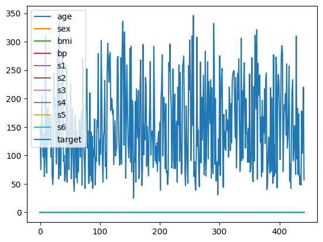
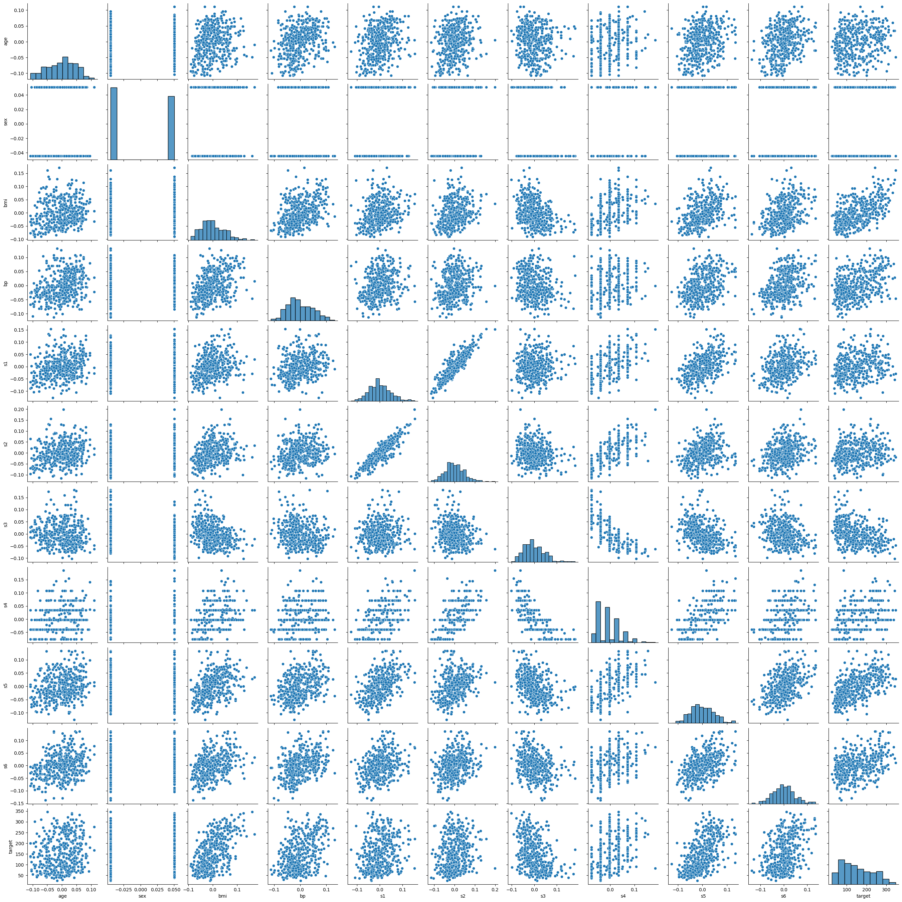
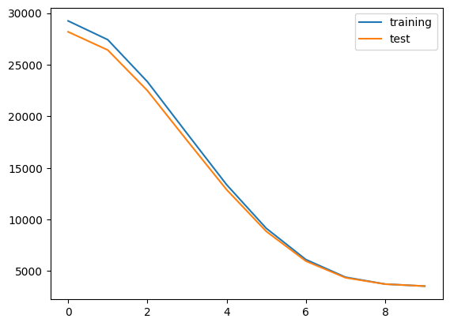

## torch regression


```python
%pip install scikit-learn seaborn matplotlib
```

    Defaulting to user installation because normal site-packages is not writeable
    Requirement already satisfied: scikit-learn in /home/ubuntu/.local/lib/python3.10/site-packages (1.7.1)
    Requirement already satisfied: seaborn in /home/ubuntu/.local/lib/python3.10/site-packages (0.13.2)
    Requirement already satisfied: matplotlib in /home/ubuntu/.local/lib/python3.10/site-packages (3.10.5)
    Requirement already satisfied: threadpoolctl>=3.1.0 in /home/ubuntu/.local/lib/python3.10/site-packages (from scikit-learn) (3.6.0)
    Requirement already satisfied: scipy>=1.8.0 in /home/ubuntu/.local/lib/python3.10/site-packages (from scikit-learn) (1.15.3)
    Requirement already satisfied: joblib>=1.2.0 in /home/ubuntu/.local/lib/python3.10/site-packages (from scikit-learn) (1.5.1)
    Requirement already satisfied: numpy>=1.22.0 in /home/ubuntu/.local/lib/python3.10/site-packages (from scikit-learn) (2.2.6)
    Requirement already satisfied: pandas>=1.2 in /home/ubuntu/.local/lib/python3.10/site-packages (from seaborn) (2.3.1)
    Requirement already satisfied: kiwisolver>=1.3.1 in /home/ubuntu/.local/lib/python3.10/site-packages (from matplotlib) (1.4.8)
    Requirement already satisfied: cycler>=0.10 in /home/ubuntu/.local/lib/python3.10/site-packages (from matplotlib) (0.12.1)
    Requirement already satisfied: pyparsing>=2.3.1 in /usr/lib/python3/dist-packages (from matplotlib) (2.4.7)
    Requirement already satisfied: pillow>=8 in /home/ubuntu/.local/lib/python3.10/site-packages (from matplotlib) (11.3.0)
    Requirement already satisfied: fonttools>=4.22.0 in /home/ubuntu/.local/lib/python3.10/site-packages (from matplotlib) (4.59.0)
    Requirement already satisfied: python-dateutil>=2.7 in /home/ubuntu/.local/lib/python3.10/site-packages (from matplotlib) (2.9.0.post0)
    Requirement already satisfied: packaging>=20.0 in /home/ubuntu/.local/lib/python3.10/site-packages (from matplotlib) (25.0)
    Requirement already satisfied: contourpy>=1.0.1 in /home/ubuntu/.local/lib/python3.10/site-packages (from matplotlib) (1.3.2)
    Requirement already satisfied: tzdata>=2022.7 in /home/ubuntu/.local/lib/python3.10/site-packages (from pandas>=1.2->seaborn) (2025.2)
    Requirement already satisfied: pytz>=2020.1 in /usr/lib/python3/dist-packages (from pandas>=1.2->seaborn) (2022.1)
    Requirement already satisfied: six>=1.5 in /usr/lib/python3/dist-packages (from python-dateutil>=2.7->matplotlib) (1.16.0)
    Note: you may need to restart the kernel to use updated packages.


```python
from sklearn.datasets import load_diabetes
import pandas as pd
import seaborn as sns
%matplotlib inline
```

    /home/ubuntu/.local/lib/python3.10/site-packages/numpy/_core/getlimits.py:551: UserWarning: Signature b'\x00\xd0\xcc\xcc\xcc\xcc\xcc\xcc\xfb\xbf\x00\x00\x00\x00\x00\x00' for <class 'numpy.longdouble'> does not match any known type: falling back to type probe function.
    This warnings indicates broken support for the dtype!
      machar = _get_machar(dtype)


```python
data = load_diabetes()
```


```python
print(type(data))

```

    <class 'sklearn.utils._bunch.Bunch'>


```python
print(data.keys())
```

    dict_keys(['data', 'target', 'frame', 'DESCR', 'feature_names', 'data_filename', 'target_filename', 'data_module'])


```python
print(data.DESCR)
```

    .. _diabetes_dataset:
    
    Diabetes dataset
    ----------------
    
    Ten baseline variables, age, sex, body mass index, average blood
    pressure, and six blood serum measurements were obtained for each of n =
    442 diabetes patients, as well as the response of interest, a
    quantitative measure of disease progression one year after baseline.
    
    **Data Set Characteristics:**
    
    :Number of Instances: 442
    
    :Number of Attributes: First 10 columns are numeric predictive values
    
    :Target: Column 11 is a quantitative measure of disease progression one year after baseline
    
    :Attribute Information:
        - age     age in years
        - sex
        - bmi     body mass index
        - bp      average blood pressure
        - s1      tc, total serum cholesterol
        - s2      ldl, low-density lipoproteins
        - s3      hdl, high-density lipoproteins
        - s4      tch, total cholesterol / HDL
        - s5      ltg, possibly log of serum triglycerides level
        - s6      glu, blood sugar level
    
    Note: Each of these 10 feature variables have been mean centered and scaled by the standard deviation times the square root of `n_samples` (i.e. the sum of squares of each column totals 1).
    
    Source URL:
    https://www4.stat.ncsu.edu/~boos/var.select/diabetes.html
    
    For more information see:
    Bradley Efron, Trevor Hastie, Iain Johnstone and Robert Tibshirani (2004) "Least Angle Regression," Annals of Statistics (with discussion), 407-499.
    (https://web.stanford.edu/~hastie/Papers/LARS/LeastAngle_2002.pdf)
    


```python
print(data.target)
```

    [151.  75. 141. 206. 135.  97. 138.  63. 110. 310. 101.  69. 179. 185.
     118. 171. 166. 144.  97. 168.  68.  49.  68. 245. 184. 202. 137.  85.
     131. 283. 129.  59. 341.  87.  65. 102. 265. 276. 252.  90. 100.  55.
      61.  92. 259.  53. 190. 142.  75. 142. 155. 225.  59. 104. 182. 128.
      52.  37. 170. 170.  61. 144.  52. 128.  71. 163. 150.  97. 160. 178.
      48. 270. 202. 111.  85.  42. 170. 200. 252. 113. 143.  51.  52. 210.
      65. 141.  55. 134.  42. 111.  98. 164.  48.  96.  90. 162. 150. 279.
      92.  83. 128. 102. 302. 198.  95.  53. 134. 144. 232.  81. 104.  59.
     246. 297. 258. 229. 275. 281. 179. 200. 200. 173. 180.  84. 121. 161.
      99. 109. 115. 268. 274. 158. 107.  83. 103. 272.  85. 280. 336. 281.
     118. 317. 235.  60. 174. 259. 178. 128.  96. 126. 288.  88. 292.  71.
     197. 186.  25.  84.  96. 195.  53. 217. 172. 131. 214.  59.  70. 220.
     268. 152.  47.  74. 295. 101. 151. 127. 237. 225.  81. 151. 107.  64.
     138. 185. 265. 101. 137. 143. 141.  79. 292. 178.  91. 116.  86. 122.
      72. 129. 142.  90. 158.  39. 196. 222. 277.  99. 196. 202. 155.  77.
     191.  70.  73.  49.  65. 263. 248. 296. 214. 185.  78.  93. 252. 150.
      77. 208.  77. 108. 160.  53. 220. 154. 259.  90. 246. 124.  67.  72.
     257. 262. 275. 177.  71.  47. 187. 125.  78.  51. 258. 215. 303. 243.
      91. 150. 310. 153. 346.  63.  89.  50.  39. 103. 308. 116. 145.  74.
      45. 115. 264.  87. 202. 127. 182. 241.  66.  94. 283.  64. 102. 200.
     265.  94. 230. 181. 156. 233.  60. 219.  80.  68. 332. 248.  84. 200.
      55.  85.  89.  31. 129.  83. 275.  65. 198. 236. 253. 124.  44. 172.
     114. 142. 109. 180. 144. 163. 147.  97. 220. 190. 109. 191. 122. 230.
     242. 248. 249. 192. 131. 237.  78. 135. 244. 199. 270. 164.  72.  96.
     306.  91. 214.  95. 216. 263. 178. 113. 200. 139. 139.  88. 148.  88.
     243.  71.  77. 109. 272.  60.  54. 221.  90. 311. 281. 182. 321.  58.
     262. 206. 233. 242. 123. 167.  63. 197.  71. 168. 140. 217. 121. 235.
     245.  40.  52. 104. 132.  88.  69. 219.  72. 201. 110.  51. 277.  63.
     118.  69. 273. 258.  43. 198. 242. 232. 175.  93. 168. 275. 293. 281.
      72. 140. 189. 181. 209. 136. 261. 113. 131. 174. 257.  55.  84.  42.
     146. 212. 233.  91. 111. 152. 120.  67. 310.  94. 183.  66. 173.  72.
      49.  64.  48. 178. 104. 132. 220.  57.]


```python
print(data.feature_names)
```

    ['age', 'sex', 'bmi', 'bp', 's1', 's2', 's3', 's4', 's5', 's6']


```python
df = pd.DataFrame(data=data.data, columns=data.feature_names)
df['target'] = data.target
```


```python
df.head()
```


<div>
<style scoped>
    .dataframe tbody tr th:only-of-type {
        vertical-align: middle;
    }

    .dataframe tbody tr th {
        vertical-align: top;
    }

    .dataframe thead th {
        text-align: right;
    }
</style>
<table border="1" class="dataframe">
  <thead>
    <tr style="text-align: right;">
      <th></th>
      <th>age</th>
      <th>sex</th>
      <th>bmi</th>
      <th>bp</th>
      <th>s1</th>
      <th>s2</th>
      <th>s3</th>
      <th>s4</th>
      <th>s5</th>
      <th>s6</th>
      <th>target</th>
    </tr>
  </thead>
  <tbody>
    <tr>
      <th>0</th>
      <td>0.038076</td>
      <td>0.050680</td>
      <td>0.061696</td>
      <td>0.021872</td>
      <td>-0.044223</td>
      <td>-0.034821</td>
      <td>-0.043401</td>
      <td>-0.002592</td>
      <td>0.019907</td>
      <td>-0.017646</td>
      <td>151.0</td>
    </tr>
    <tr>
      <th>1</th>
      <td>-0.001882</td>
      <td>-0.044642</td>
      <td>-0.051474</td>
      <td>-0.026328</td>
      <td>-0.008449</td>
      <td>-0.019163</td>
      <td>0.074412</td>
      <td>-0.039493</td>
      <td>-0.068332</td>
      <td>-0.092204</td>
      <td>75.0</td>
    </tr>
    <tr>
      <th>2</th>
      <td>0.085299</td>
      <td>0.050680</td>
      <td>0.044451</td>
      <td>-0.005670</td>
      <td>-0.045599</td>
      <td>-0.034194</td>
      <td>-0.032356</td>
      <td>-0.002592</td>
      <td>0.002861</td>
      <td>-0.025930</td>
      <td>141.0</td>
    </tr>
    <tr>
      <th>3</th>
      <td>-0.089063</td>
      <td>-0.044642</td>
      <td>-0.011595</td>
      <td>-0.036656</td>
      <td>0.012191</td>
      <td>0.024991</td>
      <td>-0.036038</td>
      <td>0.034309</td>
      <td>0.022688</td>
      <td>-0.009362</td>
      <td>206.0</td>
    </tr>
    <tr>
      <th>4</th>
      <td>0.005383</td>
      <td>-0.044642</td>
      <td>-0.036385</td>
      <td>0.021872</td>
      <td>0.003935</td>
      <td>0.015596</td>
      <td>0.008142</td>
      <td>-0.002592</td>
      <td>-0.031988</td>
      <td>-0.046641</td>
      <td>135.0</td>
    </tr>
  </tbody>
</table>
</div>


```python
df.tail(10)
```


<div>
<style scoped>
    .dataframe tbody tr th:only-of-type {
        vertical-align: middle;
    }

    .dataframe tbody tr th {
        vertical-align: top;
    }

    .dataframe thead th {
        text-align: right;
    }
</style>
<table border="1" class="dataframe">
  <thead>
    <tr style="text-align: right;">
      <th></th>
      <th>age</th>
      <th>sex</th>
      <th>bmi</th>
      <th>bp</th>
      <th>s1</th>
      <th>s2</th>
      <th>s3</th>
      <th>s4</th>
      <th>s5</th>
      <th>s6</th>
      <th>target</th>
    </tr>
  </thead>
  <tbody>
    <tr>
      <th>432</th>
      <td>0.009016</td>
      <td>-0.044642</td>
      <td>0.055229</td>
      <td>-0.005670</td>
      <td>0.057597</td>
      <td>0.044719</td>
      <td>-0.002903</td>
      <td>0.023239</td>
      <td>0.055686</td>
      <td>0.106617</td>
      <td>173.0</td>
    </tr>
    <tr>
      <th>433</th>
      <td>-0.027310</td>
      <td>-0.044642</td>
      <td>-0.060097</td>
      <td>-0.029770</td>
      <td>0.046589</td>
      <td>0.019980</td>
      <td>0.122273</td>
      <td>-0.039493</td>
      <td>-0.051404</td>
      <td>-0.009362</td>
      <td>72.0</td>
    </tr>
    <tr>
      <th>434</th>
      <td>0.016281</td>
      <td>-0.044642</td>
      <td>0.001339</td>
      <td>0.008101</td>
      <td>0.005311</td>
      <td>0.010899</td>
      <td>0.030232</td>
      <td>-0.039493</td>
      <td>-0.045424</td>
      <td>0.032059</td>
      <td>49.0</td>
    </tr>
    <tr>
      <th>435</th>
      <td>-0.012780</td>
      <td>-0.044642</td>
      <td>-0.023451</td>
      <td>-0.040099</td>
      <td>-0.016704</td>
      <td>0.004636</td>
      <td>-0.017629</td>
      <td>-0.002592</td>
      <td>-0.038460</td>
      <td>-0.038357</td>
      <td>64.0</td>
    </tr>
    <tr>
      <th>436</th>
      <td>-0.056370</td>
      <td>-0.044642</td>
      <td>-0.074108</td>
      <td>-0.050427</td>
      <td>-0.024960</td>
      <td>-0.047034</td>
      <td>0.092820</td>
      <td>-0.076395</td>
      <td>-0.061176</td>
      <td>-0.046641</td>
      <td>48.0</td>
    </tr>
    <tr>
      <th>437</th>
      <td>0.041708</td>
      <td>0.050680</td>
      <td>0.019662</td>
      <td>0.059744</td>
      <td>-0.005697</td>
      <td>-0.002566</td>
      <td>-0.028674</td>
      <td>-0.002592</td>
      <td>0.031193</td>
      <td>0.007207</td>
      <td>178.0</td>
    </tr>
    <tr>
      <th>438</th>
      <td>-0.005515</td>
      <td>0.050680</td>
      <td>-0.015906</td>
      <td>-0.067642</td>
      <td>0.049341</td>
      <td>0.079165</td>
      <td>-0.028674</td>
      <td>0.034309</td>
      <td>-0.018114</td>
      <td>0.044485</td>
      <td>104.0</td>
    </tr>
    <tr>
      <th>439</th>
      <td>0.041708</td>
      <td>0.050680</td>
      <td>-0.015906</td>
      <td>0.017293</td>
      <td>-0.037344</td>
      <td>-0.013840</td>
      <td>-0.024993</td>
      <td>-0.011080</td>
      <td>-0.046883</td>
      <td>0.015491</td>
      <td>132.0</td>
    </tr>
    <tr>
      <th>440</th>
      <td>-0.045472</td>
      <td>-0.044642</td>
      <td>0.039062</td>
      <td>0.001215</td>
      <td>0.016318</td>
      <td>0.015283</td>
      <td>-0.028674</td>
      <td>0.026560</td>
      <td>0.044529</td>
      <td>-0.025930</td>
      <td>220.0</td>
    </tr>
    <tr>
      <th>441</th>
      <td>-0.045472</td>
      <td>-0.044642</td>
      <td>-0.073030</td>
      <td>-0.081413</td>
      <td>0.083740</td>
      <td>0.027809</td>
      <td>0.173816</td>
      <td>-0.039493</td>
      <td>-0.004222</td>
      <td>0.003064</td>
      <td>57.0</td>
    </tr>
  </tbody>
</table>
</div>


```python
df.describe()
```


<div>
<style scoped>
    .dataframe tbody tr th:only-of-type {
        vertical-align: middle;
    }

    .dataframe tbody tr th {
        vertical-align: top;
    }

    .dataframe thead th {
        text-align: right;
    }
</style>
<table border="1" class="dataframe">
  <thead>
    <tr style="text-align: right;">
      <th></th>
      <th>age</th>
      <th>sex</th>
      <th>bmi</th>
      <th>bp</th>
      <th>s1</th>
      <th>s2</th>
      <th>s3</th>
      <th>s4</th>
      <th>s5</th>
      <th>s6</th>
      <th>target</th>
    </tr>
  </thead>
  <tbody>
    <tr>
      <th>count</th>
      <td>4.420000e+02</td>
      <td>4.420000e+02</td>
      <td>4.420000e+02</td>
      <td>4.420000e+02</td>
      <td>4.420000e+02</td>
      <td>4.420000e+02</td>
      <td>4.420000e+02</td>
      <td>4.420000e+02</td>
      <td>4.420000e+02</td>
      <td>4.420000e+02</td>
      <td>442.000000</td>
    </tr>
    <tr>
      <th>mean</th>
      <td>-2.511817e-19</td>
      <td>1.230790e-17</td>
      <td>-2.245564e-16</td>
      <td>-4.797570e-17</td>
      <td>-1.381499e-17</td>
      <td>3.918434e-17</td>
      <td>-5.777179e-18</td>
      <td>-9.042540e-18</td>
      <td>9.293722e-17</td>
      <td>1.130318e-17</td>
      <td>152.133484</td>
    </tr>
    <tr>
      <th>std</th>
      <td>4.761905e-02</td>
      <td>4.761905e-02</td>
      <td>4.761905e-02</td>
      <td>4.761905e-02</td>
      <td>4.761905e-02</td>
      <td>4.761905e-02</td>
      <td>4.761905e-02</td>
      <td>4.761905e-02</td>
      <td>4.761905e-02</td>
      <td>4.761905e-02</td>
      <td>77.093005</td>
    </tr>
    <tr>
      <th>min</th>
      <td>-1.072256e-01</td>
      <td>-4.464164e-02</td>
      <td>-9.027530e-02</td>
      <td>-1.123988e-01</td>
      <td>-1.267807e-01</td>
      <td>-1.156131e-01</td>
      <td>-1.023071e-01</td>
      <td>-7.639450e-02</td>
      <td>-1.260971e-01</td>
      <td>-1.377672e-01</td>
      <td>25.000000</td>
    </tr>
    <tr>
      <th>25%</th>
      <td>-3.729927e-02</td>
      <td>-4.464164e-02</td>
      <td>-3.422907e-02</td>
      <td>-3.665608e-02</td>
      <td>-3.424784e-02</td>
      <td>-3.035840e-02</td>
      <td>-3.511716e-02</td>
      <td>-3.949338e-02</td>
      <td>-3.324559e-02</td>
      <td>-3.317903e-02</td>
      <td>87.000000</td>
    </tr>
    <tr>
      <th>50%</th>
      <td>5.383060e-03</td>
      <td>-4.464164e-02</td>
      <td>-7.283766e-03</td>
      <td>-5.670422e-03</td>
      <td>-4.320866e-03</td>
      <td>-3.819065e-03</td>
      <td>-6.584468e-03</td>
      <td>-2.592262e-03</td>
      <td>-1.947171e-03</td>
      <td>-1.077698e-03</td>
      <td>140.500000</td>
    </tr>
    <tr>
      <th>75%</th>
      <td>3.807591e-02</td>
      <td>5.068012e-02</td>
      <td>3.124802e-02</td>
      <td>3.564379e-02</td>
      <td>2.835801e-02</td>
      <td>2.984439e-02</td>
      <td>2.931150e-02</td>
      <td>3.430886e-02</td>
      <td>3.243232e-02</td>
      <td>2.791705e-02</td>
      <td>211.500000</td>
    </tr>
    <tr>
      <th>max</th>
      <td>1.107267e-01</td>
      <td>5.068012e-02</td>
      <td>1.705552e-01</td>
      <td>1.320436e-01</td>
      <td>1.539137e-01</td>
      <td>1.987880e-01</td>
      <td>1.811791e-01</td>
      <td>1.852344e-01</td>
      <td>1.335973e-01</td>
      <td>1.356118e-01</td>
      <td>346.000000</td>
    </tr>
  </tbody>
</table>
</div>


```python
df.info()
```

    <class 'pandas.core.frame.DataFrame'>
    RangeIndex: 442 entries, 0 to 441
    Data columns (total 11 columns):
     #   Column  Non-Null Count  Dtype  
    ---  ------  --------------  -----  
     0   age     442 non-null    float64
     1   sex     442 non-null    float64
     2   bmi     442 non-null    float64
     3   bp      442 non-null    float64
     4   s1      442 non-null    float64
     5   s2      442 non-null    float64
     6   s3      442 non-null    float64
     7   s4      442 non-null    float64
     8   s5      442 non-null    float64
     9   s6      442 non-null    float64
     10  target  442 non-null    float64
    dtypes: float64(11)
    memory usage: 38.1 KB


```python
print(df.isnull().sum())
```

    age       0
    sex       0
    bmi       0
    bp        0
    s1        0
    s2        0
    s3        0
    s4        0
    s5        0
    s6        0
    target    0
    dtype: int64


```python
df.plot()
```


    <Axes: >


    

    


```python
sns.pairplot(df)
```


    <seaborn.axisgrid.PairGrid at 0x7fe4bcb4efe0>


    

    


```python
import torch
import torch.nn as nn
import torch.nn.functional as F
import torch.optim as optim
import torch.utils.data as data_utils
```


```python
class DiabetesModel(nn.Module):
    def __init__(self, input_size, output_size):
        super(DiabetesModel, self).__init__()
        self.model = nn.Sequential(
            nn.Linear(input_size, 16),
            nn.ReLU(),
            nn.Linear(16, output_size)
        )
        
    def forward(self, x):
        output = self.model(x)
        return output
```


```python
X = torch.Tensor(data.data)
y = torch.Tensor(data.target)
```


```python
import numpy as np
from sklearn.model_selection import train_test_split

X_train, X_test, y_train, y_test = train_test_split(X, y, test_size=0.2) # train과 test를 8:2로 분할
```


```python
model = DiabetesModel(10, 1) # 입력은 10, 출력은 하나의 숫자
```


```python
n = 0
y = model(X_train[n]).detach() # 더 이상 연산을 추적하지 않는다
print(y, y_train[n])
```

    tensor([0.0447]) tensor(138.)


```python
optimizer = torch.optim.Adam(model.parameters(), lr=0.001)
```


```python
print(model)
```

    DiabetesModel(
      (model): Sequential(
        (0): Linear(in_features=10, out_features=16, bias=True)
        (1): ReLU()
        (2): Linear(in_features=16, out_features=1, bias=True)
      )
    )


```python
# 이렇게 학습하면 안됨: 하나씩 학습하는 방식을 보여주기 위한 예제

criterion = nn.MSELoss()

n_epochs = 100 # 100회 학습

avg_loss = 0 
for epoch in range(n_epochs):
    for i in range(len(X_train)):
        y = torch.squeeze(model(X_train[i]), dim=0)
        loss = criterion(y, y_train[i])
        optimizer.zero_grad()
        loss.backward()
        optimizer.step()
        avg_loss += loss.data
    avg_loss /= len(X_train)
    if epoch % 10 == 0:
        print('epoch {}th loss: {}'.format(epoch, avg_loss))
```

    epoch 0th loss: 29079.3203125
    epoch 10th loss: 6352.3251953125
    epoch 20th loss: 4380.7685546875
    epoch 30th loss: 3908.5693359375
    epoch 40th loss: 3609.7978515625
    epoch 50th loss: 3416.021484375
    epoch 60th loss: 3283.08544921875
    epoch 70th loss: 3186.3232421875
    epoch 80th loss: 3113.1181640625
    epoch 90th loss: 3056.8623046875


```python
n = 0
y = model(X_train[n]).detach() # 더 이상 연산을 추적하지 않는다
print(y, y_train[n])
```

    tensor([87.5825]) tensor(138.)


```python
# 전체 데이터를 batch 학습, 이게 권장되는 방식

model = DiabetesModel(10, 1) 
optimizer = torch.optim.Adam(model.parameters(), lr=0.001)
criterion = nn.MSELoss()

n_epochs = 10000 # 10000회 학습

avg_loss = 0 
for epoch in range(n_epochs):
    y = model(X_train) # (442, 10) -> (442, 1)
    target = torch.unsqueeze(y_train, dim=1) # (442) -> (442, 1)
    loss = criterion(y, target).sum() # 442개 값의 (y-target)^2의 평균
    optimizer.zero_grad()
    loss.backward()
    optimizer.step()
    if epoch % 1000 == 0:
        print('epoch {}th loss: {}'.format(epoch, loss.data))
```

    epoch 0th loss: 29271.65234375
    epoch 1000th loss: 21168.064453125
    epoch 2000th loss: 8946.6923828125
    epoch 3000th loss: 4077.105224609375
    epoch 4000th loss: 3443.40869140625
    epoch 5000th loss: 3245.23046875
    epoch 6000th loss: 3101.21435546875
    epoch 7000th loss: 3000.34033203125
    epoch 8000th loss: 2937.5673828125
    epoch 9000th loss: 2902.888427734375


```python
n = 99
y = model(X_train[n]).detach() # 더 이상 연산을 추적하지 않는다
print(y, y_train[n])
```

    tensor([154.4707]) tensor(259.)


```python
model = DiabetesModel(10, 1) 
optimizer = torch.optim.Adam(model.parameters(), lr=0.0005)
criterion = nn.MSELoss()

n_epochs = 10000 # 10000회 학습

list_training_loss = []
list_test_loss = []

for epoch in range(n_epochs):
    model.train()
    y = model(X_train)
    target = torch.unsqueeze(y_train, dim=1)
    loss = criterion(y, target).sum()
    optimizer.zero_grad()
    loss.backward()
    optimizer.step()
    if epoch % 1000 == 0:
        model.eval()
        y_pred = model(X_test).squeeze(dim=1)
        test_loss = criterion(y_pred, y_test).sum()
        print('epoch {}th training loss: {} test loss: {}'.format(epoch, loss.data, test_loss.data))
        list_training_loss.append(loss.data)
        list_test_loss.append(test_loss.data)
```

    epoch 0th training loss: 29240.037109375 test loss: 28182.115234375
    epoch 1000th training loss: 27418.5546875 test loss: 26417.828125
    epoch 2000th training loss: 23351.931640625 test loss: 22488.677734375
    epoch 3000th training loss: 18342.20703125 test loss: 17662.40625
    epoch 4000th training loss: 13372.4345703125 test loss: 12890.5185546875
    epoch 5000th training loss: 9148.8857421875 test loss: 8850.7109375
    epoch 6000th training loss: 6122.1904296875 test loss: 5971.060546875
    epoch 7000th training loss: 4414.70361328125 test loss: 4361.431640625
    epoch 8000th training loss: 3746.92431640625 test loss: 3741.5234375
    epoch 9000th training loss: 3547.67431640625 test loss: 3548.124267578125


```python
import matplotlib.pyplot as plt

plt.plot(list_training_loss, label='training')
plt.plot(list_test_loss, label='test')
plt.legend()
plt.show()
```


    

    


```python
from sklearn.metrics import r2_score

with torch.no_grad():
    y_pred = model(X_test)
    score = r2_score(y_test, y_pred)
    print(score)
```

    0.4195859432220459


```python
class MAPELoss(nn.Module):
    def __init__(self):
        super(MAPELoss, self).__init__()

    def forward(self, y_pred, y_true):
        epsilon = 1e-8  
        loss = torch.mean(torch.abs((y_true - y_pred) / (y_true + epsilon)))
        return loss * 100  
    
mape_loss = MAPELoss()
y_pred = model(X_test).squeeze()
loss_value = mape_loss(y_pred, y_test)
print(f"MAPE Loss: {loss_value.item():.4f}%")
```

    MAPE Loss: 45.9408%

